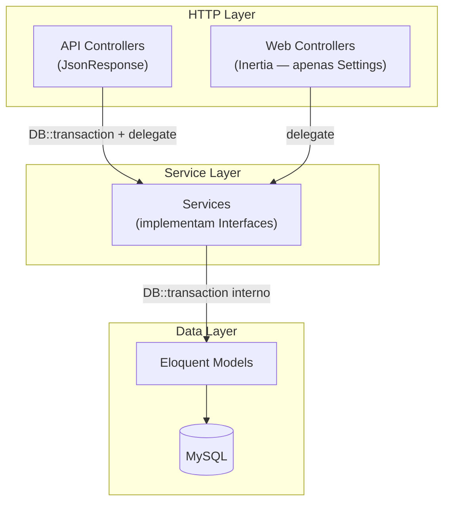
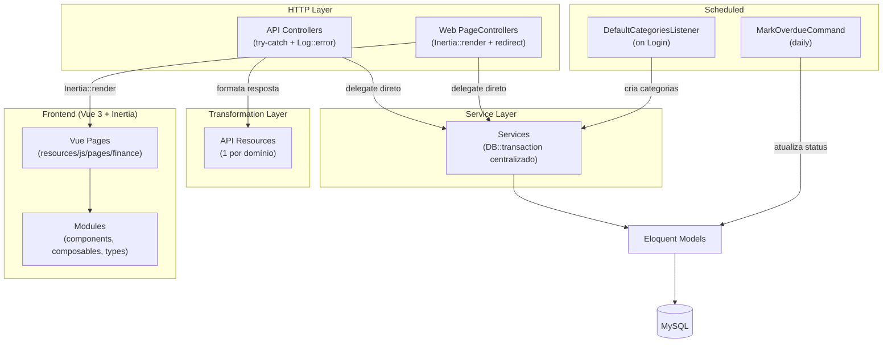
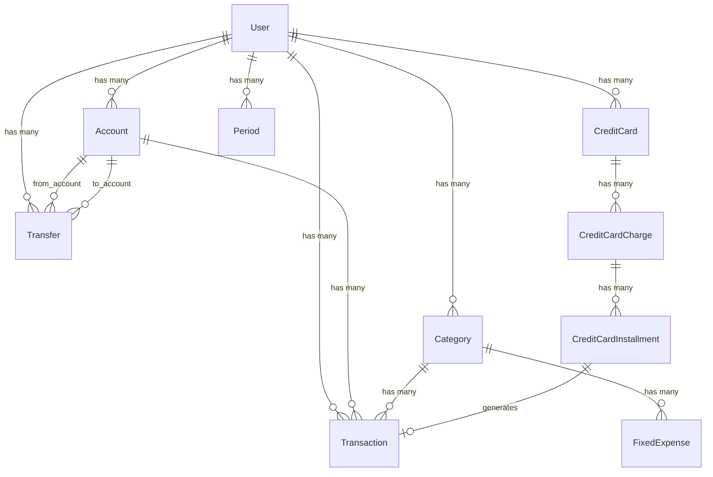

# Design Técnico — Melhorias do Projeto, Controllers Inertia e Steering para IA

## Visão Geral

Este documento detalha o design técnico para três frentes de trabalho no Himel App:

1. **Melhorias de backend** — Refatoração de controllers (remoção de `DB::transaction` duplicado), melhoria do filtro de busca, campo `description` na criação de transações, API Resources para todos os domínios, comando agendado OVERDUE, categorias padrão no primeiro acesso e validação de parcelas de cartão de crédito.
2. **Controllers Inertia + Frontend** — Criação de controllers web (Inertia) para todos os domínios financeiros, mantendo os controllers API existentes. Inclui páginas Vue, componentes modulares, tipos TypeScript, validação com Zod e rotas web.
3. **Conversão de steering files** — Transformação dos arquivos `instructions/` em `.agents/steering/` para consumo automático por agentes de IA.

A API existente (controllers retornando `JsonResponse`) será mantida intacta. Novos controllers Inertia serão criados em paralelo, reutilizando o mesmo Service Layer.

## Arquitetura

### Visão Atual



### Visão Após Refatoração



**Decisão arquitetural:** O `DB::transaction` é removido dos controllers e permanece exclusivamente no Service Layer. Os controllers mantêm apenas `try-catch` + `Log::error` + retorno HTTP. Isso elimina transações aninhadas desnecessárias e centraliza a responsabilidade de atomicidade.

## Componentes e Interfaces

### 1. Refatoração de Controllers (Requisito 1)

Todos os 9 API controllers seguem o mesmo padrão de duplicação. A refatoração é idêntica para todos:

**Antes (padrão atual):**
```php
public function store(StoreRequest $request): JsonResponse
{
    try {
        $userUid = $request->user()->uid;
        $entity = DB::transaction(function () use ($request, $userUid) {
            return $this->service->create($request->validated(), $userUid);
        });
        return response()->json(['data' => $entity], 201);
    } catch (\Throwable $e) {
        Log::error('Failed to create entity', [...]);
        return response()->json(['error' => '...', 'message' => $e->getMessage()], 422);
    }
}
```

**Depois (padrão refatorado):**
```php
public function store(StoreRequest $request): JsonResponse
{
    try {
        $userUid = $request->user()->uid;
        $entity = $this->service->create($request->validated(), $userUid);
        return response()->json(new EntityResource($entity), 201);
    } catch (\Throwable $e) {
        Log::error('Failed to create entity', [...]);
        return response()->json(['error' => '...', 'message' => $e->getMessage()], 422);
    }
}
```

**Controllers afetados:**
- `AccountController` — store, update, destroy
- `CategoryController` — store, update, destroy
- `TransactionController` — store, update, destroy
- `TransferController` — store, destroy
- `FixedExpenseController` — store, update, destroy
- `CreditCardController` — store, update, destroy
- `CreditCardChargeController` — store, update, destroy
- `CreditCardInstallmentController` — markAsPaid
- `PeriodController` — store, destroy

Os Services já possuem `DB::transaction` internamente — nenhuma alteração necessária neles.

### 2. Melhoria do Filtro de Busca (Requisito 2)

**Arquivo:** `app/Domain/Transaction/Services/TransactionService.php`

**Antes:**
```php
$query->when($filters['search'] ?? null, fn ($q, $search) =>
    $q->whereHas('account', fn ($aq) => $aq->where('name', 'like', "%{$search}%"))
);
```

**Depois:**
```php
$query->when($filters['search'] ?? null, fn ($q, $search) =>
    $q->where(function ($subQ) use ($search) {
        $subQ->where('description', 'like', "%{$search}%")
             ->orWhereHas('account', fn ($aq) => $aq->where('name', 'like', "%{$search}%"));
    })
);
```

### 3. Campo `description` na Criação de Transações (Requisito 3)

**Arquivos afetados:**
- `StoreTransactionRequest` — adicionar `'description' => 'nullable|string|max:255'`
- `TransactionService::create()` — incluir `'description' => $data['description'] ?? null` no array de criação
- `Transaction` model — adicionar `'description'` ao `$fillable`

### 4. API Resources (Requisito 4)

Criar uma classe `Resource` por domínio em `app/Domain/{Domain}/Resources/`:

| Domínio | Resource | Campos expostos |
|---------|----------|-----------------|
| Account | `AccountResource` | uid, name, type, balance, created_at |
| Category | `CategoryResource` | uid, name, direction, created_at |
| Transaction | `TransactionResource` | uid, amount, direction, status, source, description, occurred_at, due_date, paid_at, account (nested), category (nested) |
| Transfer | `TransferResource` | uid, amount, occurred_at, from_account (nested), to_account (nested) |
| FixedExpense | `FixedExpenseResource` | uid, description, amount, due_day, active, category (nested) |
| CreditCard | `CreditCardResource` | uid, name, closing_day, due_day, card_type, last_four_digits |
| CreditCardCharge | `CreditCardChargeResource` | uid, description, amount, total_installments, purchase_date, credit_card (nested), installments (nested) |
| CreditCardInstallment | `CreditCardInstallmentResource` | uid, installment_number, amount, due_date, paid_at, transaction (nested) |
| Period | `PeriodResource` | uid, month, year |

**Padrão de implementação:**
```php
class AccountResource extends JsonResource
{
    public function toArray(Request $request): array
    {
        return [
            'uid' => $this->uid,
            'name' => $this->name,
            'type' => $this->type,
            'balance' => $this->balance,
            'created_at' => $this->created_at,
        ];
    }
}
```

Relacionamentos carregados são incluídos via `whenLoaded()`:
```php
'account' => new AccountResource($this->whenLoaded('account')),
```

### 5. Comando Agendado OVERDUE (Requisito 5)

**Novo arquivo:** `app/Domain/Transaction/Commands/MarkOverdueTransactionsCommand.php`

```php
class MarkOverdueTransactionsCommand extends Command
{
    protected $signature = 'transactions:mark-overdue';
    protected $description = 'Marca transações PENDING vencidas como OVERDUE';

    public function handle(): int
    {
        $count = Transaction::where('status', Transaction::STATUS_PENDING)
            ->where('due_date', '<', now()->startOfDay())
            ->update(['status' => Transaction::STATUS_OVERDUE]);

        Log::info("Marked {$count} transactions as OVERDUE");
        $this->info("Transações atualizadas: {$count}");

        return self::SUCCESS;
    }
}
```

**Registro:** Em `routes/console.php`:
```php
Schedule::command('transactions:mark-overdue')->daily();
```

### 6. Categorias Padrão no Primeiro Acesso (Requisito 6)

**Abordagem:** Listener no evento `Login` do Laravel.

**Novo arquivo:** `app/Domain/Category/Listeners/CreateDefaultCategoriesListener.php`

O listener verifica se o usuário possui categorias. Se não possuir, cria o conjunto padrão:

**OUTFLOW:** Alimentação, Moradia, Transporte, Saúde, Educação, Lazer, Vestuário, Outros
**INFLOW:** Salário, Freelance, Investimentos, Outros

**Registro:** Em `EventServiceProvider` ou via atributo `#[Listener]`:
```php
Event::listen(Login::class, CreateDefaultCategoriesListener::class);
```

### 7. Validação de Parcelas de Cartão de Crédito (Requisito 7)

**Arquivo:** `app/Domain/CreditCardCharge/Services/CreditCardChargeService.php`

**Melhorias no método `create()`:**

1. **Validação de limites:** Rejeitar `total_installments < 1` ou `> 48` com `InvalidArgumentException`.
2. **Distribuição de centavos:** Usar divisão inteira em centavos e distribuir resto na última parcela:
   ```php
   $totalCents = (int) round($data['amount'] * 100);
   $baseCents = intdiv($totalCents, $data['total_installments']);
   $remainder = $totalCents % $data['total_installments'];
   // Parcela i: $baseCents / 100 (última parcela: ($baseCents + $remainder) / 100)
   ```
3. **Cálculo de `due_date`:** Baseado no `due_day` do cartão, avançando mês a mês a partir da data de compra.
4. **Geração de `FinancialTransaction`:** Cada parcela gera uma transação vinculada via `reference_id`, com `source = CREDIT_CARD` e `status = PENDING`.

### 8-10. Steering Files (Requisitos 8, 9, 10)

Três arquivos Markdown em `.agents/steering/`:

| Arquivo | Fonte | Glob Pattern |
|---------|-------|-------------|
| `business-rules.md` | `instructions/REGRAS_NEGOCIO.md` | `app/Domain/**/*.php` |
| `development-protocol.md` | `instructions/REGRAS_INFRAESTRUTURA.md` | `app/**/*.php, resources/js/**/*.{ts,vue}` |
| `database-schema.md` | `instructions/modelagem.sql` | `database/migrations/**/*.php, app/Domain/**/Models/*.php` |

Cada arquivo terá cabeçalho com glob pattern para ativação automática e conteúdo reformatado em linguagem diretiva e concisa.

---

## Controllers Inertia + Frontend

### Decisão Arquitetural: Dois Tipos de Controllers

O projeto mantém dois conjuntos de controllers por domínio:

| Tipo | Sufixo | Retorno | Uso |
|------|--------|---------|-----|
| API Controller | `Controller` (existente) | `JsonResponse` | Consumo por apps mobile/externas |
| Web Controller | `PageController` | `Inertia\Response` / `RedirectResponse` | Frontend Vue via Inertia |

Ambos reutilizam o mesmo Service Layer (mesmas interfaces, mesmos services).

### Estrutura de Rotas Web

**Arquivo principal:** `routes/web.php` — incluirá os arquivos de rota web de cada domínio.

```php
Route::middleware(['auth', 'verified'])->prefix('finance')->group(function () {
    require base_path('app/Domain/Account/Routes/web.php');
    require base_path('app/Domain/Category/Routes/web.php');
    require base_path('app/Domain/Transaction/Routes/web.php');
    require base_path('app/Domain/Transfer/Routes/web.php');
    require base_path('app/Domain/FixedExpense/Routes/web.php');
    require base_path('app/Domain/CreditCard/Routes/web.php');
    require base_path('app/Domain/CreditCardCharge/Routes/web.php');
    require base_path('app/Domain/Period/Routes/web.php');
});
```

**Prefixo `/finance`** — agrupa todas as páginas financeiras. O Dashboard.vue já redireciona para `/finance`.

### Padrão dos Web Controllers (PageController)

Cada PageController segue o padrão:

```php
class AccountPageController
{
    public function __construct(
        private readonly AccountServiceInterface $accountService
    ) {}

    public function index(Request $request): \Inertia\Response
    {
        $userUid = $request->user()->uid;
        $filters = $request->only(['page', 'per_page', 'type', 'search']);
        $result = $this->accountService->getAllWithFilters($userUid, $filters);

        return Inertia::render('finance/accounts/Index', [
            'accounts' => $result['data'],
            'meta' => $result['meta'],
            'filters' => $filters,
        ]);
    }

    public function create(): \Inertia\Response
    {
        return Inertia::render('finance/accounts/Create');
    }

    public function store(StoreAccountRequest $request): RedirectResponse
    {
        try {
            $this->accountService->create($request->validated(), $request->user()->uid);
            return redirect()->route('finance.accounts.index')
                ->with('success', 'Conta criada com sucesso.');
        } catch (\Throwable $e) {
            Log::error('Failed to create account', ['error' => $e->getMessage()]);
            return back()->with('error', 'Erro ao criar conta.');
        }
    }

    public function edit(Request $request, string $uid): \Inertia\Response
    {
        $account = $this->accountService->getByUid($uid, $request->user()->uid);
        abort_unless($account, 404);

        return Inertia::render('finance/accounts/Edit', [
            'account' => $account,
        ]);
    }

    public function update(UpdateAccountRequest $request, string $uid): RedirectResponse
    {
        try {
            $this->accountService->update($uid, $request->validated(), $request->user()->uid);
            return redirect()->route('finance.accounts.index')
                ->with('success', 'Conta atualizada com sucesso.');
        } catch (\Throwable $e) {
            Log::error('Failed to update account', ['error' => $e->getMessage()]);
            return back()->with('error', 'Erro ao atualizar conta.');
        }
    }

    public function destroy(Request $request, string $uid): RedirectResponse
    {
        try {
            $this->accountService->delete($uid, $request->user()->uid);
            return redirect()->route('finance.accounts.index')
                ->with('success', 'Conta excluída com sucesso.');
        } catch (\Throwable $e) {
            Log::error('Failed to delete account', ['error' => $e->getMessage()]);
            return back()->with('error', 'Erro ao excluir conta.');
        }
    }
}
```

**Diferenças do API Controller:**
- Retorna `Inertia::render()` em vez de `response()->json()`
- Operações de escrita retornam `RedirectResponse` com flash messages
- Reutiliza os mesmos `FormRequests` existentes
- Não usa `DB::transaction` (já está no Service)

### Mapeamento de PageControllers por Domínio

| Domínio | PageController | Métodos | Rota Base |
|---------|---------------|---------|-----------|
| Account | `AccountPageController` | index, create, store, edit, update, destroy | `/finance/accounts` |
| Category | `CategoryPageController` | index, create, store, edit, update, destroy | `/finance/categories` |
| Transaction | `TransactionPageController` | index, create, store, edit, update, destroy | `/finance/transactions` |
| Transfer | `TransferPageController` | index, create, store, destroy | `/finance/transfers` |
| FixedExpense | `FixedExpensePageController` | index, create, store, edit, update, destroy | `/finance/fixed-expenses` |
| CreditCard | `CreditCardPageController` | index, create, store, edit, update, destroy | `/finance/credit-cards` |
| CreditCardCharge | `CreditCardChargePageController` | index, create, store, show | `/finance/credit-card-charges` |
| Period | `PeriodPageController` | index (dashboard view) | `/finance/periods` |

### Estrutura de Páginas Vue

```
resources/js/pages/finance/
├── Index.vue                    (Dashboard financeiro — rota /finance)
├── accounts/
│   ├── Index.vue                (Listagem com filtros e paginação)
│   ├── Create.vue               (Formulário de criação)
│   └── Edit.vue                 (Formulário de edição)
├── categories/
│   ├── Index.vue
│   ├── Create.vue
│   └── Edit.vue
├── transactions/
│   ├── Index.vue
│   ├── Create.vue
│   └── Edit.vue
├── transfers/
│   ├── Index.vue
│   └── Create.vue
├── fixed-expenses/
│   ├── Index.vue
│   ├── Create.vue
│   └── Edit.vue
├── credit-cards/
│   ├── Index.vue
│   ├── Create.vue
│   └── Edit.vue
├── credit-card-charges/
│   ├── Index.vue
│   ├── Create.vue
│   └── Show.vue
└── periods/
    └── Index.vue
```

### Estrutura de Módulos Frontend

Seguindo o padrão modular definido em `REGRAS_INFRAESTRUTURA.md`:

```
resources/js/modules/finance/
├── components/
│   ├── AccountForm.vue
│   ├── CategoryForm.vue
│   ├── TransactionForm.vue
│   ├── TransferForm.vue
│   ├── FixedExpenseForm.vue
│   ├── CreditCardForm.vue
│   ├── CreditCardChargeForm.vue
│   ├── DataTable.vue            (Tabela reutilizável com paginação)
│   ├── FilterBar.vue            (Barra de filtros reutilizável)
│   ├── StatusBadge.vue          (Badge de status: PENDING/PAID/OVERDUE)
│   └── DirectionBadge.vue       (Badge de direção: INFLOW/OUTFLOW)
├── composables/
│   ├── useFinanceFilters.ts     (Lógica de filtros compartilhada)
│   ├── usePagination.ts         (Lógica de paginação)
│   └── useFlashMessages.ts      (Leitura de flash messages do Inertia)
├── services/
│   └── finance.services.ts      (Helpers de formatação: moeda, datas)
└── types/
    └── finance.ts               (Tipos TypeScript para todos os domínios)
```

### Tipos TypeScript

```typescript
// resources/js/modules/finance/types/finance.ts

export type AccountType = 'CHECKING' | 'SAVINGS' | 'CASH' | 'OTHER';
export type Direction = 'INFLOW' | 'OUTFLOW';
export type TransactionStatus = 'PENDING' | 'PAID' | 'OVERDUE';
export type TransactionSource = 'MANUAL' | 'CREDIT_CARD' | 'FIXED' | 'TRANSFER';
export type CardType = 'PHYSICAL' | 'VIRTUAL';

export interface Account {
    uid: string;
    name: string;
    type: AccountType;
    balance: number;
    created_at: string;
}

export interface Category {
    uid: string;
    name: string;
    direction: Direction;
    created_at: string;
}

export interface Transaction {
    uid: string;
    amount: number;
    direction: Direction;
    status: TransactionStatus;
    source: TransactionSource;
    description: string | null;
    occurred_at: string;
    due_date: string | null;
    paid_at: string | null;
    account?: Account;
    category?: Category;
}

export interface Transfer {
    uid: string;
    amount: number;
    occurred_at: string;
    description: string | null;
    from_account?: Account;
    to_account?: Account;
}

export interface FixedExpense {
    uid: string;
    description: string;
    amount: number;
    due_day: number;
    active: boolean;
    category?: Category;
}

export interface CreditCard {
    uid: string;
    name: string;
    closing_day: number;
    due_day: number;
    card_type: CardType;
    last_four_digits: string;
}

export interface CreditCardCharge {
    uid: string;
    description: string;
    total_amount: number;
    installments: number;
    purchase_date: string;
    credit_card?: CreditCard;
}

export interface CreditCardInstallment {
    uid: string;
    installment_number: number;
    amount: number;
    due_date: string;
    transaction?: Transaction;
}

export interface Period {
    uid: string;
    month: number;
    year: number;
}

export interface PaginationMeta {
    current_page: number;
    per_page: number;
    total: number;
    last_page: number;
}
```

### Validação de Formulários (Zod + Vee-Validate)

Cada formulário terá um schema Zod correspondente:

```typescript
// resources/js/modules/finance/validations/account-schema.ts
import { z } from 'zod';

export const accountSchema = z.object({
    name: z.string().min(1, 'Nome é obrigatório').max(100),
    type: z.enum(['CHECKING', 'SAVINGS', 'CASH', 'OTHER']),
    balance: z.number().min(0).optional().default(0),
});
```

Submissão via `useForm` do Inertia com validação Zod no frontend antes do submit.

### Componentes Shadcn/Vue Utilizados

| Componente | Uso |
|-----------|-----|
| `Table` | Listagens de dados |
| `Card` | Containers de formulários e resumos |
| `Dialog` | Confirmação de exclusão |
| `Button` | Ações (criar, salvar, excluir) |
| `Input` | Campos de texto |
| `Select` | Dropdowns (tipo de conta, direção, status) |
| `Badge` | Status e direção |
| `Skeleton` | Loading states |
| `Sonner` (toast) | Flash messages de sucesso/erro |
| `Breadcrumb` | Navegação hierárquica |

### Navegação (Sidebar)

Adicionar itens ao sidebar existente (`AppSidebarLayout.vue`):

```typescript
const financeNavItems: NavItem[] = [
    { title: 'Visão Geral', href: '/finance', icon: LayoutDashboard },
    { title: 'Contas', href: '/finance/accounts', icon: Wallet },
    { title: 'Categorias', href: '/finance/categories', icon: Tags },
    { title: 'Transações', href: '/finance/transactions', icon: ArrowLeftRight },
    { title: 'Transferências', href: '/finance/transfers', icon: ArrowRightLeft },
    { title: 'Despesas Fixas', href: '/finance/fixed-expenses', icon: CalendarClock },
    { title: 'Cartões', href: '/finance/credit-cards', icon: CreditCard },
    { title: 'Compras Cartão', href: '/finance/credit-card-charges', icon: ShoppingCart },
];
```


## Modelos de Dados

### Modelos Existentes (sem alteração estrutural)

Os modelos já existem e estão corretamente configurados com UUID v4, `HasUids` trait, e relacionamentos. A única alteração de modelo é:

**Transaction model — adicionar `description` ao `$fillable`:**
```php
protected $fillable = [
    'uid', 'user_uid', 'account_uid', 'category_uid',
    'amount', 'direction', 'status', 'source',
    'description',  // ← NOVO
    'occurred_at', 'due_date', 'paid_at', 'reference_id',
];
```

O campo `description` já existe na tabela `financial_transactions` (conforme `modelagem.sql`), mas não está no `$fillable` do model nem no `StoreTransactionRequest`.

### Novos Artefatos

| Artefato | Tipo | Localização |
|----------|------|-------------|
| `AccountResource` | API Resource | `app/Domain/Account/Resources/` |
| `CategoryResource` | API Resource | `app/Domain/Category/Resources/` |
| `TransactionResource` | API Resource | `app/Domain/Transaction/Resources/` |
| `TransferResource` | API Resource | `app/Domain/Transfer/Resources/` |
| `FixedExpenseResource` | API Resource | `app/Domain/FixedExpense/Resources/` |
| `CreditCardResource` | API Resource | `app/Domain/CreditCard/Resources/` |
| `CreditCardChargeResource` | API Resource | `app/Domain/CreditCardCharge/Resources/` |
| `CreditCardInstallmentResource` | API Resource | `app/Domain/CreditCardInstallment/Resources/` |
| `PeriodResource` | API Resource | `app/Domain/Period/Resources/` |
| `MarkOverdueTransactionsCommand` | Artisan Command | `app/Domain/Transaction/Commands/` |
| `CreateDefaultCategoriesListener` | Event Listener | `app/Domain/Category/Listeners/` |
| `AccountPageController` | Inertia Controller | `app/Domain/Account/Controllers/` |
| `CategoryPageController` | Inertia Controller | `app/Domain/Category/Controllers/` |
| `TransactionPageController` | Inertia Controller | `app/Domain/Transaction/Controllers/` |
| `TransferPageController` | Inertia Controller | `app/Domain/Transfer/Controllers/` |
| `FixedExpensePageController` | Inertia Controller | `app/Domain/FixedExpense/Controllers/` |
| `CreditCardPageController` | Inertia Controller | `app/Domain/CreditCard/Controllers/` |
| `CreditCardChargePageController` | Inertia Controller | `app/Domain/CreditCardCharge/Controllers/` |
| `PeriodPageController` | Inertia Controller | `app/Domain/Period/Controllers/` |

### Diagrama de Relacionamentos (referência)




## Propriedades de Corretude

*Uma propriedade é uma característica ou comportamento que deve ser verdadeiro em todas as execuções válidas de um sistema — essencialmente, uma declaração formal sobre o que o sistema deve fazer. Propriedades servem como ponte entre especificações legíveis por humanos e garantias de corretude verificáveis por máquina.*

### Propriedade 1: Busca textual retorna transações que correspondem em description OU account.name

*Para qualquer* termo de busca e qualquer conjunto de transações, o filtro `search` do TransactionService deve retornar todas as transações cujo campo `description` contenha o termo OU cuja conta associada tenha `name` contendo o termo — e nenhuma transação que não corresponda a nenhum dos dois campos.

**Valida: Requisitos 2.1, 2.2, 2.3**

### Propriedade 2: Round-trip de description na criação de transação

*Para qualquer* string válida (não-nula, até 255 caracteres), ao criar uma transação com esse valor em `description`, a transação persistida deve conter exatamente o mesmo valor de `description`.

**Valida: Requisito 3.1**

### Propriedade 3: Validação de comprimento máximo de description

*Para qualquer* string com mais de 255 caracteres, a tentativa de criar uma transação com esse valor em `description` deve ser rejeitada pela validação do FormRequest.

**Valida: Requisito 3.3**

### Propriedade 4: API Resource expõe apenas campos esperados com relacionamentos formatados

*Para qualquer* model de domínio financeiro com relacionamentos carregados, a transformação via API Resource correspondente deve produzir um array contendo exatamente os campos especificados na tabela de design, com relacionamentos aninhados formatados via suas respectivas Resources.

**Valida: Requisitos 4.3, 4.4**

### Propriedade 5: Comando OVERDUE atualiza apenas transações PENDING com due_date passado

*Para qualquer* conjunto de transações com status e due_dates variados, a execução do comando `transactions:mark-overdue` deve atualizar para OVERDUE somente as transações com status PENDING e `due_date` anterior à data atual — todas as demais transações devem permanecer inalteradas.

**Valida: Requisito 5.2**

### Propriedade 6: Criação de compra gera exatamente N parcelas com transações vinculadas

*Para qualquer* número válido de parcelas (1-48) e qualquer valor de compra, o CreditCardChargeService deve criar exatamente `total_installments` parcelas, cada uma com uma FinancialTransaction vinculada com `source = CREDIT_CARD` e `status = PENDING`.

**Valida: Requisitos 7.1, 7.4**

### Propriedade 7: Soma das parcelas é igual ao valor total da compra

*Para qualquer* valor de compra e qualquer número de parcelas (1-48), a soma dos valores de todas as parcelas geradas deve ser exatamente igual ao valor total da compra, e a diferença entre o valor de quaisquer duas parcelas deve ser no máximo 1 centavo.

**Valida: Requisito 7.2**

### Propriedade 8: Due dates das parcelas seguem o due_day do cartão em meses sequenciais

*Para qualquer* cartão de crédito com um `due_day` e qualquer número de parcelas, cada parcela gerada deve ter `due_date` com o dia igual ao `due_day` do cartão e meses incrementais a partir da data de compra.

**Valida: Requisito 7.3**

### Propriedade 9: Rejeição de número de parcelas fora do intervalo válido

*Para qualquer* número de parcelas menor que 1 ou maior que 48, a tentativa de criar uma compra no cartão deve lançar uma exceção `InvalidArgumentException` e nenhuma parcela ou transação deve ser criada.

**Valida: Requisito 7.5**

### Propriedade 10: Transação PAID atualiza saldo da conta corretamente

*Para qualquer* valor monetário positivo e qualquer direção (INFLOW/OUTFLOW), ao criar uma transação com status PAID, o saldo da conta associada deve ser incrementado (INFLOW) ou decrementado (OUTFLOW) exatamente pelo valor da transação.

**Valida: Requisito 11.5**

## Tratamento de Erros

### Padrão de Erro nos Controllers (pós-refatoração)

Todos os controllers seguem o mesmo padrão:

```php
try {
    // Delegação direta ao Service (sem DB::transaction)
    $result = $this->service->method(...);
    return response()->json(new Resource($result), 200);
} catch (\Throwable $e) {
    Log::error('Mensagem descritiva', [
        'uid' => $uid ?? null,
        'user_uid' => $request->user()->uid,
        'error' => $e->getMessage(),
    ]);
    return response()->json([
        'error' => 'Mensagem amigável em pt-BR.',
        'message' => $e->getMessage(),
    ], 422);
}
```

### Erros Específicos por Domínio

| Cenário | Exceção | HTTP | Mensagem |
|---------|---------|------|----------|
| Categoria com direction incompatível | `InvalidArgumentException` | 422 | "A categoria não corresponde à direção da transação." |
| Parcelas < 1 ou > 48 | `InvalidArgumentException` | 422 | "O número de parcelas deve ser entre 1 e 48." |
| Conta não encontrada (transferência) | `InvalidArgumentException` | 422 | "Conta(s) não encontrada(s)." |
| Cartão não encontrado (compra) | `InvalidArgumentException` | 422 | "Cartão de crédito não encontrado." |
| Recurso não encontrado (show/update/destroy) | — | 404 | "{Entidade} não encontrado(a)." |

### Tratamento no Service Layer

Os Services mantêm `try-catch` com `Log::error` e re-throw da exceção. O `DB::transaction` garante rollback automático em caso de falha.

### Tratamento no Comando OVERDUE

O comando usa `update()` em massa (sem loop individual), então falhas são atômicas. Logs registram a quantidade de transações atualizadas.

## Estratégia de Testes

### Abordagem Dual

- **Testes de Feature (PHPUnit):** Cobrem cenários específicos, edge cases, integração entre camadas e fluxos completos.
- **Testes de Propriedade (PBT):** Verificam propriedades universais com inputs gerados aleatoriamente.

### Biblioteca de Property-Based Testing

**Biblioteca:** `eris/eris` (PHP PBT library compatível com PHPUnit)

Cada teste de propriedade deve:
- Executar no mínimo **100 iterações**
- Referenciar a propriedade do design via tag no comentário
- Formato da tag: `Feature: project-improvements-and-ai-steering, Property {N}: {título}`

### Mapeamento de Testes

| Propriedade | Tipo de Teste | Arquivo de Teste |
|-------------|---------------|------------------|
| P1: Busca textual | Property | `tests/Feature/Transaction/TransactionSearchPropertyTest.php` |
| P2: Round-trip description | Property | `tests/Feature/Transaction/TransactionDescriptionPropertyTest.php` |
| P3: Validação max length | Property | `tests/Feature/Transaction/TransactionDescriptionPropertyTest.php` |
| P4: API Resource campos | Property | `tests/Feature/Resources/ApiResourcePropertyTest.php` |
| P5: Comando OVERDUE | Property | `tests/Feature/Transaction/MarkOverduePropertyTest.php` |
| P6: Parcelas + transações | Property | `tests/Feature/CreditCard/InstallmentGenerationPropertyTest.php` |
| P7: Soma parcelas = total | Property | `tests/Feature/CreditCard/InstallmentAmountPropertyTest.php` |
| P8: Due dates sequenciais | Property | `tests/Feature/CreditCard/InstallmentDueDatePropertyTest.php` |
| P9: Rejeição parcelas inválidas | Property | `tests/Feature/CreditCard/InstallmentValidationPropertyTest.php` |
| P10: Saldo PAID | Property | `tests/Feature/Transaction/TransactionBalancePropertyTest.php` |

### Testes de Feature (Example-Based)

| Cenário | Arquivo |
|---------|---------|
| Controller sem DB::transaction (Req 1) | `tests/Feature/Controller/ControllerRefactorTest.php` |
| Categorias padrão no login (Req 6) | `tests/Feature/Category/DefaultCategoriesTest.php` |
| Categoria direction incompatível (Req 11.4) | `tests/Feature/Transaction/TransactionServiceTest.php` |
| Busca sem resultados (Req 2.4) | `tests/Feature/Transaction/TransactionServiceTest.php` |
| Description null quando omitido (Req 3.2) | `tests/Feature/Transaction/TransactionServiceTest.php` |
| Comando OVERDUE log count (Req 5.4) | `tests/Feature/Transaction/MarkOverdueCommandTest.php` |
| Schedule diário (Req 5.3) | `tests/Feature/Transaction/MarkOverdueCommandTest.php` |

### Testes de Steering Files (Smoke)

Os steering files (Requisitos 8-10) são arquivos estáticos Markdown. Validação é feita por revisão manual — não requerem testes automatizados.
