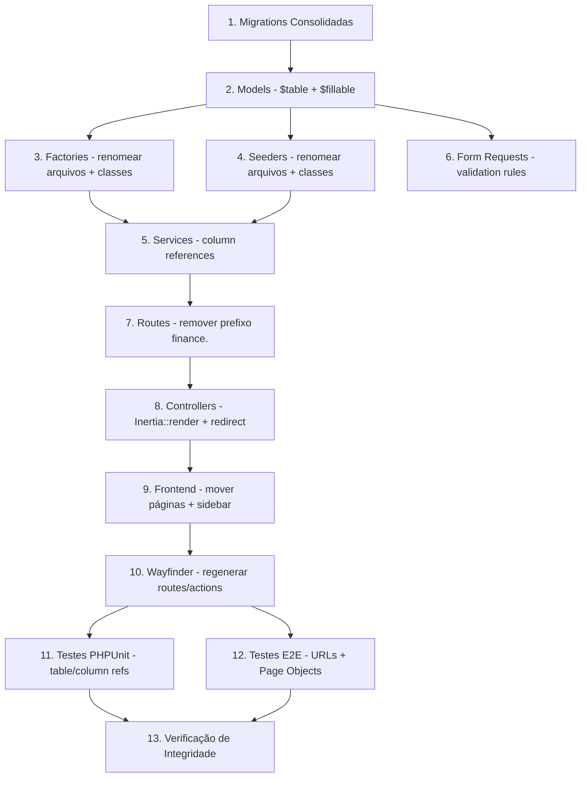
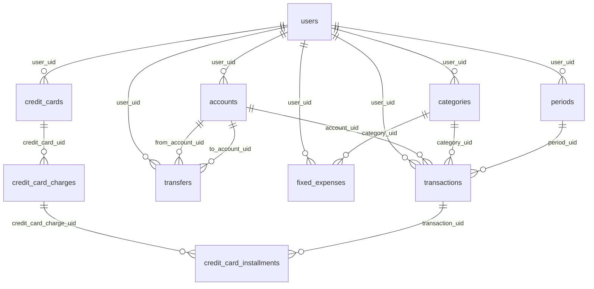

# Documento de Design

## Visão Geral

Esta refatoração remove nomenclatura redundante (`financial_`, `finance.`, `/finance`) de toda a codebase do Himel App. O projeto é inteiramente de gestão financeira, tornando esses prefixos desnecessários. Como o projeto **não está em produção**, podemos usar `migrate:fresh` em vez de migrations de renomeação, simplificando drasticamente a abordagem.

A refatoração abrange 5 camadas:
1. **Banco de dados**: Tabelas, colunas e migrations
2. **Backend PHP**: Models, Factories, Seeders, Services, Form Requests, Controllers, Rotas
3. **Frontend Vue/TS**: Páginas Inertia, Sidebar, Wayfinder routes/actions
4. **Testes PHPUnit**: Referências a tabelas e colunas
5. **Testes E2E**: Page Objects e URLs

### Decisão Arquitetural: Ordem de Execução

A ordem de operações é crítica para evitar estados quebrados intermediários. A estratégia é:

1. **Primeiro**: Camada de dados (migrations + models) — base de tudo
2. **Segundo**: Camada de suporte (factories, seeders) — dependem dos models
3. **Terceiro**: Camada de lógica (services, form requests) — dependem dos models e tabelas
4. **Quarto**: Camada de rotas (routes, controllers) — dependem dos services
5. **Quinto**: Camada de frontend (páginas, sidebar, wayfinder) — dependem das rotas
6. **Sexto**: Camada de testes (PHPUnit, E2E) — dependem de tudo acima
7. **Último**: Verificação de integridade — valida tudo junto

## Arquitetura

### Diagrama de Dependências da Refatoração



### Estratégia de Migração: Fresh vs Rename

Como o projeto **não está em produção**, a abordagem escolhida é:

- **Editar as migrations de criação existentes** para usar os nomes limpos (sem `financial_`)
- **Incorporar colunas das migrations incrementais** nas migrations de criação
- **Remover as 5 migrations incrementais**
- **Executar `migrate:fresh --seed`** para recriar o banco do zero

Isso é mais simples e seguro do que criar migrations de renomeação que seriam descartadas antes da produção.

## Componentes e Interfaces

### Camada 1: Migrations Consolidadas

**9 migrations de criação** serão editadas para:
- Trocar `Schema::create('financial_X', ...)` por `Schema::create('X', ...)`
- Trocar referências de foreign key de `financial_X` para `X`
- Incorporar colunas das migrations incrementais

**Consolidações específicas:**

| Migration Base | Colunas Incorporadas | Origem |
|---|---|---|
| `create_transactions_table` | `period_uid` (nullable, FK → periods), `description` (string 255, nullable), `category_uid` alterado para nullable | 3 migrations incrementais |
| `create_credit_cards_table` | `closing_day` (tinyInt, nullable), `last_four_digits` (string 4, nullable) | 1 migration incremental |
| `create_credit_card_charges_table` | `purchase_date` (date, nullable) | 1 migration incremental |

**Coluna renomeada:**
- `create_credit_card_installments_table`: `financial_transaction_uid` → `transaction_uid`

**5 migrations incrementais a remover:**
1. `2026_04_09_194739_add_period_uid_to_financial_transactions.php`
2. `2026_04_10_102543_add_description_to_financial_transactions_table.php`
3. `2026_04_20_115934_add_closing_day_and_last_four_digits_to_financial_credit_cards_table.php`
4. `2026_04_21_171509_add_purchase_date_to_financial_credit_card_charges_table.php`
5. `2026_04_22_002939_make_category_uid_nullable_in_financial_transactions.php`

### Camada 2: Models Eloquent

**9 Models** terão `$table` atualizado:

| Model | Antes | Depois |
|---|---|---|
| Account | `financial_accounts` | `accounts` |
| Category | `financial_categories` | `categories` |
| Period | `financial_periods` | `periods` |
| CreditCard | `financial_credit_cards` | `credit_cards` |
| Transfer | `financial_transfers` | `transfers` |
| FixedExpense | `financial_fixed_expenses` | `fixed_expenses` |
| CreditCardCharge | `financial_credit_card_charges` | `credit_card_charges` |
| Transaction | `financial_transactions` | `transactions` |
| CreditCardInstallment | `financial_credit_card_installments` | `credit_card_installments` |

**CreditCardInstallment** adicionalmente:
- `$fillable`: `financial_transaction_uid` → `transaction_uid`
- `transaction()` relationship: foreign key `financial_transaction_uid` → `transaction_uid`

### Camada 3: Factories

**9 arquivos renomeados** (arquivo + classe):

| Antes | Depois |
|---|---|
| `FinancialAccountFactory` | `AccountFactory` |
| `FinancialCategoryFactory` | `CategoryFactory` |
| `FinancialPeriodFactory` | `PeriodFactory` |
| `FinancialCreditCardFactory` | `CreditCardFactory` |
| `FinancialTransferFactory` | `TransferFactory` |
| `FinancialFixedExpenseFactory` | `FixedExpenseFactory` |
| `FinancialCreditCardChargeFactory` | `CreditCardChargeFactory` |
| `FinancialTransactionFactory` | `TransactionFactory` |
| `FinancialCreditCardInstallmentFactory` | `CreditCardInstallmentFactory` |

**Impacto nos Models**: Atualizar PHPDoc `@use HasFactory<...>` e imports em todos os 9 Models.

**Impacto no CreditCardInstallmentFactory**: Atualizar referência `financial_transaction_uid` → `transaction_uid` na definição.

### Camada 4: Seeders

**10 arquivos renomeados** (arquivo + classe):

| Antes | Depois |
|---|---|
| `FinancialAccountSeeder` | `AccountSeeder` |
| `FinancialCategorySeeder` | `CategorySeeder` |
| `FinancialPeriodSeeder` | `PeriodSeeder` |
| `FinancialCreditCardSeeder` | `CreditCardSeeder` |
| `FinancialTransferSeeder` | `TransferSeeder` |
| `FinancialFixedExpenseSeeder` | `FixedExpenseSeeder` |
| `FinancialCreditCardChargeSeeder` | `CreditCardChargeSeeder` |
| `FinancialTransactionSeeder` | `TransactionSeeder` |
| `FinancialCreditCardInstallmentSeeder` | `CreditCardInstallmentSeeder` |
| `FinancialSeeder` | `FinanceSeeder` |

**Impacto**: `DatabaseSeeder` e `FinanceSeeder` (orquestrador) devem referenciar os novos nomes. `E2eTestSeeder` deve atualizar imports e chamadas de factory.

### Camada 5: Services e Form Requests

**Services afetados:**
- `CreditCardChargeService`: `'financial_transaction_uid' => $transactionUid` → `'transaction_uid' => $transactionUid`
- `PeriodService`: `$installment->financial_transaction_uid` → `$installment->transaction_uid`

**Form Requests afetados:**
- `StoreTransactionRequest`: `'exists:financial_periods,uid'` → `'exists:periods,uid'`
- Verificar todos os outros Form Requests para regras `exists:` ou `unique:` com prefixo `financial_`

### Camada 6: Rotas

**routes/web.php**: Remover o grupo `Route::prefix('finance')->name('finance.')`, movendo os `require` diretamente para o grupo `auth + verified`. Remover ou realocar a rota `Inertia::render('finance/Index')`.

**5 arquivos de rotas de domínio** atualizados:

| Arquivo | Antes | Depois |
|---|---|---|
| `CreditCard/Routes/web.php` | `->names('finance.credit-cards')` | `->names('credit-cards')` |
| `Category/Routes/web.php` | `->names('finance.categories')` | `->names('categories')` |
| `Period/Routes/web.php` | `->names('finance.periods')` + rotas `finance.periods.*` | `->names('periods')` + rotas `periods.*` |
| `FixedExpense/Routes/web.php` | `->names('finance.fixed-expenses')` | `->names('fixed-expenses')` |
| `CreditCardCharge/Routes/web.php` | `->names('finance.credit-card-charges')` | `->names('credit-card-charges')` |

**3 arquivos de rotas sem alteração** (já não usam prefixo):
- `Account/Routes/web.php`: `->names('accounts')`
- `Transaction/Routes/web.php`: `->names('transactions')`
- `Transfer/Routes/web.php`: `->names('transfers')`

### Camada 7: Controllers

**Todos os PageControllers** devem:
1. Atualizar `Inertia::render('finance/X/Y')` → `Inertia::render('X/Y')`
2. Atualizar `redirect()->route('finance.X.Y')` → `redirect()->route('X.Y')`

**Controllers afetados:**
- `AccountPageController` — render + redirects (`finance.accounts.index` → `accounts.index`)
- `CategoryPageController` — render + redirects
- `CreditCardPageController` — render + redirects
- `CreditCardChargePageController` — render + redirects
- `FixedExpensePageController` — render + redirects
- `PeriodPageController` — render + redirects (corrige bug existente: `finance.finance.periods.*` → `periods.*`)
- `TransactionPageController` — render + redirects
- `TransferPageController` — render + redirects

### Camada 8: Frontend

**Páginas Inertia**: Mover de `resources/js/pages/finance/<domínio>/` para `resources/js/pages/<domínio>/`:
- 9 subdiretórios movidos (accounts, categories, credit-cards, credit-card-charges, fixed-expenses, periods, transactions, transfers)
- `finance/Index.vue` → decidir destino (já existe `Dashboard.vue`, pode ser removida ou incorporada)
- Remover diretório `resources/js/pages/finance/` vazio

**AppSidebar.vue**: Atualizar todos os `href` de `/finance/X` para `/X`. Atualizar lógica `isActive` que verifica `href === '/finance'`.

**Wayfinder**: Executar `php artisan wayfinder:generate` para regenerar `resources/js/routes/` e `resources/js/actions/`.

### Camada 9: Testes PHPUnit

**9 arquivos de teste** devem ter referências atualizadas:
- `assertDatabaseHas('financial_X', ...)` → `assertDatabaseHas('X', ...)`
- `assertDatabaseMissing('financial_X', ...)` → `assertDatabaseMissing('X', ...)`
- `assertDatabaseCount('financial_X', ...)` → `assertDatabaseCount('X', ...)`
- `DB::table('financial_X')` → `DB::table('X')`
- `'financial_transaction_uid'` → `'transaction_uid'`

### Camada 10: Testes E2E

**6 Page Objects** devem ter URLs atualizadas:
- `AccountPage.ts`: `/finance/accounts` → `/accounts`
- `CreditCardPage.ts`: `/finance/credit-cards` → `/credit-cards`
- `CreditCardChargePage.ts`: `/finance/credit-card-charges` → `/credit-card-charges`
- `TransferPage.ts`: `/finance/transfers` → `/transfers`
- `FixedExpensePage.ts`: `/finance/fixed-expenses` → `/fixed-expenses`
- `TransactionPage.ts`: `/finance/transactions` → `/transactions`

## Modelo de Dados

### Mapeamento de Tabelas (Antes → Depois)



### Mudança de Coluna

| Tabela | Coluna Antes | Coluna Depois |
|---|---|---|
| `credit_card_installments` | `financial_transaction_uid` | `transaction_uid` |

### Schema Consolidado da Tabela `transactions`

```sql
CREATE TABLE transactions (
    uid UUID PRIMARY KEY,
    user_uid UUID NOT NULL REFERENCES users(uid) ON DELETE CASCADE,
    account_uid UUID NOT NULL REFERENCES accounts(uid) ON DELETE CASCADE,
    category_uid UUID NULLABLE REFERENCES categories(uid) ON DELETE RESTRICT,
    amount DECIMAL(15,2),
    direction ENUM('INFLOW', 'OUTFLOW'),
    status ENUM('PENDING', 'PAID', 'OVERDUE') DEFAULT 'PENDING',
    source ENUM('MANUAL', 'CREDIT_CARD', 'FIXED', 'TRANSFER') DEFAULT 'MANUAL',
    description VARCHAR(255) NULLABLE,
    occurred_at DATETIME,
    due_date DATETIME NULLABLE,
    paid_at DATETIME NULLABLE,
    reference_id UUID NULLABLE,
    period_uid UUID NULLABLE REFERENCES periods(uid) ON DELETE SET NULL,
    created_at TIMESTAMP,
    updated_at TIMESTAMP
);
```

## Tratamento de Erros

### Riscos e Mitigações

| Risco | Mitigação |
|---|---|
| Referência `financial_` esquecida em algum arquivo | Grep automatizado em toda a codebase como passo final |
| Foreign key referenciando tabela antiga | Todas as FKs atualizadas nas migrations consolidadas; `migrate:fresh` falha se houver erro |
| Rota `finance.` esquecida em controller/frontend | `php artisan route:list --name=finance` deve retornar 0 resultados |
| Import de factory/seeder antigo | `migrate:fresh --seed` falha se houver import quebrado |
| Página Inertia não encontrada | `Inertia::render()` lança exceção se o componente Vue não existir no caminho |
| Wayfinder desatualizado | Regenerar com `wayfinder:generate` após todas as mudanças de rotas |
| Bug existente no PeriodPageController | `finance.finance.periods.*` (prefixo duplicado) será corrigido para `periods.*` |

### Rollback

Como o projeto não está em produção e usamos `migrate:fresh`, o rollback é simplesmente reverter o commit no Git. Não há dados de produção a preservar.

## Estratégia de Testes

### Por que Property-Based Testing NÃO se aplica

Esta é uma refatoração estrutural (renomeação de arquivos, tabelas, colunas, rotas e caminhos). Não há lógica algorítmica sendo alterada — apenas referências textuais sendo atualizadas. As mudanças são determinísticas e o conjunto de entradas é fixo (9 tabelas, 9 models, 9 factories, etc.). Não existe um espaço de entrada variável onde gerar inputs aleatórios revelaria bugs adicionais.

### Abordagem de Testes

A verificação de corretude desta refatoração se baseia em **3 pilares**:

#### 1. Testes de Fumaça (Smoke Tests) — Estrutura

Verificações one-shot que confirmam que a estrutura está correta:

- `php artisan migrate:fresh --seed` completa sem erros
- `vendor/bin/pint --dirty --format agent` reporta 0 erros
- `npm run types:check` reporta 0 erros TypeScript
- Grep por `financial_` em arquivos PHP (exceto `personal_access_tokens`) retorna 0 resultados
- Grep por `finance.` em nomes de rotas retorna 0 resultados
- Grep por `/finance` em URLs hardcoded no frontend retorna 0 resultados
- `php artisan route:list --name=finance` retorna 0 resultados

#### 2. Testes de Integração — Comportamento

Os testes PHPUnit existentes servem como testes de integração:

- `php artisan test --compact` deve ter 0 falhas
- Os 9 arquivos de teste listados no Requisito 8 devem passar
- Testes exercitam: criação de transações, inicialização de períodos, criação de charges com installments, etc.

#### 3. Testes E2E — Fluxo Completo

Os testes Playwright existentes verificam o fluxo completo:

- `npm run test:e2e` deve passar com as novas URLs
- Page Objects atualizados navegam para as URLs corretas

### Checklist de Verificação Final

```bash
# 1. Banco de dados
php artisan migrate:fresh --seed

# 2. Testes PHPUnit
php artisan test --compact

# 3. Formatação PHP
vendor/bin/pint --dirty --format agent

# 4. TypeScript
npm run types:check

# 5. Grep por referências residuais
grep -r "financial_" app/ database/ tests/ --include="*.php" | grep -v "personal_access_tokens"
grep -r "finance\." app/ resources/ --include="*.php" --include="*.vue" --include="*.ts" | grep -v "node_modules"
grep -r "/finance" resources/js/ e2e/ --include="*.vue" --include="*.ts" | grep -v "node_modules"

# 6. Rotas
php artisan route:list --name=finance

# 7. E2E (manual)
npm run test:e2e
```
