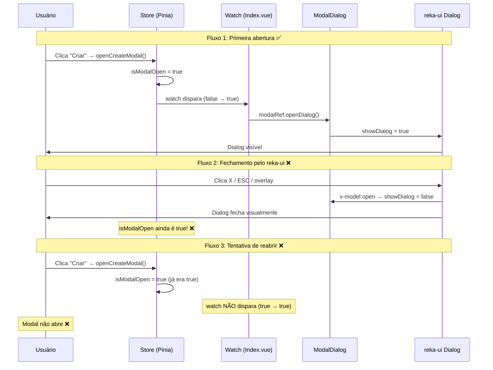
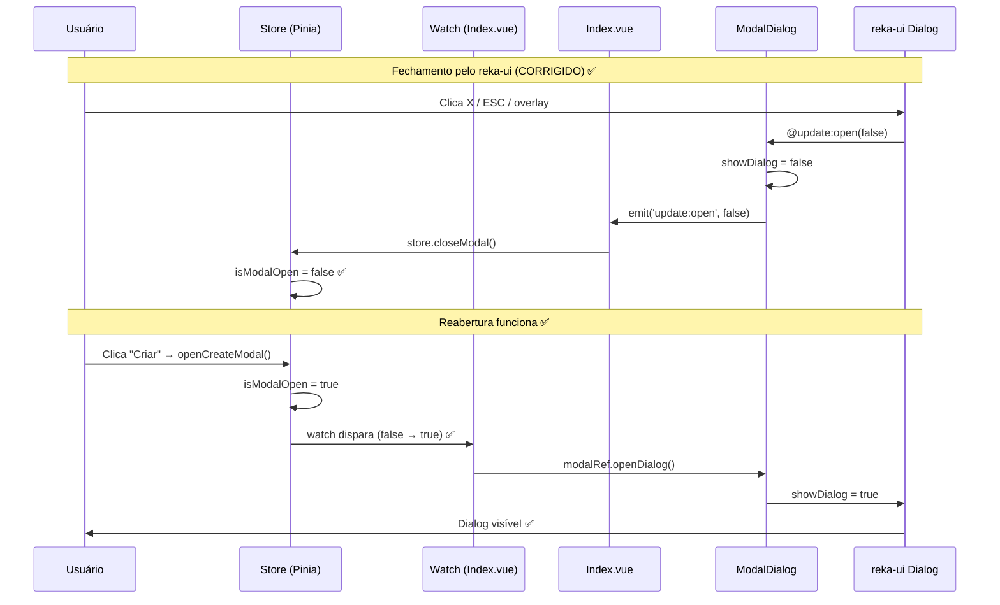
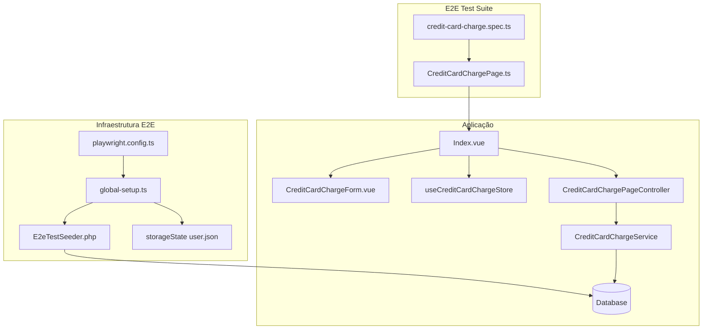
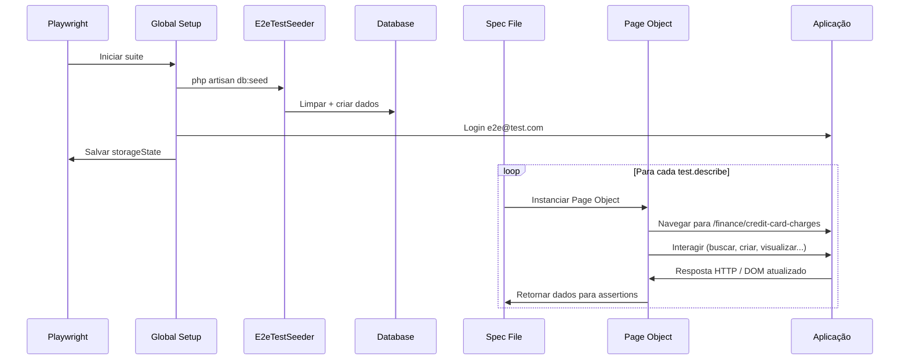

# Documento de Design — Testes E2E para CreditCardCharge

## Visão Geral

Este documento descreve o design técnico para implementação dos testes E2E do módulo CreditCardCharge (Compras de Cartão) usando Playwright. O design segue exatamente os mesmos padrões estabelecidos nos testes E2E do módulo CreditCard, que já está em produção com 26 testes funcionais.

A implementação consiste em quatro artefatos principais:
1. **Correção do ModalDialog** — fix do bug de reabertura do modal (Requisito 0)
2. **Page Object** (`CreditCardChargePage.ts`) — encapsula seletores e interações
3. **Seeder** (atualização do `E2eTestSeeder.php`) — dados de teste idempotentes
4. **Spec** (`credit-card-charge.spec.ts`) — testes organizados por funcionalidade

### Estado Atual do Frontend

A análise do código revelou que `Index.vue` do CreditCardCharge implementa:
- ✅ Listagem com DataTable (descrição, valor total, parcelas, cartão)
- ✅ Busca/Filtro por descrição via FilterBar
- ✅ Paginação (Anterior/Próxima)
- ✅ Criação via modal ("Nova Compra")
- ✅ Visualização via modal ("Detalhes da Compra") — botão Eye
- ❌ Edição — sem botão de edição na UI (store tem `openEditModal` mas não é usado)
- ❌ Exclusão — sem botão de exclusão na UI (store tem `deletingUid` mas não é usado)

**Decisão:** Os testes de Edição e Exclusão (Requisitos 8 e 9) serão implementados no spec como blocos `test.describe` com `test.skip`, documentando a dependência da implementação UI. Isso permite que os testes sejam ativados assim que os botões forem adicionados.

## Correção do Bug do ModalDialog (Requisito 0)

### Análise da Causa Raiz

O fluxo atual do modal apresenta uma dessincronização entre o estado do reka-ui e a Pinia store:



### Solução Técnica

A correção envolve duas alterações:

#### 1. `ModalDialog.vue` — Emitir evento ao fechar

Adicionar um handler `@update:open` no componente `Dialog` do reka-ui que emite um evento para o componente pai quando o dialog é fechado internamente.

**Arquivo:** `resources/js/domain/Shared/components/ui/modal/ModalDialog.vue`

**Antes:**
```vue
<script setup lang="ts">
const props = defineProps<{
	title: string;
	description?: string;
	subtitle?: string;
}>();

const displaySubtitle = computed(() => props.subtitle ?? props.description);

const showDialog = ref(false);

function openDialog() {
	showDialog.value = true;
}

function closeDialog() {
	showDialog.value = false;
}

defineExpose({
	openDialog,
	closeDialog,
});
</script>

<template>
	<Dialog v-model:open="showDialog">
		<!-- ... -->
	</Dialog>
</template>
```

**Depois:**
```vue
<script setup lang="ts">
const props = defineProps<{
	title: string;
	description?: string;
	subtitle?: string;
}>();

const emit = defineEmits<{
	'update:open': [value: boolean];
}>();

const displaySubtitle = computed(() => props.subtitle ?? props.description);

const showDialog = ref(false);

function openDialog() {
	showDialog.value = true;
}

function closeDialog() {
	showDialog.value = false;
}

function handleOpenChange(value: boolean) {
	showDialog.value = value;
	emit('update:open', value);
}

defineExpose({
	openDialog,
	closeDialog,
});
</script>

<template>
	<Dialog :open="showDialog" @update:open="handleOpenChange">
		<!-- ... -->
	</Dialog>
</template>
```

**Mudanças chave:**
- Substituir `v-model:open="showDialog"` por `:open="showDialog"` + `@update:open="handleOpenChange"` para interceptar o evento do reka-ui
- Adicionar `defineEmits` com o evento `update:open`
- A função `handleOpenChange` atualiza o `showDialog` local E emite o evento para o pai
- Compatibilidade retroativa: módulos que não escutam `@update:open` continuam funcionando normalmente (o emit é ignorado)

#### 2. `Index.vue` (CreditCard) — Escutar o evento de fechamento

Adicionar handler `@update:open` no `<ModalDialog>` para sincronizar a store quando o reka-ui fecha o dialog.

**Arquivo:** `resources/js/pages/finance/credit-cards/Index.vue`

**Antes:**
```vue
<ModalDialog ref="modalRef" :title="modalTitle">
```

**Depois:**
```vue
<ModalDialog ref="modalRef" :title="modalTitle" @update:open="handleModalOpenChange">
```

**Handler adicionado:**
```typescript
function handleModalOpenChange(value: boolean) {
	if (!value) {
		store.closeModal();
	}
}
```

**Lógica:** Quando o reka-ui fecha o dialog (valor `false`), chama `store.closeModal()` que seta `isModalOpen = false`. Na próxima abertura, o `watch` detecta a transição `false → true` e dispara corretamente.

#### 3. Padrão para CreditCardCharge e demais módulos

O `Index.vue` do CreditCardCharge (e qualquer outro módulo que use `ModalDialog`) deve seguir o mesmo padrão:

```vue
<ModalDialog ref="modalRef" :title="modalTitle" @update:open="handleModalOpenChange">
```

```typescript
function handleModalOpenChange(value: boolean) {
	if (!value) {
		store.closeModal();
	}
}
```

### Fluxo Corrigido



### Impacto e Compatibilidade

| Módulo | Arquivo | Ação Necessária |
|---|---|---|
| Shared | `ModalDialog.vue` | Adicionar emit + handler (breaking: nenhum) |
| CreditCard | `pages/finance/credit-cards/Index.vue` | Adicionar `@update:open` handler |
| CreditCardCharge | `pages/finance/credit-card-charges/Index.vue` | Adicionar `@update:open` handler (na implementação dos testes E2E) |
| Demais módulos | Qualquer página que use `ModalDialog` | Adicionar `@update:open` handler quando necessário |

**Nota:** A correção no `ModalDialog.vue` é retrocompatível. Módulos que não adicionarem o handler `@update:open` continuarão funcionando como antes (com o bug). A adição do handler é incremental e pode ser feita módulo a módulo.

## Arquitetura

### Diagrama de Componentes



### Fluxo de Execução



## Componentes e Interfaces

### 1. Page Object — `CreditCardChargePage`

Classe TypeScript que encapsula todas as interações com a página de Compras de Cartão. Segue o mesmo padrão do `CreditCardPage.ts`.

```typescript
interface CreditCardChargeFormData {
  credit_card_uid: string;  // UID do cartão (selecionado via Select)
  description: string;       // Descrição da compra
  amount: number;            // Valor total (decimal)
  total_installments: number; // Número de parcelas (1-48)
}
```

#### Métodos por Responsabilidade

| Categoria | Método | Descrição |
|---|---|---|
| Navegação | `goto()` | Navega para `/finance/credit-card-charges` e aguarda tabela |
| Página | `getPageTitle()` | Retorna texto do heading "Compras no Cartão" |
| DataTable | `getTableRows()` | Retorna linhas da tabela (excluindo colspan) |
| DataTable | `getRowByDescription(desc)` | Filtra linha por descrição |
| DataTable | `getEmptyState()` | Retorna locator da mensagem "Nenhum registro encontrado." |
| Busca | `search(term)` | Preenche campo, clica Buscar, aguarda resposta |
| Busca | `clearSearch()` | Clica Limpar, aguarda resposta |
| Paginação | `getNextButton()` | Retorna locator do botão "Próxima" |
| Paginação | `getPreviousButton()` | Retorna locator do botão "Anterior" |
| Paginação | `goToNextPage()` | Clica Próxima e aguarda resposta |
| Paginação | `goToPreviousPage()` | Clica Anterior e aguarda resposta |
| Modal | `clickCreateButton()` | Clica "Criar" e aguarda dialog |
| Modal | `clickViewButton(desc)` | Clica Eye na linha e aguarda dialog |
| Modal | `clickEditButton(desc)` | Clica Pencil na linha e aguarda dialog |
| Modal | `clickDeleteButton(desc)` | Clica Trash na linha |
| Modal | `getModalTitle()` | Retorna título do dialog |
| Modal | `isModalOpen()` | Verifica visibilidade do dialog |
| Formulário | `fillForm(data)` | Preenche todos os campos do formulário |
| Formulário | `submitForm()` | Clica botão Criar/Salvar |
| Formulário | `cancelForm()` | Clica botão Cancelar |
| Formulário | `getFormFieldValue(field)` | Retorna valor de um campo |
| Formulário | `isFieldDisabled(field)` | Verifica se campo está desabilitado |
| Formulário | `isSubmitButtonVisible()` | Verifica visibilidade do botão submit |
| Exclusão | `confirmDelete()` | Clica "Excluir" no popover de confirmação |
| Toast | `waitForToast(message)` | Aguarda toast com mensagem específica |
| Validação | `getValidationError(field)` | Retorna mensagem de erro de validação |

#### Diferenças em relação ao CreditCardPage

| Aspecto | CreditCardPage | CreditCardChargePage |
|---|---|---|
| URL | `/finance/credit-cards` | `/finance/credit-card-charges` |
| Formulário | 5 campos (name, closing_day, due_day, card_type, last_four_digits) | 4 campos (credit_card_uid, description, amount, total_installments) |
| Select | card_type (Físico/Virtual) — 2 opções fixas | credit_card_uid — lista dinâmica de cartões do usuário |
| Busca por | Nome do cartão | Descrição da compra |
| Colunas DataTable | Nome, Tipo, Vencimento | Descrição, Valor Total, Parcelas, Cartão |
| Botões de ação | Eye, Pencil, Trash (todos implementados) | Apenas Eye (Pencil e Trash pendentes) |
| waitForResponse URL | `credit-cards` | `credit-card-charges` |

#### Seletores Específicos do Formulário

O formulário do CreditCardCharge usa componentes reka-ui:
- **Cartão:** `Select` → `SelectTrigger` renderiza como `role="combobox"`. As opções mostram `card.name (•••• card.last_four_digits)`. Para selecionar, clicar no combobox e depois em `role="option"` com o nome do cartão.
- **Descrição:** `Input` com `[name="description"]`
- **Valor Total:** `Input` com `[name="amount"]`, type="number", step="0.01"
- **Parcelas:** `Input` com `[name="total_installments"]`, type="number"

#### Interação com Select de Cartão

O `fillForm` precisa tratar o select de cartão de forma diferente do CreditCardPage:
- No CreditCardPage, o select tem opções fixas ("Físico"/"Virtual")
- No CreditCardChargePage, o select lista cartões do banco. O `credit_card_uid` do `FormData` é o UID, mas a seleção na UI é pelo nome visível do cartão
- **Solução:** O `fillForm` recebe `credit_card_uid` como o **nome do cartão** (ex: "Nubank") para simplificar os testes. Internamente, clica no combobox e seleciona a option que contém o nome.

### 2. Seeder — Atualização do `E2eTestSeeder`

O seeder existente já cria cartões de crédito nomeados (Nubank, Inter, C6 Bank) e cartões via factory. A atualização adiciona compras de cartão associadas a esses cartões.

#### Dados Nomeados

| Descrição | Valor (amount) | Parcelas | Cartão |
|---|---|---|---|
| "Notebook Dell" | 4500.00 | 12 | Nubank |
| "Fone Bluetooth" | 250.00 | 3 | Inter |
| "Curso Online" | 1200.00 | 6 | C6 Bank |

#### Lógica de Reset

```
1. Buscar compras do usuário (via creditCard.user_uid)
2. Deletar installments associados (FK constraint)
3. Deletar compras
4. Criar compras nomeadas (associadas aos cartões nomeados)
5. Criar compras via factory (13+ para totalizar >15 com paginação)
```

**Nota:** A ordem de deleção é crítica — installments devem ser deletados antes das charges por causa da foreign key `credit_card_charge_uid`. O service `delete()` já faz isso, mas no seeder faremos via query direta para performance.

#### Factory para Volume

As compras via factory devem ser associadas aos cartões nomeados existentes (Nubank, Inter, C6 Bank) para evitar criar cartões extras. Usar `FinancialCreditCardChargeFactory` com override de `credit_card_uid`, distribuindo entre os 3 cartões nomeados.

### 3. Spec — `credit-card-charge.spec.ts`

Organização em blocos `test.describe` seguindo a mesma ordem do CreditCard:

```
1. CreditCardCharge Listing (read-only)
2. CreditCardCharge Search and Filtering (read-only)
3. CreditCardCharge Pagination (read-only)
4. CreditCardCharge Creation (mutação)
5. CreditCardCharge Viewing (read-only, mas após Creation para ter dados)
6. CreditCardCharge Editing (mutação — SKIP até UI implementada)
7. CreditCardCharge Deletion (mutação — SKIP até UI implementada)
```

## Modelos de Dados

### CreditCardCharge (Backend — Model)

```
Tabela: financial_credit_card_charges
├── uid (string, PK, UUID)
├── credit_card_uid (string, FK → financial_credit_cards.uid)
├── amount (decimal:2)
├── description (string, max:255)
├── total_installments (integer, 1-48)
├── created_at (timestamp)
└── updated_at (timestamp)
```

### CreditCardCharge (Frontend — TypeScript)

```typescript
interface CreditCardCharge {
  uid: string;
  description: string;
  total_amount: number;    // Nota: frontend usa total_amount, backend usa amount
  installments: number;     // Nota: frontend usa installments, backend usa total_installments
  purchase_date: string;
  credit_card?: { uid: string; name: string };
}
```

### CreditCardChargeFormData (Page Object)

```typescript
interface CreditCardChargeFormData {
  credit_card_uid: string;    // Nome do cartão para seleção na UI (ex: "Nubank")
  description: string;
  amount: number;
  total_installments: number;
}
```

### Mapeamento de Campos (Backend → Frontend → DataTable)

| Backend (Model) | API Resource | Frontend Type | DataTable Column | Formato |
|---|---|---|---|---|
| `description` | `description` | `description` | "Descrição" | Texto |
| `amount` | `amount` | `total_amount` | "Valor Total" | `formatCurrency()` (ex: R$ 4.500,00) |
| `total_installments` | `total_installments` | `installments` | "Parcelas" | `Nx` (ex: 12x) |
| `creditCard.name` | `credit_card.name` | `credit_card.name` | "Cartão" | Texto |

### Dados do Seeder

```typescript
// Compras nomeadas para assertions previsíveis
const NAMED_CHARGES = [
  { description: 'Notebook Dell', amount: 4500.00, installments: 12, card: 'Nubank' },
  { description: 'Fone Bluetooth', amount: 250.00, installments: 3, card: 'Inter' },
  { description: 'Curso Online', amount: 1200.00, installments: 6, card: 'C6 Bank' },
];

// Factory charges: 13 adicionais → total 16 > 15 (per_page)
```

## Tratamento de Erros

### Erros de Validação no Formulário

O formulário usa Zod + vee-validate. Os erros são renderizados em `<span class="text-destructive">` dentro do `ValidatedField`. O Page Object acessa via:

```typescript
const labelMap: Record<string, string> = {
  credit_card_uid: 'Cartão',
  description: 'Descrição',
  amount: 'Valor Total',
  total_installments: 'Parcelas',
};
```

O método `getValidationError(field)` localiza o container do campo pelo label, depois busca o `<span class="text-destructive">` dentro dele.

### Erros de Rede / Servidor

Os testes E2E não testam erros de rede diretamente. O `waitForResponse` com timeout de 5s (actionTimeout) garante que falhas de rede resultem em timeout do teste.

### Cenários de Erro Testados

| Cenário | Teste | Comportamento Esperado |
|---|---|---|
| Campos obrigatórios vazios | Creation - validation errors | Mensagem de erro visível no campo |
| Busca sem resultados | Search - non-matching | "Nenhum registro encontrado." |
| Primeira página | Pagination - Anterior disabled | Botão "Anterior" desabilitado |
| Última página | Pagination - Próxima disabled | Botão "Próxima" desabilitado |

## Estratégia de Testes

### Por que NÃO usar Property-Based Testing

Testes E2E com Playwright são testes de integração de UI que:
- Interagem com um navegador real (Chromium) e um servidor Laravel
- Testam fluxos de usuário específicos com cenários concretos
- Têm custo alto por execução (navegador + servidor + banco de dados)
- Não possuem propriedades universais — cada teste verifica um comportamento específico da UI
- Não se beneficiam de 100+ iterações — o comportamento é determinístico para os mesmos dados

A abordagem correta é **testes example-based** organizados por funcionalidade, seguindo o padrão já estabelecido no módulo CreditCard.

### Abordagem de Testes

| Bloco | Tipo | Nº Testes | Descrição |
|---|---|---|---|
| Listing | Read-only | 3 | Título, dados semeados, colunas da tabela |
| Search | Read-only | 3 | Filtro match, limpar filtro, sem resultados |
| Pagination | Read-only | 5 | Controles visíveis, próxima, anterior, disabled states |
| Creation | Mutação | 5 | Modal abre, submit sucesso, aparece na tabela, validação, cancelar |
| Viewing | Read-only | 3 | Modal abre, campos disabled, sem botão submit |
| Editing | Mutação (SKIP) | 4 | Modal abre, pré-preenchido, submit sucesso, tabela atualizada |
| Deletion | Mutação (SKIP) | 3 | Popover confirmação, toast sucesso, removido da tabela |

**Total: ~26 testes** (19 ativos + 7 skipped)

### Configuração

- **Timeout de teste:** 15s (definido em `playwright.config.ts`)
- **Timeout de ação:** 5s (definido em `playwright.config.ts`)
- **Retries:** 1 (definido em `playwright.config.ts`)
- **Navegação:** `waitForResponse` em vez de `waitForLoadState('networkidle')`
- **Seeder:** Idempotente — limpa e recria dados a cada execução do global setup

### Ordem de Execução

Testes read-only primeiro, mutação depois. Isso garante que os testes de listagem, busca e paginação não são afetados por criações/edições/exclusões.

### Dependências entre Testes

- **Listing, Search, Pagination, Viewing:** Dependem apenas dos dados do seeder
- **Creation:** Independente — cria seus próprios dados
- **Editing (SKIP):** Depende de dados do seeder (edita compra existente)
- **Deletion (SKIP):** Depende de dados do seeder ou criados em Creation

### Decisões de Design

| Decisão | Justificativa |
|---|---|
| Reusar padrão CreditCardPage | Consistência, menor curva de aprendizado, manutenção unificada |
| `credit_card_uid` como nome no FormData | Simplifica testes — seleção na UI é por nome, não por UUID |
| Testes Edit/Delete como SKIP | UI não implementada, mas testes prontos para ativação futura |
| 13 charges via factory | Total 16 > 15 (per_page) garante paginação |
| Reset installments antes de charges | Respeita FK constraint no banco |
| Compras nomeadas com valores distintos | Facilita assertions específicas (ex: "R$ 4.500,00" para Notebook Dell) |
