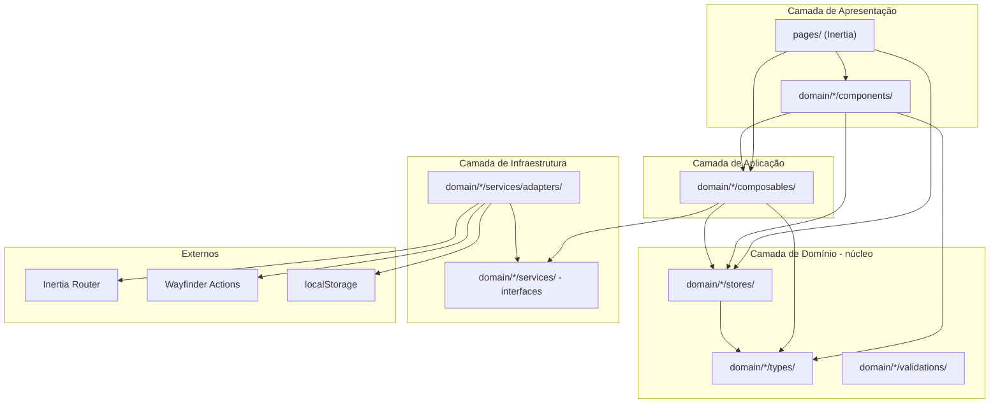
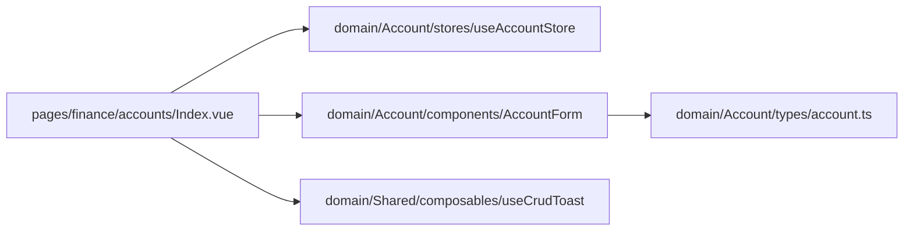
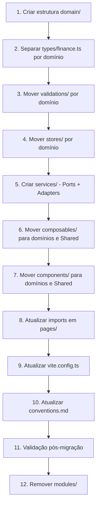

# Documento de Design — Reestruturação Frontend DDD

## Visão Geral

Este documento descreve o design técnico para migrar o frontend de `resources/js/modules/` para `resources/js/domain/`, adotando Domain-Driven Design (DDD) espelhando o backend, com Arquitetura Hexagonal (Ports & Adapters), Clean Architecture (Regra de Dependência) e práticas de Clean Code.

A migração preserva `pages/`, `actions/`, `routes/`, `wayfinder/`, `components/` (layout) e `lib/` em seus locais atuais. As páginas Inertia continuam como camada de roteamento que importa dos domínios.

---

## Arquitetura

### Diagrama de Camadas (Arquitetura Hexagonal + Clean Architecture)



### Regra de Dependência (fluxo permitido)

```
types/        → (nenhum import do domínio)
validations/  → types/
stores/       → types/
services/     → types/ (ports = interfaces puras)
composables/  → types/, stores/, services/ (ports)
components/   → composables/, stores/, types/
adapters/     → services/ (ports), bibliotecas externas
```

### Fluxo pages/ → domain/



As páginas Inertia (`resources/js/pages/`) permanecem no local atual porque o Inertia resolve páginas via `import.meta.glob('./pages/**/*.vue')` no `app.ts`. Elas funcionam como ponto de entrada que importa stores, composables e componentes dos domínios.

---

## Componentes e Interfaces

### Estrutura de Diretórios — Nova Organização

```
resources/js/
├── actions/                    # Mantido (Wayfinder)
├── components/                 # Mantido (layout + UI base)
│   ├── layouts/
│   ├── ui/
│   ├── AppContent.vue
│   ├── PageHeader.vue
│   ├── ValidatedField.vue
│   └── ...
├── composables/                # Mantido (infra da app)
│   ├── useAppearance.ts
│   ├── useCurrentUrl.ts
│   └── useInitials.ts
├── domain/                     # Raiz DDD
│   ├── Account/
│   │   ├── components/         # AccountForm.vue
│   │   ├── composables/
│   │   ├── services/           # AccountServicePort.ts
│   │   │   └── adapters/       # AccountWayfinderAdapter.ts
│   │   ├── stores/             # useAccountStore.ts
│   │   ├── types/              # account.ts
│   │   └── validations/        # account-schema.ts
│   ├── Auth/
│   │   ├── components/         # DeleteUser, PasswordInput, TwoFactor*
│   │   ├── composables/        # useTwoFactorAuth.ts
│   │   ├── services/           # TwoFactorServicePort.ts
│   │   │   └── adapters/       # TwoFactorFetchAdapter.ts
│   │   ├── stores/
│   │   ├── types/
│   │   └── validations/
│   ├── Category/               # (mesma estrutura)
│   ├── CreditCard/
│   ├── CreditCardCharge/
│   ├── CreditCardInstallment/
│   ├── FixedExpense/
│   ├── Period/
│   ├── Settings/
│   │   └── components/         # AlertError, AppearanceTabs, Heading, etc.
│   ├── Shared/
│   │   ├── components/         # DataTable, DirectionBadge, FilterBar, StatusBadge
│   │   ├── composables/        # useCrudToast, useFinanceFilters, useFlashMessages, usePagination
│   │   ├── services/           # FormatServicePort.ts
│   │   │   └── adapters/       # FormatIntlAdapter.ts
│   │   ├── stores/
│   │   ├── types/              # pagination.ts, common.ts
│   │   └── validations/
│   ├── Transaction/
│   ├── Transfer/
│   └── User/
├── lib/                        # Mantido
├── pages/                      # Mantido (Inertia)
├── routes/                     # Mantido (Wayfinder)
├── types/                      # Mantido (tipos globais)
├── wayfinder/                  # Mantido (Wayfinder)
└── app.ts                      # Mantido
```

### Port — Interface TypeScript (exemplo: Account)

Ports são interfaces puras que definem contratos de comunicação. Ficam em `services/` de cada domínio e **não importam** bibliotecas de infraestrutura.

```typescript
// resources/js/domain/Account/services/AccountServicePort.ts

import type { Account } from '../types/account';

export interface AccountServicePort {
  /** Busca lista paginada de contas */
  fetchAll(filters?: Record<string, string>): Promise<void>;

  /** Cria uma nova conta */
  create(data: { name: string; type: string; balance?: number }): Promise<void>;

  /** Atualiza uma conta existente */
  update(uid: string, data: { name: string; type: string; balance?: number }): Promise<void>;

  /** Remove uma conta */
  destroy(uid: string): Promise<void>;
}
```

### Adapter — Implementação Concreta (exemplo: Account com Wayfinder + Inertia)

Adapters implementam o Port e encapsulam a dependência de infraestrutura. Ficam em `services/adapters/`.

```typescript
// resources/js/domain/Account/services/adapters/AccountWayfinderAdapter.ts

import { router } from '@inertiajs/vue3';

import {
  destroy,
  index,
  store,
  update,
} from '@/actions/App/Domain/Account/Controllers/AccountPageController';

import type { AccountServicePort } from '../AccountServicePort';

export class AccountWayfinderAdapter implements AccountServicePort {
  async fetchAll(filters?: Record<string, string>): Promise<void> {
    router.get(index.url(), filters ?? {}, {
      preserveState: true,
      preserveScroll: true,
    });
  }

  async create(data: { name: string; type: string; balance?: number }): Promise<void> {
    router.post(store.url(), data);
  }

  async update(uid: string, data: { name: string; type: string; balance?: number }): Promise<void> {
    router.put(update.url(uid), data);
  }

  async destroy(uid: string): Promise<void> {
    router.delete(destroy.url(uid));
  }
}
```

### Port Compartilhado — Formatação (Shared)

```typescript
// resources/js/domain/Shared/services/FormatServicePort.ts

export interface FormatServicePort {
  formatCurrency(value: number): string;
  formatDate(dateString: string): string;
  formatDateTime(dateString: string): string;
}
```

```typescript
// resources/js/domain/Shared/services/adapters/FormatIntlAdapter.ts

import type { FormatServicePort } from '../FormatServicePort';

export class FormatIntlAdapter implements FormatServicePort {
  formatCurrency(value: number): string {
    return new Intl.NumberFormat('pt-BR', {
      style: 'currency',
      currency: 'BRL',
    }).format(value);
  }

  formatDate(dateString: string): string {
    return new Intl.DateTimeFormat('pt-BR').format(new Date(dateString));
  }

  formatDateTime(dateString: string): string {
    return new Intl.DateTimeFormat('pt-BR', {
      dateStyle: 'short',
      timeStyle: 'short',
    }).format(new Date(dateString));
  }
}
```

### Port Auth — Two Factor (exemplo com fetch)

```typescript
// resources/js/domain/Auth/services/TwoFactorServicePort.ts

export interface TwoFactorServicePort {
  fetchQrCode(): Promise<{ svg: string; url: string }>;
  fetchSetupKey(): Promise<{ secretKey: string }>;
  fetchRecoveryCodes(): Promise<string[]>;
}
```

```typescript
// resources/js/domain/Auth/services/adapters/TwoFactorFetchAdapter.ts

import { qrCode, recoveryCodes, secretKey } from '@/routes/two-factor';

import type { TwoFactorServicePort } from '../TwoFactorServicePort';

function getCsrfToken(): string {
  return decodeURIComponent(
    document.cookie.match(/XSRF-TOKEN=([^;]+)/)?.[1] ?? '',
  );
}

async function httpRequest<T>(route: { url: string; method: string }): Promise<T> {
  const response = await fetch(route.url, {
    method: route.method,
    headers: {
      'Accept': 'application/json',
      'X-Requested-With': 'XMLHttpRequest',
      'X-XSRF-TOKEN': getCsrfToken(),
    },
    credentials: 'same-origin',
  });

  if (!response.ok) {
    throw new Error(`HTTP ${response.status}`);
  }

  return response.json() as Promise<T>;
}

export class TwoFactorFetchAdapter implements TwoFactorServicePort {
  async fetchQrCode(): Promise<{ svg: string; url: string }> {
    return httpRequest(qrCode());
  }

  async fetchSetupKey(): Promise<{ secretKey: string }> {
    return httpRequest(secretKey());
  }

  async fetchRecoveryCodes(): Promise<string[]> {
    return httpRequest(recoveryCodes());
  }
}
```

### Store — Exemplo Refatorado (Account)

Stores ficam na Camada de Domínio. Importam apenas de `types/`.

```typescript
// resources/js/domain/Account/stores/useAccountStore.ts

import { defineStore } from 'pinia';
import { ref } from 'vue';

import type { Account } from '../types/account';

export const useAccountStore = defineStore('account', () => {
  const isModalOpen = ref(false);
  const modalMode = ref<'create' | 'edit' | 'view'>('create');
  const currentItem = ref<Account | null>(null);
  const deletingUid = ref<string | null>(null);

  function openCreateModal() {
    currentItem.value = null;
    modalMode.value = 'create';
    isModalOpen.value = true;
  }

  function openEditModal(item: Account) {
    currentItem.value = item;
    modalMode.value = 'edit';
    isModalOpen.value = true;
  }

  function openViewModal(item: Account) {
    currentItem.value = item;
    modalMode.value = 'view';
    isModalOpen.value = true;
  }

  function closeModal() {
    isModalOpen.value = false;
    setTimeout(() => {
      currentItem.value = null;
      modalMode.value = 'create';
    }, 200);
  }

  return {
    isModalOpen,
    modalMode,
    currentItem,
    deletingUid,
    openCreateModal,
    openEditModal,
    openViewModal,
    closeModal,
  };
});
```

### Composable — Exemplo com Injeção de Dependência

Composables ficam na Camada de Aplicação. Recebem adapters via parâmetro (Inversão de Controle).

```typescript
// resources/js/domain/Shared/composables/useFinanceFilters.ts

import { ref } from 'vue';

export interface NavigationPort {
  navigate(url: string, params: Record<string, unknown>, options?: Record<string, boolean>): void;
}

export function useFinanceFilters(
  initialFilters: Record<string, string> = {},
  navigation: NavigationPort,
) {
  const filters = ref({ ...initialFilters });

  function applyFilters(routeUrl: string) {
    const cleanFilters = Object.fromEntries(
      Object.entries(filters.value).filter(([, v]) => v !== null && v !== ''),
    );
    navigation.navigate(routeUrl, cleanFilters, { preserveState: true, preserveScroll: true });
  }

  function resetFilters(routeUrl: string) {
    filters.value = { ...initialFilters };
    navigation.navigate(routeUrl, {}, { preserveState: true });
  }

  return { filters, applyFilters, resetFilters };
}
```

```typescript
// resources/js/domain/Shared/services/adapters/InertiaNavigationAdapter.ts

import { router } from '@inertiajs/vue3';

import type { NavigationPort } from '../../composables/useFinanceFilters';

export class InertiaNavigationAdapter implements NavigationPort {
  navigate(url: string, params: Record<string, unknown>, options?: Record<string, boolean>): void {
    router.get(url, params, options);
  }
}
```

### Componente — Exemplo Consumindo Store e Validação

```vue
<!-- resources/js/domain/Account/components/AccountForm.vue -->
<script setup lang="ts">
import { computed } from 'vue';

import { store, update } from '@/actions/App/Domain/Account/Controllers/AccountPageController';
import { Button } from '@/components/ui/button';
import { Input } from '@/components/ui/input';
import ValidatedField from '@/components/ValidatedField.vue';
import ValidatedInertiaForm from '@/components/ValidatedInertiaForm.vue';

import type { Account } from '../types/account';
import { accountSchema } from '../validations/account-schema';

const props = defineProps<{
  item?: Account;
  readonly?: boolean;
}>();

const emit = defineEmits<{
  success: [];
  cancel: [];
}>();

const isEditing = computed(() => !!props.item);
const action = computed(() =>
  isEditing.value ? update.url(props.item!.uid) : store.url(),
);
const method = computed(() => (isEditing.value ? 'put' : 'post'));

const initialValues = computed(() => ({
  name: props.item?.name ?? '',
  type: props.item?.type ?? 'CHECKING',
  balance: props.item?.balance ?? 0,
}));
</script>
```

**Decisão de design**: Componentes de formulário continuam importando Wayfinder actions diretamente para construir URLs de submissão. Isso é aceitável porque:
1. O componente delega a submissão real ao `ValidatedInertiaForm` (infraestrutura de UI)
2. As actions do Wayfinder são funções puras que retornam URLs tipadas — não executam I/O
3. Forçar injeção de URLs via props adicionaria complexidade sem benefício real

### Convenção de Ordem de Imports

Cada arquivo deve seguir esta ordem, separada por linhas em branco:

```typescript
// 1. Dependências externas (vue, pinia, zod, lucide, etc.)
import { defineStore } from 'pinia';
import { ref } from 'vue';

// 2. Imports da aplicação (@/actions, @/components, @/routes, @/types)
import { index } from '@/actions/App/Domain/Account/Controllers/AccountPageController';
import PageHeader from '@/components/PageHeader.vue';

// 3. Imports do domínio Shared
import { useCrudToast } from '@/domain/Shared/composables/useCrudToast';
import type { PaginationMeta } from '@/domain/Shared/types/pagination';

// 4. Imports do próprio domínio (caminho relativo)
import type { Account } from '../types/account';
import { accountSchema } from '../validations/account-schema';
```

### Convenção de Nomenclatura de Arquivos por Camada

| Camada | Padrão | Exemplo |
|---|---|---|
| `types/` | kebab-case, nome da entidade | `account.ts`, `credit-card.ts` |
| `stores/` | camelCase com prefixo `use` | `useAccountStore.ts` |
| `validations/` | kebab-case com sufixo `-schema` | `account-schema.ts` |
| `services/` | PascalCase com sufixo `Port` | `AccountServicePort.ts` |
| `services/adapters/` | PascalCase com sufixo do tipo | `AccountWayfinderAdapter.ts` |
| `composables/` | camelCase com prefixo `use` | `useCrudToast.ts` |
| `components/` | PascalCase | `AccountForm.vue` |

---

## Modelos de Dados

### Separação de Types por Domínio

O arquivo monolítico `resources/js/modules/finance/types/finance.ts` será dividido em arquivos por domínio:

| Arquivo Atual | Tipos | Destino |
|---|---|---|
| `finance.ts` | `Account`, `AccountType` | `domain/Account/types/account.ts` |
| `finance.ts` | `Category` | `domain/Category/types/category.ts` |
| `finance.ts` | `Transaction`, `TransactionStatus`, `TransactionSource` | `domain/Transaction/types/transaction.ts` |
| `finance.ts` | `Transfer` | `domain/Transfer/types/transfer.ts` |
| `finance.ts` | `FixedExpense` | `domain/FixedExpense/types/fixed-expense.ts` |
| `finance.ts` | `CreditCard`, `CardType` | `domain/CreditCard/types/credit-card.ts` |
| `finance.ts` | `CreditCardCharge` | `domain/CreditCardCharge/types/credit-card-charge.ts` |
| `finance.ts` | `CreditCardInstallment` | `domain/CreditCardInstallment/types/credit-card-installment.ts` |
| `finance.ts` | `Period`, `PeriodSummary`, `InitializationResult` | `domain/Period/types/period.ts` |
| `finance.ts` | `PaginationMeta` | `domain/Shared/types/pagination.ts` |
| `finance.ts` | `Direction` | `domain/Shared/types/common.ts` |

### Tratamento de Referências Cruzadas entre Types

Alguns tipos referenciam entidades de outros domínios (ex: `Transaction` referencia `Account` e `Category`). Para respeitar a Regra de Dependência:

**Estratégia**: Tipos compartilhados (`Direction`) ficam em `domain/Shared/types/`. Referências a entidades de outros domínios dentro de interfaces são substituídas por tipos inline simplificados:

```typescript
// resources/js/domain/Shared/types/common.ts
export type Direction = 'INFLOW' | 'OUTFLOW';
```

```typescript
// resources/js/domain/Transaction/types/transaction.ts
import type { Direction } from '@/domain/Shared/types/common';

export type TransactionStatus = 'PENDING' | 'PAID' | 'OVERDUE';
export type TransactionSource = 'MANUAL' | 'CREDIT_CARD' | 'FIXED' | 'TRANSFER';

export interface Transaction {
  uid: string;
  amount: number;
  direction: Direction;
  status: TransactionStatus;
  source: TransactionSource;
  description: string | null;
  occurred_at: string;
  due_date: string | null;
  paid_at: string | null;
  account?: { uid: string; name: string };
  category?: { uid: string; name: string };
}
```

**Decisão de design**: Referências como `account?: Account` em `Transaction` são substituídas por `account?: { uid: string; name: string }`. Isso evita acoplamento entre domínios. O backend retorna esses dados via Inertia props como objetos simples, então tipos inline refletem melhor a realidade.

### Tipos Globais (permanecem em `resources/js/types/`)

Não são movidos pois são tipos de infraestrutura: `auth.ts`, `global.d.ts`, `index.ts`, `navigation.ts`, `ui.ts`, `vue-shims.d.ts`, `auto-imports.d.ts`, `components.d.ts`.

---

## Propriedades de Corretude

*Uma propriedade é uma característica ou comportamento que deve ser verdadeiro em todas as execuções válidas de um sistema — essencialmente, uma declaração formal sobre o que o sistema deve fazer. Propriedades servem como ponte entre especificações legíveis por humanos e garantias de corretude verificáveis por máquina.*

### Property 1: Estrutura de subpastas por domínio

*Para qualquer* domínio em `resources/js/domain/`, ele deve conter exatamente as 6 subpastas padronizadas: `stores/`, `components/`, `services/`, `composables/`, `types/` e `validations/`.

**Validates: Requirements 1.5, 15.6**

### Property 2: Regra de Dependência entre camadas

*Para qualquer* arquivo dentro de um domínio, seus imports devem respeitar a hierarquia de camadas: arquivos em `types/` não importam de nenhuma outra pasta do domínio; arquivos em `stores/` importam apenas de `types/`; arquivos em `composables/` importam apenas de `types/`, `stores/` e `services/` (ports); arquivos em `components/` importam apenas de `composables/`, `stores/` e `types/`; arquivos em `services/adapters/` são os únicos que importam bibliotecas de infraestrutura (Inertia, Wayfinder, localStorage).

**Validates: Requirements 14.4, 14.6, 16.1, 16.3, 16.4, 16.5, 16.6**

### Property 3: Isolamento entre domínios via Shared

*Para qualquer* arquivo em `resources/js/domain/<X>/`, todos os imports de outros domínios devem referenciar exclusivamente `resources/js/domain/Shared/`. Nenhum domínio importa diretamente de outro domínio que não seja Shared.

**Validates: Requirements 16.7, 16.8**

### Property 4: Adapters implementam Ports

*Para qualquer* arquivo em `services/adapters/` de qualquer domínio, ele deve importar e implementar (via `implements`) a interface Port correspondente definida no diretório `services/` pai.

**Validates: Requirements 14.2, 14.5**

### Property 5: Ordem de imports consistente

*Para qualquer* arquivo `.ts` ou `.vue` dentro de `resources/js/domain/`, os imports devem seguir a ordem: (1) dependências externas, (2) imports da aplicação (`@/actions`, `@/components`, `@/routes`, `@/types`), (3) imports do domínio Shared, (4) imports do próprio domínio (relativos).

**Validates: Requirements 15.9**

### Property 6: Limites de tamanho de código

*Para qualquer* função dentro de `resources/js/domain/`, o corpo deve ter no máximo 30 linhas de código executável. *Para qualquer* arquivo `.vue` dentro de `resources/js/domain/`, o bloco `<script setup>` deve ter no máximo 200 linhas.

**Validates: Requirements 15.3, 15.7**

---

## Tratamento de Erros

### Padrão Consistente por Camada

| Camada | Tipo de Erro | Tratamento |
|---|---|---|
| `validations/` | Erros de validação | Zod schemas com mensagens em pt-BR. Erros propagados via VeeValidate ao componente. |
| `services/adapters/` | Erros de API/rede | Capturados no adapter. Erros HTTP propagados como exceções tipadas. |
| `composables/` | Erros de caso de uso | Composable `useCrudToast` exibe toast via `vue-sonner`. Erros de validação tratados pelo Zod, erros de API pelo toast. |
| `components/` | Erros de UI | Componentes exibem estados de erro via props. Não tratam erros diretamente — delegam ao composable. |
| `stores/` | Erros de estado | Stores não tratam erros. Erros são tratados pelo composable que orquestra a operação. |

### Exemplo de Fluxo de Erro

```
Usuário submete formulário inválido
  → Zod rejeita no ValidatedInertiaForm
  → VeeValidate exibe mensagens nos campos

Usuário submete formulário válido, API retorna erro
  → Inertia propaga erro via onError callback
  → useCrudToast exibe toast de erro
  → Store não é afetada (estado preservado)
```

---

## Estratégia de Testes

### Abordagem

Esta feature é uma **reestruturação de arquivos e imports** — não introduz lógica de negócio nova. A estratégia de testes foca em:

1. **Validação de build** (`npm run build`) — garante que todos os imports resolvem corretamente
2. **Type checking** (`npm run types:check`) — garante que tipos estão corretos após a separação
3. **Linting** (`npm run lint`) — garante que convenções de código são mantidas
4. **Testes existentes** (`php artisan test --compact`) — garante que nenhuma funcionalidade foi quebrada
5. **Testes de propriedade** — validam as propriedades arquiteturais definidas acima

### Testes de Propriedade (PBT)

As propriedades de corretude são verificáveis via análise estática de imports e estrutura de diretórios.

- **Biblioteca**: Vitest com `fast-check` para geração de dados quando aplicável
- **Mínimo 100 iterações** por teste de propriedade
- **Tag**: `Feature: frontend-ddd-restructure, Property {N}: {título}`

As propriedades 1-5 são verificáveis por análise estática de filesystem e AST de imports. A propriedade 6 requer parsing de arquivos para contagem de linhas.

### Testes Unitários (exemplos específicos)

- Verificar que cada arquivo listado nos requisitos 2-8 existe no destino correto
- Verificar que `resources/js/modules/` não existe após migração completa
- Verificar que `vite.config.ts` referencia os novos caminhos de `domain/`
- Verificar que `conventions.md` referencia `domain/` em vez de `modules/`

---

## Estratégia de Migração

### Ordem de Operações

A migração segue uma ordem que minimiza quebras intermediárias:



### Detalhamento por Fase

**Fase 1 — Criar estrutura de diretórios**
- Criar `resources/js/domain/` e todos os 13 domínios (12 + Shared)
- Criar as 6 subpastas em cada domínio

**Fase 2 — Separar types**
- Dividir `finance.ts` em arquivos por domínio
- Criar `Shared/types/pagination.ts` e `Shared/types/common.ts`
- Manter `resources/js/types/` inalterado

**Fase 3 — Mover validations**
- Mover cada `*-schema.ts` para o domínio correspondente
- Atualizar imports relativos para os novos tipos

**Fase 4 — Mover stores**
- Mover cada `use*Store.ts` para o domínio correspondente
- Atualizar imports de types para caminhos relativos

**Fase 5 — Criar services (Ports + Adapters)**
- Criar interfaces Port para domínios que comunicam com API
- Criar Adapters concretos (Wayfinder, Inertia, fetch)
- Criar Ports/Adapters compartilhados em Shared

**Fase 6 — Mover composables**
- Mover `useTwoFactorAuth.ts` para `domain/Auth/composables/`
- Mover composables compartilhados para `domain/Shared/composables/`
- Refatorar para injeção de dependência onde aplicável

**Fase 7 — Mover components**
- Mover formulários para domínios correspondentes
- Mover componentes compartilhados para `domain/Shared/components/`
- Mover componentes de settings e auth para seus domínios

**Fase 8 — Atualizar imports em pages/**
- Atualizar todos os imports em `resources/js/pages/` de `@/modules/` para `@/domain/`
- Verificar que nenhum import antigo permanece

**Fase 9 — Atualizar vite.config.ts**
- Substituir os diretórios do `unplugin-vue-components`:

```typescript
// ANTES
Components({
  dirs: [
    './resources/js/components',
    './resources/js/components/ui',
    './resources/js/components/shared',
    './resources/js/components/layouts',
    './resources/js/modules/auth/components',
    './resources/js/modules/settings/components',
  ],
})

// DEPOIS
Components({
  dirs: [
    './resources/js/components',
    './resources/js/components/ui',
    './resources/js/components/shared',
    './resources/js/components/layouts',
    './resources/js/domain/Auth/components',
    './resources/js/domain/Settings/components',
  ],
})
```

**Fase 10 — Atualizar documentação**
- Atualizar `conventions.md` substituindo `modules/` por `domain/`
- Documentar a nova estrutura DDD e convenções de camadas

**Fase 11 — Validação pós-migração**
- `npm run types:check` — zero erros TypeScript
- `npm run lint` — zero erros ESLint
- `npm run build` — build sem erros
- `php artisan test --compact` — testes existentes passando

**Fase 12 — Remover estrutura antiga**
- Remover `resources/js/modules/` e todos os subdiretórios
- Verificar que nenhum import referencia `@/modules/`

### Período de Transição

Durante a migração, ambas as estruturas (`modules/` e `domain/`) coexistem temporariamente. Para evitar imports duplicados:

1. Migrar um domínio por vez (types → validations → store → components)
2. Após mover cada arquivo, atualizar imediatamente todos os imports consumidores
3. Usar `npm run types:check` após cada domínio para validar
4. Só remover `modules/` quando todos os domínios estiverem migrados e validados
