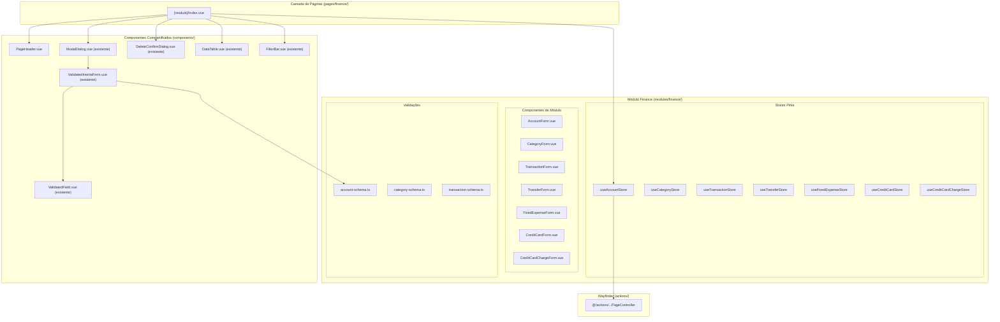
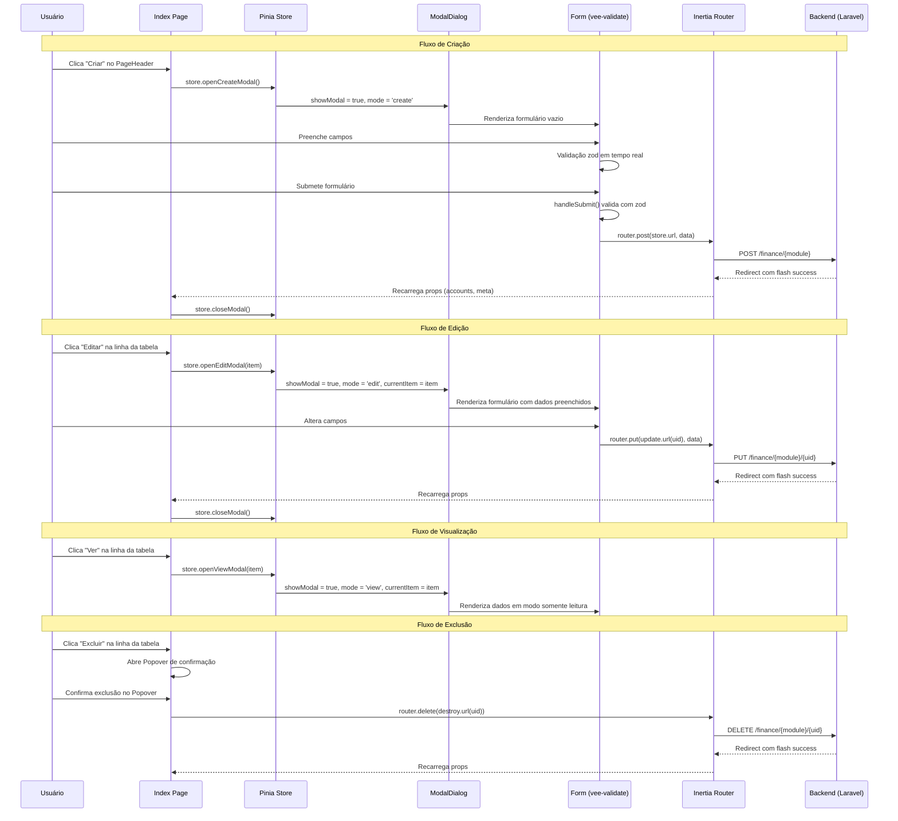
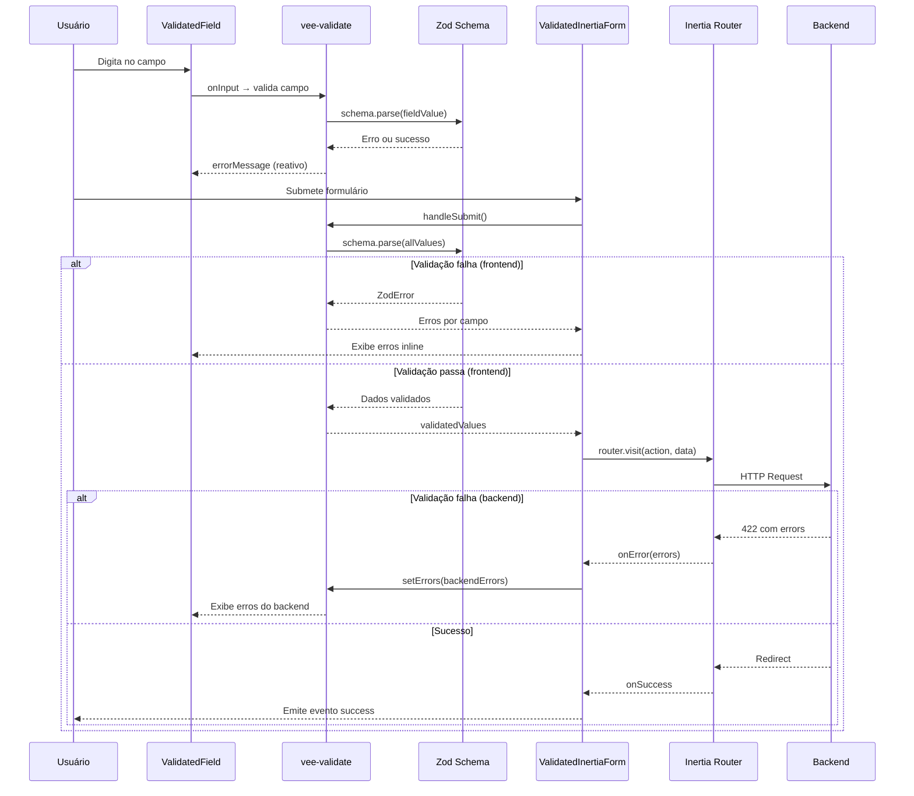
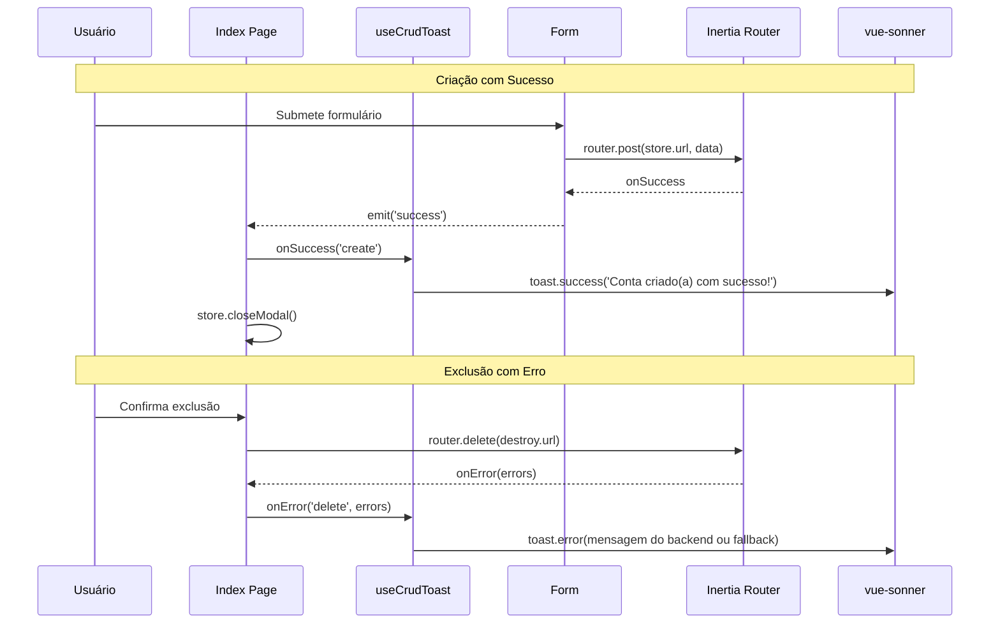

# Documento de Design: Sistema CRUD Frontend Modular

## Visão Geral

O sistema CRUD Frontend Modular é uma refatoração arquitetural do frontend do Himel App que transforma as páginas CRUD atuais (Create/Edit em páginas separadas com `confirm()` nativo para exclusão) em um sistema baseado em modais reutilizáveis, com stores Pinia por módulo, validação vee-validate + zod, confirmação de exclusão via popover (estilo shadcn), e rotas Wayfinder tipadas. O objetivo é eliminar navegação desnecessária entre páginas para operações CRUD, centralizar o estado de cada módulo em stores Pinia dedicadas, e criar componentes genéricos reutilizáveis que sirvam todos os módulos financeiros.

A arquitetura atual possui cada módulo com páginas separadas para Create e Edit (ex: `pages/finance/accounts/Create.vue`, `Edit.vue`), usa `confirm()` nativo do browser para exclusão, URLs hardcoded em strings, e não possui stores Pinia. A nova arquitetura manterá a página Index como ponto central de cada módulo, abrindo modais para Create, Edit e View, com um componente de confirmação de exclusão via popover, formulários validados com vee-validate + zod, e todas as rotas via Wayfinder.

## Arquitetura

A arquitetura segue o padrão modular já existente em `resources/js/modules/finance/`, expandindo-o com stores Pinia e componentes genéricos compartilhados.



## Diagramas de Sequência

### Fluxo CRUD Completo (Index → Modal → Ação)



### Fluxo de Validação (vee-validate + zod + Inertia)



## Componentes e Interfaces

### Componente 1: PageHeader

**Propósito**: Componente de cabeçalho reutilizável para todas as páginas Index de módulos CRUD. Exibe título, breadcrumbs (via AppLayout) e botão de ação primária (ex: "Criar").

**Interface**:
```typescript
// Props
interface PageHeaderProps {
  title: string
  buttonLabel: string
  buttonIcon?: Component  // Lucide icon component
}

// Emits
interface PageHeaderEmits {
  (e: 'action'): void
}
```

**Responsabilidades**:
- Renderizar título da página com estilo consistente (`text-2xl font-semibold`)
- Renderizar botão de ação primária com ícone opcional
- Emitir evento `action` ao clicar no botão
- Manter layout flex com `justify-between`

### Componente 2: ModalDialog (existente — aprimorar)

**Propósito**: Modal genérico com conteúdo dinâmico via slots. Já existe em `components/ui/modal/ModalDialog.vue`, será aprimorado com prop `subtitle` e melhor controle de abertura/fechamento.

**Interface**:
```typescript
// Props
interface ModalDialogProps {
  title: string
  subtitle?: string
}

// Expose
interface ModalDialogExpose {
  openDialog: () => void
  closeDialog: () => void
}

// Slots
// default: conteúdo dinâmico do modal
```

**Responsabilidades**:
- Renderizar Dialog do shadcn/vue com título e subtítulo
- Expor métodos `openDialog()` e `closeDialog()` via `defineExpose`
- Aceitar conteúdo dinâmico via slot default
- Usado para Create, Edit e View

### Componente 3: DeleteConfirmPopover (novo)

**Propósito**: Componente de confirmação de exclusão usando Popover do shadcn (não Dialog). Aparece inline na linha da tabela ao clicar no botão de excluir.

**Interface**:
```typescript
// Props
interface DeleteConfirmPopoverProps {
  title?: string       // default: "Tem certeza?"
  description?: string // default: "Esta ação não pode ser desfeita."
  loading?: boolean
}

// Emits
interface DeleteConfirmPopoverEmits {
  (e: 'confirm'): void
  (e: 'cancel'): void
}

// Slots
// trigger: botão que abre o popover
```

**Responsabilidades**:
- Renderizar Popover do shadcn/vue com mensagem de confirmação
- Exibir botões "Cancelar" e "Excluir" dentro do popover
- Emitir `confirm` ao clicar em "Excluir"
- Emitir `cancel` ao clicar em "Cancelar"
- Aceitar slot `trigger` para o botão que abre o popover
- Exibir estado de loading no botão "Excluir"

### Componente 4: DataTable (existente — manter)

**Propósito**: Tabela genérica com colunas dinâmicas e slots para células customizadas. Já funciona bem, será mantido como está.

**Interface existente**:
```typescript
interface Column {
  key: string
  label: string
}

interface DataTableProps {
  columns: Column[]
  data: Record<string, unknown>[]
  loading?: boolean
}
```

### Componente 5: Formulários de Módulo (existentes — refatorar)

**Propósito**: Cada módulo possui seu formulário específico (AccountForm, CategoryForm, etc.). Serão refatorados para funcionar tanto em modo create quanto edit, e serem renderizados dentro do ModalDialog.

**Interface padrão para formulários**:
```typescript
// Props padrão de todo formulário de módulo
interface ModuleFormProps<T> {
  item?: T           // Se presente, modo edição; se ausente, modo criação
  readonly?: boolean // Se true, modo visualização (campos desabilitados)
}

// Emits padrão
interface ModuleFormEmits {
  (e: 'success'): void
  (e: 'cancel'): void
}
```

## Modelos de Dados

### Store Pinia Genérico por Módulo

Cada módulo financeiro terá seu próprio store Pinia seguindo um padrão consistente:

```typescript
// Padrão base para todos os stores de módulo
interface ModuleStoreState<T> {
  // Estado do modal
  isModalOpen: boolean
  modalMode: 'create' | 'edit' | 'view'
  currentItem: T | null

  // Estado de exclusão
  deletingUid: string | null
}

interface ModuleStoreActions<T> {
  // Controle do modal
  openCreateModal: () => void
  openEditModal: (item: T) => void
  openViewModal: (item: T) => void
  closeModal: () => void

  // Exclusão
  deleteItem: (uid: string) => void
}
```

### Tipos existentes (manter)

Os tipos em `modules/finance/types/finance.ts` já estão bem definidos e serão reutilizados:

```typescript
// Já existentes — não alterar
interface Account { uid: string; name: string; type: AccountType; balance: number; created_at: string }
interface Category { uid: string; name: string; direction: Direction; created_at: string }
interface Transaction { uid: string; amount: number; direction: Direction; status: TransactionStatus; /* ... */ }
interface Transfer { uid: string; amount: number; occurred_at: string; /* ... */ }
interface FixedExpense { uid: string; description: string; amount: number; due_day: number; active: boolean; /* ... */ }
interface CreditCard { uid: string; name: string; closing_day: number; due_day: number; /* ... */ }
interface CreditCardCharge { uid: string; description: string; total_amount: number; installments: number; /* ... */ }
interface PaginationMeta { current_page: number; per_page: number; total: number; last_page: number }
```

### Tipo RouteDefinition (Wayfinder)

```typescript
// Já existente via Wayfinder — importar de @/wayfinder
interface RouteDefinition<M extends string> {
  url: string
  method: M
}
```

## Pseudocódigo Algorítmico

### Algoritmo: Inicialização da Página Index de Módulo

```typescript
// Padrão que toda página Index de módulo DEVE seguir
function setupModuleIndexPage<T>(
  props: { items: T[]; meta: PaginationMeta; filters: Record<string, string> },
  moduleConfig: {
    moduleName: string
    columns: Column[]
    breadcrumbs: BreadcrumbItem[]
    storeFactory: () => ModuleStore<T>
    destroyAction: (uid: string) => RouteDefinition<'delete'>
    indexAction: () => RouteDefinition<'get'>
  }
) {
  // Pré-condições:
  // - props.items é array válido (pode ser vazio)
  // - props.meta contém dados de paginação válidos
  // - moduleConfig.storeFactory retorna store Pinia válido

  // 1. Inicializar store do módulo
  const store = moduleConfig.storeFactory()

  // 2. Inicializar filtros e paginação
  const { filters, applyFilters, resetFilters } = useFinanceFilters(props.filters)
  const { goToPage } = usePagination()

  // 3. Handler de exclusão com Wayfinder
  function handleDelete(uid: string) {
    store.deletingUid = uid
    const route = moduleConfig.destroyAction(uid)
    router.delete(route.url, {
      onSuccess: () => {
        store.deletingUid = null
        toast.success('Excluído com sucesso!')
      },
      onError: (errors) => {
        store.deletingUid = null
        toast.error(Object.values(errors)[0] as string)
      },
    })
  }

  // Pós-condições:
  // - store está inicializado e reativo
  // - filtros estão sincronizados com query params da URL
  // - handlers de CRUD estão prontos para uso

  return { store, filters, applyFilters, resetFilters, goToPage, handleDelete }
}
```

### Algoritmo: Store Pinia de Módulo

```typescript
// Implementação padrão de store Pinia para cada módulo
function defineModuleStore<T extends { uid: string }>(moduleName: string) {
  return defineStore(`finance-${moduleName}`, () => {
    // Estado
    const isModalOpen = ref(false)
    const modalMode = ref<'create' | 'edit' | 'view'>('create')
    const currentItem = ref<T | null>(null)
    const deletingUid = ref<string | null>(null)

    // Pré-condição para openEditModal/openViewModal:
    // - item DEVE ter uid válido (string não vazia)
    // Pós-condição:
    // - isModalOpen === true
    // - modalMode reflete a ação solicitada
    // - currentItem contém o item (edit/view) ou null (create)

    function openCreateModal() {
      currentItem.value = null
      modalMode.value = 'create'
      isModalOpen.value = true
    }

    function openEditModal(item: T) {
      // Pré-condição: item.uid !== ''
      currentItem.value = item
      modalMode.value = 'edit'
      isModalOpen.value = true
    }

    function openViewModal(item: T) {
      // Pré-condição: item.uid !== ''
      currentItem.value = item
      modalMode.value = 'view'
      isModalOpen.value = true
    }

    function closeModal() {
      isModalOpen.value = false
      // Delay para animação de fechamento do Dialog
      setTimeout(() => {
        currentItem.value = null
        modalMode.value = 'create'
      }, 200)
    }

    // Invariante de loop: N/A (sem loops)
    // Invariante de estado: se isModalOpen === false, então currentItem será null após timeout

    return {
      isModalOpen,
      modalMode,
      currentItem,
      deletingUid,
      openCreateModal,
      openEditModal,
      openViewModal,
      closeModal,
    }
  })
}
```

### Algoritmo: Submissão de Formulário com Validação Dupla

```typescript
// Fluxo de submissão usado pelo ValidatedInertiaForm (já existente)
// Documentado aqui para referência da integração com modais

function submitFormWithValidation(
  schema: ZodSchema,
  values: Record<string, unknown>,
  action: string,
  method: 'post' | 'put' | 'patch',
  callbacks: {
    onSuccess: () => void
    onError: (errors: Record<string, string>) => void
  }
) {
  // Pré-condições:
  // - schema é um ZodSchema válido
  // - action é uma URL válida (gerada via Wayfinder)
  // - method é um método HTTP válido para a operação

  // Passo 1: Validação frontend (zod via vee-validate)
  const parseResult = schema.safeParse(values)
  if (!parseResult.success) {
    // Pós-condição: erros exibidos inline nos campos
    const fieldErrors = parseResult.error.flatten().fieldErrors
    callbacks.onError(flattenErrors(fieldErrors))
    return
  }

  // Passo 2: Envio via Inertia
  router.visit(action, {
    method,
    data: parseResult.data,
    onSuccess: (page) => {
      // Passo 3: Verificar erros do backend (422)
      const backendErrors = page.props?.errors
      if (backendErrors && Object.keys(backendErrors).length > 0) {
        callbacks.onError(flattenErrors(backendErrors))
        return
      }
      // Pós-condição: modal fechado, dados recarregados via Inertia
      callbacks.onSuccess()
    },
    onError: (errors) => {
      callbacks.onError(flattenErrors(errors))
    },
  })

  // Pós-condições:
  // - Se sucesso: página recarregada com dados atualizados
  // - Se erro frontend: erros exibidos inline, nenhuma requisição feita
  // - Se erro backend: erros do servidor exibidos inline nos campos
}
```

## Funções-Chave com Especificações Formais

### Função 1: useModuleStore()

```typescript
function useModuleStore<T extends { uid: string }>(moduleName: string): ModuleStore<T>
```

**Pré-condições:**
- `moduleName` é string não vazia e corresponde a um módulo financeiro válido
- Pinia está instalado e ativo na aplicação Vue

**Pós-condições:**
- Retorna store Pinia reativo com estado e ações do módulo
- Estado inicial: `isModalOpen = false`, `modalMode = 'create'`, `currentItem = null`
- Store é singleton por módulo (chamadas subsequentes retornam mesma instância)

**Invariantes de Loop:** N/A

### Função 2: handleDelete()

```typescript
function handleDelete(uid: string, destroyRoute: RouteDefinition<'delete'>): void
```

**Pré-condições:**
- `uid` é string UUID v4 válida e não vazia
- `destroyRoute` contém URL válida gerada via Wayfinder
- Usuário confirmou exclusão via DeleteConfirmPopover

**Pós-condições:**
- Se sucesso: item removido da lista, toast de sucesso exibido
- Se erro: toast de erro exibido com mensagem do backend
- `deletingUid` retorna a `null` em ambos os casos

**Invariantes de Loop:** N/A

### Função 3: openModal() (create/edit/view)

```typescript
function openCreateModal(): void
function openEditModal(item: T): void
function openViewModal(item: T): void
```

**Pré-condições:**
- Para `openEditModal`/`openViewModal`: `item` não é null e possui `uid` válido
- Para `openCreateModal`: nenhuma pré-condição adicional

**Pós-condições:**
- `isModalOpen === true`
- `modalMode` reflete a operação ('create' | 'edit' | 'view')
- `currentItem` é `null` para create, ou o item passado para edit/view
- Dialog do shadcn/vue é renderizado com conteúdo apropriado

**Invariantes de Loop:** N/A

## Exemplo de Uso

### Página Index completa de um módulo (Account como exemplo)

```typescript
// pages/finance/accounts/Index.vue
<script setup lang="ts">
import AppLayout from '@/components/layouts/AppLayout.vue'
import PageHeader from '@/components/PageHeader.vue'
import DataTable from '@/modules/finance/components/DataTable.vue'
import FilterBar from '@/modules/finance/components/FilterBar.vue'
import DeleteConfirmPopover from '@/components/DeleteConfirmPopover.vue'
import AccountForm from '@/modules/finance/components/AccountForm.vue'
import { ModalDialog } from '@/components/ui/modal'
import { useAccountStore } from '@/modules/finance/stores/useAccountStore'
import { useFinanceFilters } from '@/modules/finance/composables/useFinanceFilters'
import { usePagination } from '@/modules/finance/composables/usePagination'
import { formatCurrency } from '@/modules/finance/services/finance.services'
import type { Account, PaginationMeta } from '@/modules/finance/types/finance'
import type { BreadcrumbItem } from '@/types'
import { Button } from '@/components/ui/button'
import { router } from '@inertiajs/vue3'
import { destroy } from '@/actions/App/Domain/Account/Controllers/AccountPageController'
import { index } from '@/actions/App/Domain/Account/Controllers/AccountPageController'
import { Plus, Eye, Pencil, Trash2 } from 'lucide-vue-next'
import { toast } from 'vue-sonner'

const props = defineProps<{
  accounts: Account[]
  meta: PaginationMeta
  filters: Record<string, string>
}>()

const breadcrumbs: BreadcrumbItem[] = [
  { title: 'Financeiro', href: '/finance' },
  { title: 'Contas', href: index.url() },
]

const columns = [
  { key: 'name', label: 'Nome' },
  { key: 'type', label: 'Tipo' },
  { key: 'balance', label: 'Saldo' },
  { key: 'actions', label: '' },
]

const store = useAccountStore()
const { filters, applyFilters, resetFilters } = useFinanceFilters(props.filters)
const { goToPage } = usePagination()

const modalRef = ref<InstanceType<typeof ModalDialog> | null>(null)

// Watchers para controlar o modal via store
watch(() => store.isModalOpen, (open) => {
  if (open) modalRef.value?.openDialog()
  else modalRef.value?.closeDialog()
})

const modalTitle = computed(() => {
  if (store.modalMode === 'create') return 'Nova Conta'
  if (store.modalMode === 'edit') return 'Editar Conta'
  return 'Detalhes da Conta'
})

function handleDelete(uid: string) {
  store.deletingUid = uid
  router.delete(destroy.url(uid), {
    onSuccess: () => {
      store.deletingUid = null
      toast.success('Conta excluída com sucesso!')
    },
    onError: (errors) => {
      store.deletingUid = null
      toast.error(Object.values(errors)[0] as string)
    },
  })
}
</script>
```

### Store Pinia de módulo (Account como exemplo)

```typescript
// modules/finance/stores/useAccountStore.ts
import { defineStore } from 'pinia'
import { ref } from 'vue'
import type { Account } from '../types/finance'

export const useAccountStore = defineStore('finance-accounts', () => {
  const isModalOpen = ref(false)
  const modalMode = ref<'create' | 'edit' | 'view'>('create')
  const currentItem = ref<Account | null>(null)
  const deletingUid = ref<string | null>(null)

  function openCreateModal() {
    currentItem.value = null
    modalMode.value = 'create'
    isModalOpen.value = true
  }

  function openEditModal(item: Account) {
    currentItem.value = item
    modalMode.value = 'edit'
    isModalOpen.value = true
  }

  function openViewModal(item: Account) {
    currentItem.value = item
    modalMode.value = 'view'
    isModalOpen.value = true
  }

  function closeModal() {
    isModalOpen.value = false
    setTimeout(() => {
      currentItem.value = null
      modalMode.value = 'create'
    }, 200)
  }

  return {
    isModalOpen, modalMode, currentItem, deletingUid,
    openCreateModal, openEditModal, openViewModal, closeModal,
  }
})
```

### Formulário refatorado para funcionar no modal

```typescript
// modules/finance/components/AccountForm.vue (refatorado)
<script setup lang="ts">
import ValidatedInertiaForm from '@/components/ValidatedInertiaForm.vue'
import ValidatedField from '@/components/ValidatedField.vue'
import { Input } from '@/components/ui/input'
import { Button } from '@/components/ui/button'
import { Select, SelectContent, SelectItem, SelectTrigger, SelectValue } from '@/components/ui/select'
import { accountSchema } from '../validations/account-schema'
import { store, update } from '@/actions/App/Domain/Account/Controllers/AccountPageController'
import type { Account } from '../types/finance'

const props = defineProps<{
  item?: Account
  readonly?: boolean
}>()

const emit = defineEmits<{
  success: []
  cancel: []
}>()

const isEditing = computed(() => !!props.item)
const action = computed(() =>
  isEditing.value ? update.url(props.item!.uid) : store.url()
)
const method = computed(() => isEditing.value ? 'put' : 'post')

const initialValues = computed(() => ({
  name: props.item?.name ?? '',
  type: props.item?.type ?? 'CHECKING',
  balance: props.item?.balance ?? 0,
}))
</script>
```

## Correctness Properties

*A property is a characteristic or behavior that should hold true across all valid executions of a system-essentially, a formal statement about what the system should do. Properties serve as the bridge between human-readable specifications and machine-verifiable correctness guarantees.*

### Property 1: Store modal state transitions

*For any* Module_Store and any valid item, calling `openCreateModal()` SHALL result in `isModalOpen === true`, `modalMode === 'create'`, `currentItem === null`; calling `openEditModal(item)` SHALL result in `isModalOpen === true`, `modalMode === 'edit'`, `currentItem === item`; calling `openViewModal(item)` SHALL result in `isModalOpen === true`, `modalMode === 'view'`, `currentItem === item`.

**Validates: Requirements 4.3, 4.4, 4.5**

### Property 2: Store closeModal resets state

*For any* Module_Store with `isModalOpen === true` (regardless of `modalMode` or `currentItem`), calling `closeModal()` SHALL result in `isModalOpen === false` immediately, and after 200ms, `currentItem === null` and `modalMode === 'create'`.

**Validates: Requirements 4.6**

### Property 3: Frontend validation blocks HTTP requests

*For any* form data that fails Zod_Schema validation, submitting the form SHALL produce inline error messages on the invalid fields and SHALL NOT trigger any HTTP request via Inertia router.

**Validates: Requirements 6.2, 6.3, 13.1**

### Property 4: Backend error mapping to form fields

*For any* set of backend validation errors (HTTP 422 response), the ValidatedInertiaForm SHALL map each error key to the corresponding form field and display the error message inline via vee-validate `setErrors`.

**Validates: Requirements 6.4, 13.2**

### Property 5: Deletion state cleanup

*For any* deletion operation (regardless of success or failure outcome), the Module_Store SHALL reset `deletingUid` to `null` after the operation completes.

**Validates: Requirements 9.3**

## Tratamento de Erros

### Cenário 1: Erro de Validação Frontend (Zod)

**Condição**: Usuário submete formulário com dados inválidos segundo o schema zod
**Resposta**: Erros exibidos inline abaixo de cada campo via `ValidatedField`, nenhuma requisição HTTP feita
**Recuperação**: Usuário corrige os campos e submete novamente

### Cenário 2: Erro de Validação Backend (422)

**Condição**: Backend retorna 422 com erros de validação (FormRequest do Laravel)
**Resposta**: `ValidatedInertiaForm` captura erros via `onError`, mapeia para campos via `setErrors` do vee-validate
**Recuperação**: Erros exibidos inline, usuário corrige e resubmete

### Cenário 3: Erro de Servidor (500)

**Condição**: Backend retorna erro inesperado
**Resposta**: Toast de erro genérico via `vue-sonner`
**Recuperação**: Usuário pode tentar novamente; modal permanece aberto com dados preenchidos

### Cenário 4: Erro de Exclusão (item com dependências)

**Condição**: Tentativa de excluir item que possui registros dependentes (ex: conta com transações)
**Resposta**: Backend retorna erro 422, toast de erro exibido com mensagem explicativa
**Recuperação**: `deletingUid` retorna a `null`, popover fecha

### Cenário 5: Erro de Rede

**Condição**: Requisição falha por problema de conectividade
**Resposta**: Inertia v3 dispara evento `networkError`, toast de erro exibido
**Recuperação**: Modal permanece aberto, usuário pode tentar novamente

## Estratégia de Testes

### Testes Unitários

- Testar cada store Pinia isoladamente: verificar transições de estado (openCreateModal, openEditModal, closeModal)
- Testar schemas zod: verificar validação de dados válidos e inválidos para cada módulo
- Testar funções utilitárias (formatCurrency, formatDate)

### Testes Property-Based

**Biblioteca**: Nenhuma (testes property-based não se aplicam diretamente ao frontend Vue; a validação zod já cobre a geração de dados)

### Testes de Integração (PHPUnit — Backend)

- Testar cada PageController: index retorna dados paginados, store cria registro, update atualiza, destroy exclui
- Testar validação de FormRequests com dados inválidos
- Testar isolamento multi-tenant (usuário A não acessa dados do usuário B)
- Testar soft delete e integridade referencial

### Testes E2E (Manual / Futuro)

- Fluxo completo: abrir modal → preencher formulário → submeter → verificar toast → verificar tabela atualizada
- Fluxo de exclusão: clicar excluir → confirmar no popover → verificar remoção da tabela
- Validação inline: preencher campo inválido → verificar mensagem de erro → corrigir → verificar erro desaparece

## Considerações de Performance

- **Pinia stores são leves**: cada store contém apenas estado de UI (modal, item atual), sem cache de dados. Os dados vêm das props do Inertia que são recarregadas automaticamente.
- **Modais não pré-carregam dados**: o formulário dentro do modal usa os dados já disponíveis nas props da página ou no `currentItem` do store.
- **Wayfinder tree-shaking**: importar apenas as ações necessárias de cada controller garante que o bundle final não inclua rotas não utilizadas.
- **Componentes lazy**: considerar `defineAsyncComponent` para formulários de módulos menos acessados se o bundle crescer significativamente.

## Considerações de Segurança

- **Multi-tenancy**: toda operação CRUD passa pelo backend Laravel que valida `user_uid`. O frontend não faz verificações de ownership — isso é responsabilidade exclusiva do backend (Policies + Service Layer).
- **CSRF**: Inertia.js inclui automaticamente o token CSRF em todas as requisições.
- **Validação dupla**: validação no frontend (zod) é para UX; validação no backend (FormRequest) é para segurança. Ambas DEVEM existir.
- **Sem dados sensíveis no store**: stores Pinia contêm apenas dados já visíveis na tabela. Nenhum dado adicional é armazenado.

## Dependências

### Existentes (já instaladas)
- `vue` v3 — framework frontend
- `@inertiajs/vue3` v2 — bridge backend/frontend
- `pinia` — gerenciamento de estado (verificar se já está instalado)
- `vee-validate` + `@vee-validate/zod` — validação de formulários
- `zod` — schemas de validação
- `vue-sonner` — toasts de notificação
- `lucide-vue-next` — ícones
- Componentes shadcn/vue: Dialog, Popover, Table, Button, Input, Select, etc.

### A verificar
- `pinia` — confirmar se já está registrado no `app.ts`; se não, instalar e registrar

## Padronização de Notificações Toast (vue-sonner)

### Problema Atual

As notificações toast estão inconsistentes no sistema:
- Operações de **exclusão** possuem toasts de sucesso/erro nas páginas Index, mas com mensagens hardcoded por módulo.
- Operações de **criação e edição** NÃO possuem toasts — os formulários apenas emitem `success` e o modal fecha silenciosamente.
- O `DeleteConfirmDialog.vue` possui seus próprios toasts genéricos, duplicando lógica.
- Não existe um padrão centralizado para mensagens de toast.

### Solução: Composable `useCrudToast`

Criar um composable centralizado em `resources/js/modules/finance/composables/useCrudToast.ts` que padroniza todas as mensagens de toast para operações CRUD.

#### Interface

```typescript
// modules/finance/composables/useCrudToast.ts
import { toast } from 'vue-sonner'

type CrudOperation = 'create' | 'update' | 'delete'

interface CrudToast {
  onSuccess: (operation: CrudOperation) => void
  onError: (operation: CrudOperation, errors?: Record<string, unknown>) => void
}

export function useCrudToast(entityLabel: string): CrudToast
```

#### Mapeamento de Mensagens

| Operação | Sucesso | Erro |
|----------|---------|------|
| `create` | `"{entityLabel} criado(a) com sucesso!"` | `"Erro ao criar {entityLabel}."` ou mensagem do backend |
| `update` | `"{entityLabel} atualizado(a) com sucesso!"` | `"Erro ao atualizar {entityLabel}."` ou mensagem do backend |
| `delete` | `"{entityLabel} excluído(a) com sucesso!"` | `"Erro ao excluir {entityLabel}."` ou mensagem do backend |

#### Implementação

```typescript
import { toast } from 'vue-sonner'

type CrudOperation = 'create' | 'update' | 'delete'

const successMessages: Record<CrudOperation, (label: string) => string> = {
  create: (label) => `${label} criado(a) com sucesso!`,
  update: (label) => `${label} atualizado(a) com sucesso!`,
  delete: (label) => `${label} excluído(a) com sucesso!`,
}

const errorMessages: Record<CrudOperation, (label: string) => string> = {
  create: (label) => `Erro ao criar ${label}.`,
  update: (label) => `Erro ao atualizar ${label}.`,
  delete: (label) => `Erro ao excluir ${label}.`,
}

export function useCrudToast(entityLabel: string) {
  function onSuccess(operation: CrudOperation) {
    toast.success(successMessages[operation](entityLabel))
  }

  function onError(operation: CrudOperation, errors?: Record<string, unknown>) {
    const backendMessage = errors
      ? Object.values(errors)[0]
      : undefined

    const message = typeof backendMessage === 'string'
      ? backendMessage
      : errorMessages[operation](entityLabel)

    toast.error(message)
  }

  return { onSuccess, onError }
}
```

#### Mapeamento de Entidades por Módulo

| Módulo | `entityLabel` |
|--------|---------------|
| Accounts | `'Conta'` |
| Categories | `'Categoria'` |
| Transactions | `'Transação'` |
| Transfers | `'Transferência'` |
| Fixed Expenses | `'Despesa fixa'` |
| Credit Cards | `'Cartão'` |
| Credit Card Charges | `'Compra no cartão'` |

### Integração com Páginas Index

Cada página Index DEVE usar o composable para operações de exclusão:

```typescript
// Exemplo: pages/finance/accounts/Index.vue
const { onSuccess, onError } = useCrudToast('Conta')

function handleDelete(uid: string) {
  store.deletingUid = uid
  router.delete(destroy.url(uid), {
    onSuccess: () => {
      store.deletingUid = null
      onSuccess('delete')
    },
    onError: (errors) => {
      store.deletingUid = null
      onError('delete', errors)
    },
  })
}
```

### Integração com Formulários (Create/Edit)

Os formulários emitem `success` via `ValidatedInertiaForm`. A página Index DEVE interceptar esse evento para exibir o toast antes de fechar o modal:

```typescript
// Exemplo: pages/finance/accounts/Index.vue
const { onSuccess, onError } = useCrudToast('Conta')

function handleFormSuccess() {
  const operation = store.modalMode === 'edit' ? 'update' : 'create'
  onSuccess(operation)
  store.closeModal()
}
```

No template:
```vue
<AccountForm
  :item="store.modalMode !== 'create' ? store.currentItem ?? undefined : undefined"
  :readonly="store.modalMode === 'view'"
  @success="handleFormSuccess"
  @cancel="store.closeModal()"
/>
```

### Integração com ValidatedInertiaForm (Erros)

O `ValidatedInertiaForm` já emite `error` quando o backend retorna erros. Para erros de rede ou erros 500 (que não são erros de validação por campo), a página Index DEVE escutar o evento `error` e exibir toast:

```typescript
function handleFormError(errors: Record<string, unknown>) {
  const operation = store.modalMode === 'edit' ? 'update' : 'create'
  // Apenas exibir toast para erros genéricos (não validação por campo)
  // Erros de validação por campo já são exibidos inline pelo ValidatedField
  if (errors && typeof Object.values(errors)[0] !== 'string') {
    onError(operation)
  }
}
```

### Diagrama de Sequência: Fluxo de Toast Padronizado



## Estrutura de Arquivos (Mudanças)

```
resources/js/
├── components/
│   ├── PageHeader.vue                          # NOVO — cabeçalho reutilizável
│   ├── DeleteConfirmPopover.vue                # NOVO — popover de confirmação
│   └── ui/modal/
│       └── ModalDialog.vue                     # EXISTENTE — adicionar prop subtitle
├── modules/finance/
│   ├── stores/                                 # NOVO — pasta de stores
│   │   ├── useAccountStore.ts
│   │   ├── useCategoryStore.ts
│   │   ├── useTransactionStore.ts
│   │   ├── useTransferStore.ts
│   │   ├── useFixedExpenseStore.ts
│   │   ├── useCreditCardStore.ts
│   │   └── useCreditCardChargeStore.ts
│   ├── components/
│   │   ├── AccountForm.vue                     # REFATORAR — suportar modal + readonly
│   │   ├── CategoryForm.vue                    # REFATORAR
│   │   ├── TransactionForm.vue                 # REFATORAR
│   │   ├── TransferForm.vue                    # REFATORAR
│   │   ├── FixedExpenseForm.vue                # REFATORAR
│   │   ├── CreditCardForm.vue                  # REFATORAR
│   │   └── CreditCardChargeForm.vue            # REFATORAR
│   ├── composables/
│   │   ├── useCrudToast.ts                     # NOVO — toast padronizado para CRUD
│   │   ├── useFinanceFilters.ts                # EXISTENTE
│   │   ├── useFlashMessages.ts                 # EXISTENTE
│   │   └── usePagination.ts                    # EXISTENTE
│   └── validations/                            # EXISTENTE — manter
├── pages/finance/
│   ├── accounts/
│   │   └── Index.vue                           # REFATORAR — modal + store + wayfinder
│   ├── categories/
│   │   └── Index.vue                           # REFATORAR
│   ├── transactions/
│   │   └── Index.vue                           # REFATORAR
│   ├── transfers/
│   │   └── Index.vue                           # REFATORAR
│   ├── fixed-expenses/
│   │   └── Index.vue                           # REFATORAR
│   ├── credit-cards/
│   │   └── Index.vue                           # REFATORAR
│   └── credit-card-charges/
│       └── Index.vue                           # REFATORAR
```

**Páginas a remover** (após migração para modais):
- `pages/finance/*/Create.vue` — substituídas por modal de criação
- `pages/finance/*/Edit.vue` — substituídas por modal de edição
- Correspondentes métodos `create()` e `edit()` nos PageControllers do backend (que renderizavam páginas Inertia separadas)
