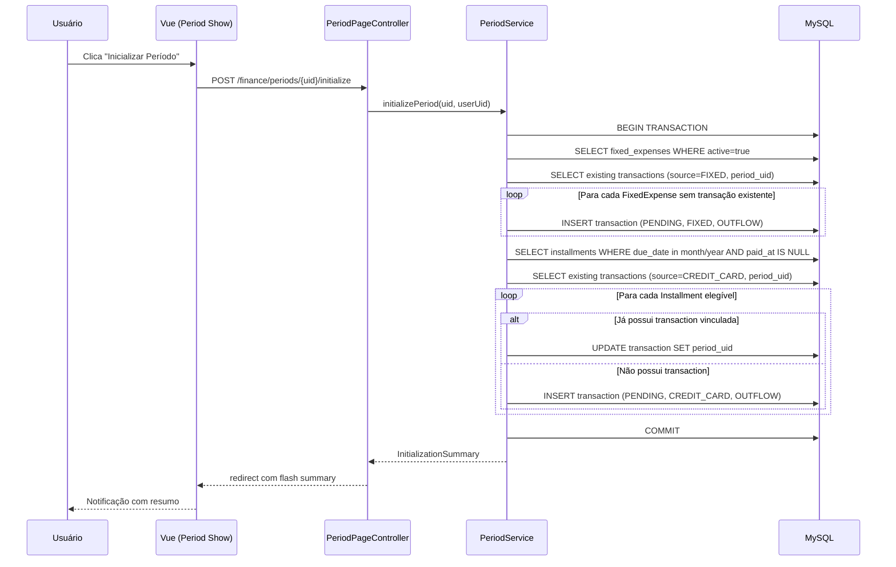
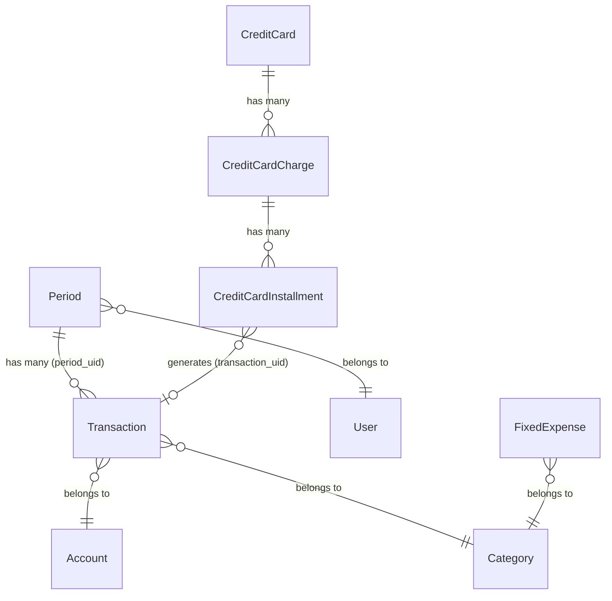
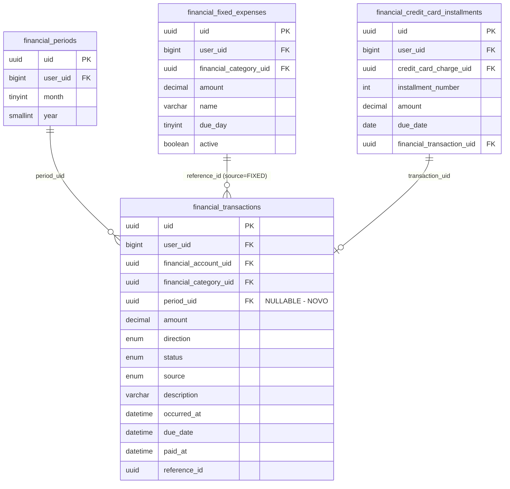

# Design Técnico — Gestão de Dados por Período

## Visão Geral

Esta feature evolui o modelo `Period` de um simples agrupador de dashboard para o eixo central de organização financeira do Himel App. O conceito replica o fluxo de planilhas onde cada mês era uma aba separada: o usuário visualiza transações filtradas por período e pode inicializar um período carregando automaticamente despesas fixas ativas e parcelas de cartão de crédito pendentes.

As principais mudanças são:
- Nova coluna `period_uid` (nullable FK) na tabela `financial_transactions`
- Lógica de inicialização de período no `PeriodService` (criação automática de transações)
- Idempotência na inicialização (re-execução segura sem duplicatas)
- Validação de exclusão de período (bloqueio quando há transações pagas)
- Nova página `Show` para períodos com resumo financeiro e lista de transações
- Endpoint API dedicado para inicialização de período

## Arquitetura

### Fluxo de Inicialização de Período



### Diagrama de Relacionamentos Atualizado



## Componentes e Interfaces

### 1. Migration — Adicionar `period_uid` à tabela `financial_transactions`

Nova migration para adicionar a coluna nullable FK:

```php
Schema::table('financial_transactions', function (Blueprint $table) {
    $table->uuid('period_uid')->nullable()->after('reference_id');
    $table->foreign('period_uid')->references('uid')->on('financial_periods')->onDelete('set null');
    $table->index('period_uid');
});
```

A opção `onDelete('set null')` garante que se um período for excluído, as transações não são perdidas — apenas desvinculadas.

### 2. Alterações nos Models

**Transaction model** — adicionar `period_uid` ao `$fillable` e relacionamento `belongsTo`:

```php
// $fillable: adicionar 'period_uid'
public function period(): BelongsTo
{
    return $this->belongsTo(Period::class, 'period_uid', 'uid');
}
```

**Period model** — adicionar relacionamento `hasMany`:

```php
public function transactions(): HasMany
{
    return $this->hasMany(Transaction::class, 'period_uid', 'uid');
}
```

### 3. PeriodServiceInterface — Novos Métodos

```php
interface PeriodServiceInterface
{
    // ... métodos existentes ...
    
    public function create(string $userUid, int $month, int $year): Period;
    public function initializePeriod(string $uid, string $userUid): array;
    public function getByUidWithSummary(string $uid, string $userUid): ?array;
    public function getTransactionsForPeriod(string $periodUid, string $userUid, array $filters = []): array;
    public function delete(string $uid, string $userUid): bool; // atualizado com validação
}
```

### 4. Lógica de Inicialização (`PeriodService::initializePeriod`)

O método executa dentro de uma única `DB::transaction` e retorna um array de resumo:

```php
public function initializePeriod(string $uid, string $userUid): array
{
    // Retorna:
    return [
        'fixed_created' => int,      // transações criadas de despesas fixas
        'installments_linked' => int, // transações existentes vinculadas ao período
        'installments_created' => int,// novas transações criadas de parcelas
        'skipped' => int,            // itens ignorados (já existiam)
    ];
}
```

**Regras de negócio da inicialização:**

1. **Despesas Fixas:** Busca `FixedExpense::forUser($userUid)->active()`. Para cada uma, verifica se já existe `Transaction` com `source=FIXED`, `reference_id=fixedExpense.uid` e `period_uid=period.uid`. Se não existir, cria com:
   - `status`: PENDING
   - `source`: FIXED
   - `direction`: OUTFLOW
   - `amount`: valor da FixedExpense
   - `category_uid`: da FixedExpense
   - `description`: nome da FixedExpense
   - `reference_id`: uid da FixedExpense
   - `period_uid`: uid do período
   - `due_date`: `due_day` da FixedExpense no mês/ano do período (com clamping)
   - `occurred_at`: primeiro dia do mês/ano do período
   - `account_uid`: conta padrão do usuário (primeira conta)

2. **Parcelas de Cartão:** Busca `CreditCardInstallment` do usuário com `due_date` no mês/ano do período e `paid_at` nulo. Para cada uma:
   - Se já possui `transaction_uid` → atualiza `period_uid` da transação existente
   - Se não possui `transaction_uid` → cria nova transação com `source=CREDIT_CARD`

3. **Clamping de due_date:** Para `due_day` > último dia do mês, usa `Carbon::create($year, $month)->endOfMonth()->day`.

### 5. Lógica de Exclusão (`PeriodService::delete`)

```php
public function delete(string $uid, string $userUid): bool
{
    // 1. Verifica se existem transações PAID vinculadas
    // 2. Se sim → lança exceção com mensagem
    // 3. Se não → desvincula transações (period_uid = null) e exclui período
    // Tudo dentro de DB::transaction
}
```

### 6. Criação de Período com Validação de Duplicata

O método `create` substitui o `getOrCreate` para o fluxo de criação explícita:

```php
public function create(string $userUid, int $month, int $year): Period
{
    $exists = Period::forUser($userUid)->forMonthYear($month, $year)->exists();
    if ($exists) {
        throw new PeriodAlreadyExistsException('O período já existe.');
    }
    return Period::create([...]);
}
```

Nova exceção: `App\Domain\Period\Exceptions\PeriodAlreadyExistsException`

### 7. PeriodPageController — Novos Métodos

```php
class PeriodPageController
{
    public function index(Request $request): Response     // atualizado com contagem de transações
    public function store(StorePeriodRequest $request): RedirectResponse  // novo
    public function show(Request $request, string $uid): Response         // novo
    public function destroy(Request $request, string $uid): RedirectResponse // novo
    public function initialize(Request $request, string $uid): RedirectResponse // novo
}
```

### 8. PeriodController (API) — Novos Endpoints

```php
// POST /api/periods/{uid}/initialize
public function initialize(Request $request, string $uid): JsonResponse
```

### 9. Rotas Web Atualizadas

```php
// app/Domain/Period/Routes/web.php
Route::resource('periods', PeriodPageController::class)
    ->names('finance.periods')
    ->only(['index', 'store', 'show', 'destroy'])
    ->parameters(['periods' => 'uid']);

Route::post('periods/{uid}/initialize', [PeriodPageController::class, 'initialize'])
    ->name('finance.periods.initialize');
```

### 10. Frontend — Novas Páginas e Componentes

**Página Show (`resources/js/pages/finance/periods/Show.vue`):**
- Cabeçalho com nome do mês e ano
- Resumo financeiro (total entradas, total saídas, saldo)
- Botão "Inicializar Período"
- Tabela de transações com filtros (status, direção, fonte)
- Ação de marcar como pago em cada linha
- Paginação

**Atualização da página Index (`resources/js/pages/finance/periods/Index.vue`):**
- Adicionar contagem de transações por período
- Adicionar botão "Criar Período" com modal de seleção mês/ano
- Links para a página Show de cada período
- Botão de exclusão com confirmação

**Tipo TypeScript atualizado:**
```typescript
export interface Period {
    uid: string;
    month: number;
    year: number;
    transactions_count?: number;
}

export interface PeriodSummary {
    total_inflow: number;
    total_outflow: number;
    balance: number;
}

export interface InitializationResult {
    fixed_created: number;
    installments_linked: number;
    installments_created: number;
    skipped: number;
}
```

### 11. PeriodResource Atualizado

```php
public function toArray(Request $request): array
{
    return [
        'uid' => $this->uid,
        'month' => $this->month,
        'year' => $this->year,
        'transactions_count' => $this->whenCounted('transactions'),
    ];
}
```

## Modelos de Dados

### Alterações no Schema

| Tabela | Alteração | Detalhes |
|--------|-----------|----------|
| `financial_transactions` | Nova coluna | `period_uid UUID NULLABLE FK → financial_periods.uid ON DELETE SET NULL` |
| `financial_transactions` | Novo índice | `INDEX (period_uid)` |

### Modelos Alterados

| Model | Alteração |
|-------|-----------|
| `Transaction` | Adicionar `period_uid` ao `$fillable`, adicionar `period()` belongsTo |
| `Period` | Adicionar `transactions()` hasMany |

### Novos Artefatos

| Artefato | Tipo | Localização |
|----------|------|-------------|
| Migration `add_period_uid_to_transactions` | Migration | `database/migrations/` |
| `PeriodAlreadyExistsException` | Exception | `app/Domain/Period/Exceptions/` |
| `PeriodHasPaidTransactionsException` | Exception | `app/Domain/Period/Exceptions/` |
| `Show.vue` | Vue Page | `resources/js/pages/finance/periods/` |

### Diagrama ER Detalhado



## Propriedades de Corretude

*Uma propriedade é uma característica ou comportamento que deve ser verdadeiro em todas as execuções válidas de um sistema — essencialmente, uma declaração formal sobre o que o sistema deve fazer. Propriedades servem como ponte entre especificações legíveis por humanos e garantias de corretude verificáveis por máquina.*


### Propriedade 1: Resumo financeiro do período é consistente com as transações

*Para qualquer* conjunto de transações vinculadas a um período, o total de entradas (INFLOW) deve ser a soma dos `amount` das transações com `direction=INFLOW`, o total de saídas (OUTFLOW) deve ser a soma dos `amount` das transações com `direction=OUTFLOW`, e o saldo deve ser exatamente `total_inflow - total_outflow`.

**Valida: Requisitos 2.2**

### Propriedade 2: Filtragem por período retorna apenas transações vinculadas

*Para qualquer* conjunto de transações distribuídas entre múltiplos períodos, a filtragem por `period_uid` deve retornar exclusivamente as transações cujo `period_uid` corresponda ao período solicitado — nenhuma transação de outro período ou sem período deve ser incluída.

**Valida: Requisitos 2.3**

### Propriedade 3: Inicialização de despesas fixas cria transações corretas

*Para qualquer* conjunto de despesas fixas ativas de um usuário, a inicialização de um período deve criar exatamente uma transação por despesa fixa ativa, onde cada transação possui `status=PENDING`, `source=FIXED`, `direction=OUTFLOW`, `amount` igual ao da despesa fixa, `category_uid` igual ao da despesa fixa, `description` igual ao `name` da despesa fixa, `reference_id` igual ao `uid` da despesa fixa, e `period_uid` igual ao do período.

**Valida: Requisitos 3.1, 3.3, 3.4, 3.5**

### Propriedade 4: Clamping de due_date para meses curtos

*Para qualquer* despesa fixa com `due_day` superior ao último dia do mês do período (ex: dia 31 em fevereiro), a transação gerada deve ter `due_date` igual ao último dia válido do mês. Para despesas fixas com `due_day` dentro do intervalo válido, o `due_date` deve usar o `due_day` original.

**Valida: Requisitos 3.2, 3.6**

### Propriedade 5: Inicialização de parcelas de cartão vincula ou cria transações corretamente

*Para qualquer* conjunto de parcelas de cartão de crédito não pagas cujo `due_date` esteja no mês/ano do período: se a parcela já possui uma transação vinculada (`transaction_uid`), essa transação existente deve receber o `period_uid` do período sem criação de nova transação; se a parcela não possui transação vinculada, uma nova transação deve ser criada com `status=PENDING`, `source=CREDIT_CARD`, `direction=OUTFLOW`, `reference_id` igual ao `uid` da parcela, e `due_date` igual ao `due_date` da parcela.

**Valida: Requisitos 4.1, 4.2, 4.3, 4.4**

### Propriedade 6: Idempotência da inicialização de período

*Para qualquer* período já inicializado, executar a inicialização novamente não deve criar transações duplicadas. O número total de transações vinculadas ao período após a segunda execução deve ser igual ao número após a primeira execução, a menos que novas despesas fixas ativas ou novas parcelas elegíveis tenham sido adicionadas entre as execuções.

**Valida: Requisitos 5.1, 5.2, 5.3**

### Propriedade 7: Resumo da inicialização reflete operações reais

*Para qualquer* execução da inicialização de período, a soma de `fixed_created + installments_linked + installments_created + skipped` deve ser igual ao número total de despesas fixas ativas mais o número total de parcelas de cartão elegíveis para o período.

**Valida: Requisitos 5.5**

### Propriedade 8: Exclusão de período bloqueada com transações pagas

*Para qualquer* período que possua ao menos uma transação com `status=PAID`, a tentativa de exclusão deve ser rejeitada. Para qualquer período sem transações `PAID`, a exclusão deve desvincular todas as transações (definir `period_uid=null`) e remover o período.

**Valida: Requisitos 9.1, 9.2, 9.3**

### Propriedade 9: Criação de período duplicado é rejeitada

*Para qualquer* combinação de `month` e `year` onde já exista um período para o usuário, a tentativa de criar um novo período com os mesmos valores deve ser rejeitada com erro.

**Valida: Requisitos 6.5, 8.4**

## Tratamento de Erros

### Exceções de Domínio

| Cenário | Exceção | HTTP | Mensagem |
|---------|---------|------|----------|
| Período duplicado (mesmo mês/ano/usuário) | `PeriodAlreadyExistsException` | 409 | "O período {mês}/{ano} já existe." |
| Exclusão com transações pagas | `PeriodHasPaidTransactionsException` | 422 | "Períodos com transações pagas não podem ser excluídos." |
| Período não encontrado | `ModelNotFoundException` | 404 | "Período não encontrado." |
| Usuário sem conta cadastrada | `InvalidArgumentException` | 422 | "É necessário ter ao menos uma conta para inicializar o período." |

### Padrão de Erro nos Controllers

```php
// PageController (Inertia)
try {
    $result = $this->periodService->initializePeriod($uid, $userUid);
    return redirect()->route('finance.periods.show', $uid)
        ->with('success', "Período inicializado: {$result['fixed_created']} despesas fixas, ...");
} catch (PeriodAlreadyExistsException $e) {
    return back()->with('error', $e->getMessage());
} catch (\Throwable $e) {
    Log::error('Failed to initialize period', [...]);
    return back()->with('error', 'Erro ao inicializar período.');
}

// API Controller
try {
    $result = $this->periodService->initializePeriod($uid, $userUid);
    return response()->json(['data' => $result], 200);
} catch (PeriodAlreadyExistsException $e) {
    return response()->json(['error' => $e->getMessage()], 409);
}
```

### Atomicidade

Toda a inicialização de período é executada dentro de uma única `DB::transaction`. Se qualquer etapa falhar (criação de transação, vinculação de parcela), todas as operações são revertidas. O mesmo se aplica à exclusão de período com desvinculação de transações.

## Estratégia de Testes

### Testes de Feature (PHPUnit)

Testes de feature cobrindo os endpoints e fluxos completos:

- **PeriodCreationTest** — criação de período, validação de duplicata (409), validação de campos (422)
- **PeriodInitializationTest** — inicialização com despesas fixas, parcelas de cartão, idempotência, resumo
- **PeriodDeletionTest** — exclusão bloqueada com PAID, exclusão com desvinculação, exclusão de período vazio
- **PeriodShowTest** — visualização com resumo financeiro, filtragem de transações por período
- **PeriodTransactionLinkTest** — criação de transação com/sem period_uid, relacionamentos

### Testes de Propriedade (PBT)

Biblioteca: **PHPUnit** com data providers gerando dados aleatórios (usando Faker via factories).

Cada teste de propriedade deve rodar com mínimo 100 iterações e referenciar a propriedade do design:

- **Feature: period-based-data-management, Property 1**: Resumo financeiro consistente
- **Feature: period-based-data-management, Property 2**: Filtragem por período
- **Feature: period-based-data-management, Property 3**: Inicialização de despesas fixas
- **Feature: period-based-data-management, Property 4**: Clamping de due_date
- **Feature: period-based-data-management, Property 5**: Inicialização de parcelas de cartão
- **Feature: period-based-data-management, Property 6**: Idempotência da inicialização
- **Feature: period-based-data-management, Property 7**: Resumo da inicialização
- **Feature: period-based-data-management, Property 8**: Exclusão com validação
- **Feature: period-based-data-management, Property 9**: Rejeição de duplicata

### Testes Unitários

- Clamping de `due_day` para meses curtos (fevereiro, abril, junho, setembro, novembro)
- Cálculo de resumo financeiro com valores decimais
- Validação de `StorePeriodRequest` com valores limítrofes
