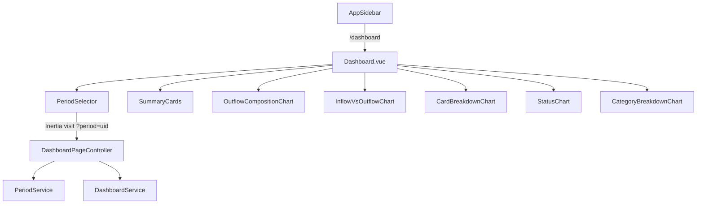
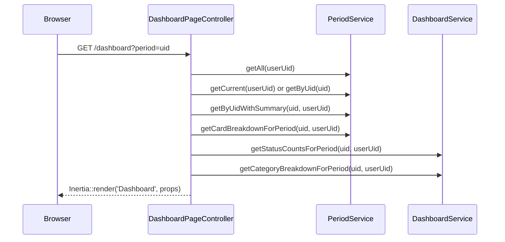

# Design Document — Period Dashboard

## Overview

O dashboard de períodos é a página principal da aplicação, acessível via rota `/dashboard` e primeiro item da sidebar. Exibe resumo financeiro e gráficos do período selecionado, reutilizando dados já disponíveis no `PeriodService` e adicionando duas novas agregações (status counts e category breakdown).

A arquitetura segue o padrão DDD existente: um novo `DashboardPageController` no domínio `Dashboard` agrega dados de múltiplos serviços e os entrega via Inertia ao frontend. O frontend usa componentes shadcn-vue (Card, Select) e o componente Chart do shadcn-vue (baseado em @unovis/vue) para os 5 gráficos.



## Architecture

### Backend

O controller `DashboardPageController` vive em `app/Domain/Dashboard/Controllers/` e depende de:
- `PeriodServiceInterface` — métodos existentes: `getAll`, `getCurrent`, `getByUid`, `getByUidWithSummary`, `getCardBreakdownForPeriod`
- `DashboardServiceInterface` — novo serviço com dois métodos de agregação específicos do dashboard

A rota `/dashboard` substitui a atual `Route::inertia('dashboard', 'Dashboard')` por um controller real.

### Frontend

A página `Dashboard.vue` em `resources/js/pages/Dashboard.vue` recebe props via Inertia e renderiza:
1. `PeriodSelector` — componente Select do shadcn-vue
2. 4 summary cards — componente Card do shadcn-vue
3. 5 gráficos — componentes Chart do shadcn-vue (@unovis/vue)

Os gráficos são componentes individuais em `resources/js/domain/Dashboard/components/`:
- `OutflowCompositionChart.vue` — Donut chart
- `InflowVsOutflowChart.vue` — Grouped bar chart
- `CardBreakdownChart.vue` — Horizontal bar chart
- `StatusChart.vue` — Donut chart com label central
- `CategoryBreakdownChart.vue` — Horizontal bar chart

### Decisões de Design

1. **Novo domínio Dashboard** em vez de estender Period — o dashboard agrega dados de múltiplos domínios (Period, Transaction, Category, CreditCard), justificando um domínio próprio.
2. **DashboardService separado** — os dois novos métodos (status counts, category breakdown) são específicos do dashboard e não pertencem ao PeriodService.
3. **Componentes de gráfico individuais** — cada gráfico é um componente Vue isolado para manter a página Dashboard.vue enxuta e facilitar testes.
4. **Inertia visit para troca de período** — ao selecionar um período diferente, o frontend faz `router.get('/dashboard', { period: uid })`, recarregando a página com novos dados server-side. Simples e consistente com o padrão Inertia do projeto.

## Components and Interfaces

### Backend

#### DashboardPageController

```
app/Domain/Dashboard/Controllers/DashboardPageController.php
```

```php
class DashboardPageController
{
    public function __construct(
        private readonly PeriodServiceInterface $periodService,
        private readonly DashboardServiceInterface $dashboardService,
    ) {}

    public function __invoke(Request $request): InertiaResponse
    {
        $userUid = $request->user()->uid;
        $periods = $this->periodService->getAll($userUid);

        // Resolve period: query param > current > null
        $period = null;
        if ($request->query('period')) {
            $period = $this->periodService->getByUid($request->query('period'), $userUid);
        }
        if (! $period) {
            $period = $this->periodService->getCurrent($userUid);
        }

        // Build data (zeroed if no period)
        $summary = $this->buildEmptySummary();
        $cardBreakdown = ['cards' => [], 'grand_total' => 0];
        $statusCounts = ['pending' => 0, 'paid' => 0, 'overdue' => 0];
        $categoryBreakdown = [];

        if ($period) {
            $periodData = $this->periodService->getByUidWithSummary($period->uid, $userUid);
            if ($periodData) {
                $summary = /* extract summary fields from $periodData */;
            }
            $cardBreakdown = $this->periodService->getCardBreakdownForPeriod($period->uid, $userUid);
            $statusCounts = $this->dashboardService->getStatusCountsForPeriod($period->uid, $userUid);
            $categoryBreakdown = $this->dashboardService->getCategoryBreakdownForPeriod($period->uid, $userUid);
        }

        return Inertia::render('Dashboard', [
            'period' => $period,
            'summary' => $summary,
            'cardBreakdown' => $cardBreakdown,
            'periods' => $periods,
            'statusCounts' => $statusCounts,
            'categoryBreakdown' => $categoryBreakdown,
        ]);
    }
}
```

Props retornadas via Inertia:
- `period` — Period atual ou selecionado (ou null)
- `summary` — PeriodSummary completo (ou zerado)
- `cardBreakdown` — PeriodCardBreakdown
- `periods` — lista de todos os períodos para o selector
- `statusCounts` — `{ pending: number, paid: number, overdue: number }`
- `categoryBreakdown` — `Array<{ category_name: string, total: number }>`

#### DashboardServiceInterface

```
app/Domain/Dashboard/Contracts/DashboardServiceInterface.php
```

```php
interface DashboardServiceInterface
{
    /**
     * @return array{pending: int, paid: int, overdue: int}
     */
    public function getStatusCountsForPeriod(string $periodUid, string $userUid): array;

    /**
     * @return array<int, array{category_name: string, total: float}>
     */
    public function getCategoryBreakdownForPeriod(string $periodUid, string $userUid): array;
}
```

#### DashboardService

```
app/Domain/Dashboard/Services/DashboardService.php
```

- `getStatusCountsForPeriod` — `SELECT status, COUNT(*) FROM transactions WHERE period_uid = ? AND user_uid = ? GROUP BY status`
- `getCategoryBreakdownForPeriod` — `SELECT categories.name, SUM(transactions.amount) as total FROM transactions JOIN categories ON transactions.category_uid = categories.uid WHERE transactions.direction = 'OUTFLOW' AND transactions.period_uid = ? AND transactions.user_uid = ? GROUP BY transactions.category_uid, categories.name ORDER BY total DESC`

#### Routes

```
app/Domain/Dashboard/Routes/web.php
```

```php
Route::get('dashboard', DashboardPageController::class)->name('dashboard');
```

A rota `Route::inertia('dashboard', 'Dashboard')` em `routes/web.php` será substituída pelo require do arquivo de rotas do domínio Dashboard.

#### Service Provider Binding

Em `AppServiceProvider.php`, adicionar:
```php
$this->app->bind(DashboardServiceInterface::class, DashboardService::class);
```

### Frontend

#### TypeScript Types

```
resources/js/domain/Dashboard/types/dashboard.ts
```

```typescript
import type { Period, PeriodCardBreakdown, PeriodSummary } from '@/domain/Period/types/period';

export interface StatusCounts {
    pending: number;
    paid: number;
    overdue: number;
}

export interface CategoryBreakdownItem {
    category_name: string;
    total: number;
}

export interface DashboardProps {
    period: Period | null;
    summary: PeriodSummary;
    cardBreakdown: PeriodCardBreakdown;
    periods: Period[];
    statusCounts: StatusCounts;
    categoryBreakdown: CategoryBreakdownItem[];
}
```

#### Dashboard.vue (Page)

Recebe `DashboardProps` via `defineProps`. Layout:

```vue
<script setup lang="ts">
import { Head, router } from '@inertiajs/vue3';
// ... imports

const props = defineProps<DashboardProps>();

const monthNames = ['', 'Janeiro', 'Fevereiro', 'Março', 'Abril', 'Maio', 'Junho',
    'Julho', 'Agosto', 'Setembro', 'Outubro', 'Novembro', 'Dezembro'];

function formatPeriodLabel(month: number, year: number): string {
    return `${monthNames[month]} ${year}`;
}

function handlePeriodChange(uid: string) {
    router.get('/dashboard', { period: uid }, { preserveState: false });
}
</script>

<template>
    <Head title="Dashboard" />
    <!-- PeriodSelector + SummaryCards + Charts grid -->
</template>
```

Layout responsivo:
- Cards: `grid grid-cols-1 md:grid-cols-2 xl:grid-cols-4 gap-4`
- Gráficos: `grid grid-cols-1 lg:grid-cols-2 gap-4`

#### PeriodSelector Component

```
resources/js/domain/Dashboard/components/PeriodSelector.vue
```

- Usa `Select`, `SelectTrigger`, `SelectContent`, `SelectItem` do shadcn-vue
- Props: `periods: Period[]`, `selectedUid: string | null`
- Emits: `update:selectedUid`
- Formata cada período como "Mês Ano" usando `formatPeriodLabel`
- Ao selecionar, o pai (`Dashboard.vue`) chama `router.get('/dashboard', { period: uid })`

#### Chart Components

Cada componente recebe dados tipados via props e renderiza usando os componentes Chart do shadcn-vue:

| Componente | Tipo Chart | Dados de entrada | Empty state |
|---|---|---|---|
| `OutflowCompositionChart` | `DonutChart` | `{ name: string, value: number }[]` das 4 fontes de saída | "Sem saídas neste período" |
| `InflowVsOutflowChart` | `BarChart` (grouped) | `[{ name: 'Período', Entradas: N, Saídas: N }]` | Sempre renderiza (valores podem ser zero) |
| `CardBreakdownChart` | `BarChart` (horizontal) | `cardBreakdown.cards` mapeado para `{ name, value }` | "Sem dados de cartão" |
| `StatusChart` | `DonutChart` | `{ name: string, value: number }[]` dos 3 status | "Sem transações" |
| `CategoryBreakdownChart` | `BarChart` (horizontal) | `categoryBreakdown` mapeado para `{ name, value }` | "Sem dados" |

Exemplo de uso do DonutChart do shadcn-vue:
```vue
<template>
    <DonutChart
        :data="chartData"
        index="name"
        :category="'value'"
        :colors="['hsl(var(--chart-1))', 'hsl(var(--chart-2))', ...]"
        :value-formatter="formatCurrency"
    />
</template>
```

Exemplo de uso do BarChart do shadcn-vue:
```vue
<template>
    <BarChart
        :data="chartData"
        index="name"
        :categories="['Entradas', 'Saídas']"
        :colors="['green', 'red']"
        :value-formatter="formatCurrency"
    />
</template>
```

#### Sidebar Update

Em `AppSidebar.vue`, adicionar como primeiro item do `financeNavItems`:

```typescript
import { BarChart3 } from 'lucide-vue-next';

const financeNavItems: NavItem[] = [
    { title: 'Dashboard', href: '/dashboard', icon: BarChart3 },
    { title: 'Períodos', href: '/periods', icon: CalendarDays },
    // ... restante
];
```

### Chart Installation

Instalar via CLI:
```bash
npx shadcn-vue@latest add chart-donut chart-bar
```

Isso adiciona `@unovis/vue` e `@unovis/ts` como dependências e cria os componentes wrapper em `resources/js/domain/Shared/components/ui/chart-donut/` e `resources/js/domain/Shared/components/ui/chart-bar/`.

Adicionar variáveis CSS do Unovis ao `resources/css/app.css`:
```css
@layer base {
  :root {
    --vis-tooltip-background-color: none !important;
    --vis-tooltip-border-color: none !important;
    --vis-tooltip-text-color: none !important;
    --vis-tooltip-shadow-color: none !important;
    --vis-tooltip-backdrop-filter: none !important;
    --vis-tooltip-padding: none !important;
    --vis-primary-color: var(--primary);
    --vis-secondary-color: 160 81% 40%;
    --vis-text-color: var(--muted-foreground);
  }
}
```

## Data Models

### Dados existentes reutilizados

- `Period` — `{ uid, month, year }`
- `PeriodSummary` — `{ total_inflow, total_outflow, balance, total_fixed_expenses, total_credit_card_installments, total_manual, total_transfer, inflow_manual, inflow_transfer }`
- `PeriodCardBreakdown` — `{ cards: CardBreakdownItem[], grand_total: number }`
- `CardBreakdownItem` — `{ credit_card_name, credit_card_uid, total }`

### Novos tipos

```typescript
// Contagem de transações por status
interface StatusCounts {
    pending: number;  // Transaction.STATUS_PENDING
    paid: number;     // Transaction.STATUS_PAID
    overdue: number;  // Transaction.STATUS_OVERDUE
}

// Breakdown de saídas por categoria (ordenado por total DESC)
interface CategoryBreakdownItem {
    category_name: string;
    total: number;  // soma dos amounts de OUTFLOW transactions nessa categoria
}
```

### Fluxo de dados



## Correctness Properties

*A property is a characteristic or behavior that should hold true across all valid executions of a system — essentially, a formal statement about what the system should do. Properties serve as the bridge between human-readable specifications and machine-verifiable correctness guarantees.*

### Property 1: Period formatting produces correct month name and year

*For any* valid month number (1–12) and any year number, the `formatPeriodLabel(month, year)` function SHALL produce a string that contains the correct Portuguese month name and the year as a substring.

**Validates: Requirements 4.5**

### Property 2: Category breakdown is sorted by value descending

*For any* array of `CategoryBreakdownItem` objects returned by `getCategoryBreakdownForPeriod`, each item's total SHALL be greater than or equal to the next item's total (descending order).

**Validates: Requirements 9.2**

## Error Handling

### Backend

| Cenário | Tratamento |
|---|---|
| Usuário sem períodos | Controller retorna `period: null`, `summary` zerado, arrays vazios |
| `period` query param inválido (uid não existe ou não pertence ao usuário) | Fallback para período atual; se não existir, retorna dados vazios |
| Erro em serviço (DB down) | Exception propagada ao handler global do Laravel (500) |

### Frontend

| Cenário | Tratamento |
|---|---|
| `period` é null (sem períodos) | Exibe mensagem informativa com orientação para criar período |
| Todos os valores de saída são zero | Gráfico de composição exibe mensagem "Sem saídas neste período" |
| `cardBreakdown.cards` vazio | Gráfico de breakdown exibe mensagem "Sem dados de cartão" |
| `statusCounts` todos zero | Gráfico de status exibe mensagem "Sem transações" |
| `categoryBreakdown` vazio | Gráfico de categorias exibe mensagem "Sem dados" |

## Testing Strategy

### Abordagem Dual

1. **Testes de Feature (PHPUnit)** — validam o controller e os serviços do backend
2. **Testes E2E (Playwright)** — validam a página completa no browser
3. **Testes de Propriedade (PHPUnit com data providers)** — validam propriedades universais

### Testes de Feature (PHPUnit)

- `DashboardPageControllerTest`:
  - Retorna Inertia response com todas as props esperadas
  - Respeita query param `period` para selecionar período
  - Retorna dados vazios quando usuário não tem períodos
  - Retorna dados corretos para período com transações mistas
- `DashboardServiceTest`:
  - `getStatusCountsForPeriod` retorna contagens corretas por status
  - `getCategoryBreakdownForPeriod` retorna categorias ordenadas por total DESC
  - Ambos retornam valores zerados/vazios para período sem transações

### Testes E2E (Playwright)

Seguem o padrão Page Object existente:

- `e2e/pages/DashboardPage.ts` — Page Object com métodos para:
  - `goto()` — navega para `/dashboard`
  - `getPageTitle()` — lê o heading
  - `getSummaryCardValue(label)` — lê valor de um card de resumo
  - `getSelectedPeriod()` — lê período selecionado no selector
  - `selectPeriod(label)` — seleciona período no selector
  - `isChartVisible(testId)` — verifica presença de gráfico via `data-testid`
  - `getEmptyStateMessage(testId)` — lê mensagem de estado vazio
  - `getSidebarItems()` — lê itens da sidebar

- `e2e/tests/dashboard.spec.ts` — organizado por `test.describe`:
  - **Page Load** — título, cards visíveis, período padrão selecionado
  - **Summary Cards** — valores formatados em R$, cor condicional do saldo
  - **Period Selector** — troca de período atualiza cards e gráficos
  - **Charts** — presença dos 5 gráficos com dados
  - **Empty States** — mensagens quando período sem dados
  - **Responsiveness** — layout mobile (375px) e desktop (1280px)
  - **Sidebar** — Dashboard como primeiro item do grupo Financeiro

- `E2eTestSeeder.php` — atualizar `seedPeriodTransactions` para:
  - Janeiro 2025: adicionar transações com status PAID e OVERDUE (atualmente só tem PENDING), e transações OUTFLOW com categorias variadas (Alimentação, Transporte, Saúde além da Moradia existente)
  - Março 2025: manter sem transações (para testar empty states no dashboard)

### Testes de Propriedade

- Biblioteca: PHPUnit com loop de 100 iterações usando `random_int` para gerar inputs
- Mínimo 100 iterações por property test
- Tag format: `Feature: period-dashboard, Property {number}: {property_text}`

| Property | Teste | Iterações |
|---|---|---|
| 1: Period formatting | Gerar mês (1-12) e ano aleatórios, verificar que resultado contém nome do mês em português e o ano | 100 |
| 2: Category sort order | Gerar array aleatório de `{category_name, total}`, inserir no banco, chamar service, verificar ordem decrescente | 100 |
