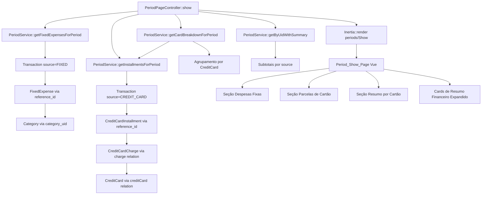
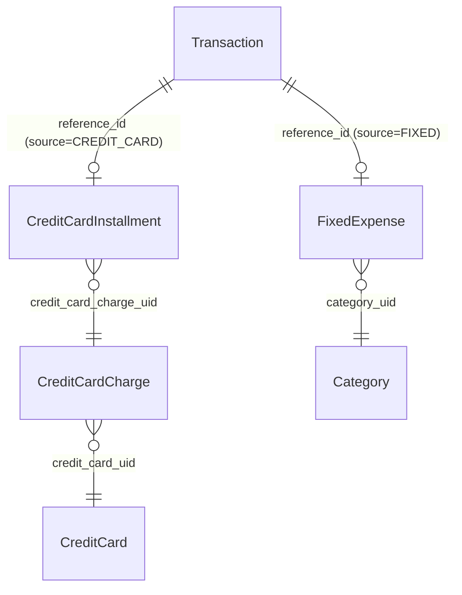

# Documento de Design — Despesas Fixas e Parcelas de Cartão na Visualização do Período

## Visão Geral

Esta feature enriquece a página Show do Period com três novas seções: **Despesas Fixas**, **Parcelas de Cartão** (com numeração X/Y) e **Resumo por Cartão**. Além disso, o resumo financeiro existente passa a exibir a composição detalhada das saídas por fonte (fixa, cartão, manual, transferência).

A abordagem é estender o `PeriodService` existente para resolver as referências (`reference_id`) das transações do período, enriquecendo-as com dados de `FixedExpense`, `CreditCardInstallment`, `CreditCardCharge` e `CreditCard`. O frontend recebe esses dados como props adicionais via Inertia e renderiza as novas seções na página Show.

### Decisões de Design

1. **Consulta no Service, não no Controller**: toda lógica de agregação e enriquecimento fica no `PeriodService`, seguindo o padrão DDD do projeto.
2. **Dados passados como props Inertia**: as novas seções (despesas fixas, parcelas, breakdown) são passadas como props separadas no `PeriodPageController::show()`, evitando chamadas adicionais do frontend.
3. **Resiliência a dados inconsistentes**: referências inválidas (`reference_id` apontando para entidades inexistentes) são tratadas com graceful degradation — campos nulos em vez de erros.
4. **Sem novas tabelas ou migrations**: toda a informação já existe nas tabelas `transactions`, `fixed_expenses`, `credit_card_installments`, `credit_card_charges` e `credit_cards`. A feature apenas consulta e agrega.

## Arquitetura



## Componentes e Interfaces

### Backend — Novos métodos no PeriodService

```php
// PeriodServiceInterface — novos métodos
public function getFixedExpensesForPeriod(string $periodUid, string $userUid): array;
public function getInstallmentsForPeriod(string $periodUid, string $userUid): array;
public function getCardBreakdownForPeriod(string $periodUid, string $userUid): array;
```

#### `getFixedExpensesForPeriod`
- Busca transações do período com `source = FIXED`
- Resolve `reference_id` → `FixedExpense` (com eager load de `category`)
- Retorna array com `items` (lista de despesas fixas enriquecidas) e `subtotal`
- Se `reference_id` não encontra FixedExpense, retorna item com campos nulos

#### `getInstallmentsForPeriod`
- Busca transações do período com `source = CREDIT_CARD`
- Resolve `reference_id` → `CreditCardInstallment` (com eager load de `charge.creditCard`)
- Retorna array com `items` (lista de parcelas enriquecidas com `installment_number`, `total_installments`, `description`, `credit_card_name`) e `subtotal`
- Se `reference_id` não encontra CreditCardInstallment, retorna item com campos nulos

#### `getCardBreakdownForPeriod`
- Reutiliza dados de `getInstallmentsForPeriod` ou faz query direta
- Agrupa parcelas por cartão de crédito
- Retorna array de `{ credit_card_name, credit_card_uid, total }` e `grand_total`

#### `getByUidWithSummary` (extensão)
- Adiciona subtotais por source ao retorno existente: `total_fixed_expenses`, `total_credit_card_installments`, `total_manual`, `total_transfer`

### Backend — PeriodPageController::show (extensão)

Novas props passadas ao Inertia:
```php
'fixed_expenses' => $fixedExpenses,        // { items: [...], subtotal: float }
'installments' => $installments,            // { items: [...], subtotal: float }
'card_breakdown' => $cardBreakdown,         // { cards: [...], grand_total: float }
'summary' => [
    'total_inflow' => ...,
    'total_outflow' => ...,
    'balance' => ...,
    'total_fixed_expenses' => ...,
    'total_credit_card_installments' => ...,
    'total_manual' => ...,
    'total_transfer' => ...,
],
```

### Frontend — Novos tipos TypeScript

```typescript
// domain/Period/types/period.ts — extensões
export interface PeriodFixedExpenseItem {
    transaction_uid: string;
    description: string | null;
    amount: number;
    due_day: number | null;
    category_name: string | null;
}

export interface PeriodFixedExpenses {
    items: PeriodFixedExpenseItem[];
    subtotal: number;
}

export interface PeriodInstallmentItem {
    transaction_uid: string;
    charge_description: string | null;
    amount: number;
    due_date: string | null;
    installment_number: number | null;
    total_installments: number | null;
    credit_card_name: string | null;
}

export interface PeriodInstallments {
    items: PeriodInstallmentItem[];
    subtotal: number;
}

export interface CardBreakdownItem {
    credit_card_name: string;
    credit_card_uid: string;
    total: number;
}

export interface PeriodCardBreakdown {
    cards: CardBreakdownItem[];
    grand_total: number;
}

export interface PeriodSummary {
    total_inflow: number;
    total_outflow: number;
    balance: number;
    total_fixed_expenses?: number;
    total_credit_card_installments?: number;
    total_manual?: number;
    total_transfer?: number;
}
```

### Frontend — Novas seções na Show.vue

1. **Seção "Despesas Fixas"**: Card com cabeçalho mostrando subtotal, tabela com nome, valor, categoria, vencimento. Estado vazio com mensagem.
2. **Seção "Parcelas de Cartão"**: Card com cabeçalho mostrando subtotal, tabela com descrição da compra + badge "X/Y", valor, vencimento, nome do cartão. Estado vazio com mensagem.
3. **Seção "Resumo por Cartão"**: Card com lista de cartões e valores. Oculto quando não há parcelas. Total geral no rodapé.
4. **Cards de resumo expandidos**: Os cards existentes de Entradas/Saídas/Saldo ganham sub-itens mostrando composição das saídas.

## Modelos de Dados

Nenhuma alteração nos modelos existentes. A feature utiliza apenas consultas de leitura sobre as tabelas existentes:

| Tabela | Campos utilizados | Relação |
|---|---|---|
| `transactions` | `uid`, `period_uid`, `source`, `reference_id`, `amount`, `direction` | Ponto de entrada |
| `fixed_expenses` | `uid`, `name`, `amount`, `due_day`, `category_uid` | Via `reference_id` de transação FIXED |
| `credit_card_installments` | `uid`, `installment_number`, `amount`, `due_date` | Via `reference_id` de transação CREDIT_CARD |
| `credit_card_charges` | `uid`, `description`, `total_installments` | Via `charge` relation da installment |
| `credit_cards` | `uid`, `name` | Via `creditCard` relation da charge |
| `categories` | `uid`, `name` | Via `category` relation da fixed_expense |

### Diagrama de Relações




## Propriedades de Corretude

*Uma propriedade é uma característica ou comportamento que deve ser verdadeiro em todas as execuções válidas de um sistema — essencialmente, uma declaração formal sobre o que o sistema deve fazer. Propriedades servem como ponte entre especificações legíveis por humanos e garantias de corretude verificáveis por máquina.*

### Propriedade 1: Enriquecimento e subtotal de despesas fixas

*Para qualquer* período com N transações de source FIXED, o método `getFixedExpensesForPeriod` deve retornar exatamente N itens, cada um contendo `description`, `amount`, `due_day` e `category_name` correspondentes à FixedExpense referenciada, e o `subtotal` deve ser igual à soma dos `amount` de todas as transações FIXED do período.

**Valida: Requisitos 1.1, 1.4**

### Propriedade 2: Enriquecimento e subtotal de parcelas de cartão

*Para qualquer* período com N transações de source CREDIT_CARD, o método `getInstallmentsForPeriod` deve retornar exatamente N itens, cada um contendo `charge_description`, `installment_number`, `total_installments` e `credit_card_name` correspondentes à cadeia CreditCardInstallment → CreditCardCharge → CreditCard, e o `subtotal` deve ser igual à soma dos `amount` de todas as transações CREDIT_CARD do período.

**Valida: Requisitos 2.1, 2.4, 3.1**

### Propriedade 3: Formatação de numeração de parcelas

*Para qualquer* par (installment_number, total_installments) onde 1 ≤ installment_number ≤ total_installments, a formatação deve produzir a string "X/Y" onde X = installment_number e Y = total_installments.

**Valida: Requisito 3.2**

### Propriedade 4: Breakdown por cartão de crédito

*Para qualquer* período com parcelas de cartão distribuídas entre N cartões distintos, o método `getCardBreakdownForPeriod` deve retornar exatamente N itens, e para cada cartão, o `total` deve ser igual à soma dos amounts das parcelas daquele cartão no período. O `grand_total` deve ser igual à soma de todos os `total` individuais.

**Valida: Requisitos 4.1, 4.4**

### Propriedade 5: Invariante de subtotais por fonte

*Para qualquer* período, a soma dos subtotais por fonte de saída (`total_fixed_expenses` + `total_credit_card_installments` + `total_manual` + `total_transfer`) deve ser igual ao `total_outflow` retornado no resumo financeiro.

**Valida: Requisitos 5.1, 5.3**

### Propriedade 6: Resiliência a referências inválidas

*Para qualquer* transação com source FIXED ou CREDIT_CARD cujo `reference_id` não corresponde a nenhuma entidade existente, o serviço deve retornar o item com os campos de enriquecimento (description, category_name, installment_number, etc.) como nulos, sem lançar exceção.

**Valida: Requisitos 6.1, 6.2**

## Tratamento de Erros

| Cenário | Comportamento |
|---|---|
| `reference_id` de transação FIXED não encontra FixedExpense | Retorna item com `description: null`, `category_name: null`, `due_day: null` |
| `reference_id` de transação CREDIT_CARD não encontra CreditCardInstallment | Retorna item com `charge_description: null`, `installment_number: null`, `total_installments: null`, `credit_card_name: null` |
| Período sem transações FIXED | Retorna `{ items: [], subtotal: 0 }` |
| Período sem transações CREDIT_CARD | Retorna `{ items: [], subtotal: 0 }` e breakdown vazio |
| Campos nulos no frontend | Exibe "—" em vez do valor |
| Erro inesperado na consulta de enriquecimento | Log do erro, retorna dados parciais disponíveis |

## Estratégia de Testes

### Testes Unitários (PHPUnit)

- **PeriodService::getFixedExpensesForPeriod**: testar com 0, 1 e N despesas fixas; testar com reference_id inválido
- **PeriodService::getInstallmentsForPeriod**: testar com 0, 1 e N parcelas; testar com reference_id inválido; verificar installment_number e total_installments
- **PeriodService::getCardBreakdownForPeriod**: testar agrupamento com 1 e N cartões; verificar totais
- **PeriodService::getByUidWithSummary**: testar subtotais por source; verificar invariante soma = total_outflow

### Testes de Propriedade (Property-Based Testing)

- **Biblioteca**: Não aplicável diretamente no contexto PHPUnit padrão do projeto. As propriedades acima guiam a criação de testes unitários abrangentes com múltiplos cenários gerados via factories.
- **Mínimo 100 iterações** por propriedade quando usando PBT
- **Tag**: `Feature: period-expenses-installments, Property {N}: {texto}`
- Cada propriedade de corretude deve ser implementada como um teste unitário que valida o comportamento para múltiplas combinações de dados gerados via factories

### Testes E2E (Playwright)

- Verificar renderização da seção "Despesas Fixas" com dados e estado vazio
- Verificar renderização da seção "Parcelas de Cartão" com badge X/Y
- Verificar seção "Resumo por Cartão" visível/oculta conforme dados
- Verificar cards de resumo financeiro com subtotais por fonte
- Verificar exibição de "—" para dados inconsistentes
