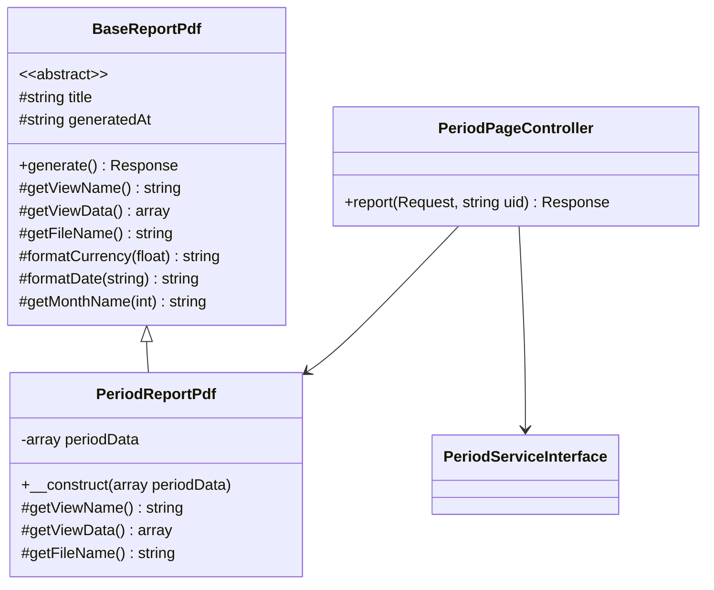

# Documento de Design — Relatório PDF do Período

## Visão Geral

Esta funcionalidade adiciona a capacidade de gerar e baixar um relatório PDF completo a partir da página de detalhe do período financeiro. O sistema é composto por três camadas:

1. **Template PDF reutilizável** (`app/Domain/Shared/Pdf/`) — classe base abstrata com cabeçalho, rodapé, estilos e métodos auxiliares para tabelas e cards de sumário, reutilizável por qualquer domínio.
2. **Relatório do Período** (`app/Domain/Period/Pdf/`) — classe concreta que estende o template base e renderiza os dados financeiros do período.
3. **Integração frontend** — opção "Gerar Relatório" no dropdown da Show.vue com download via `window.open()` e feedback de loading/erro.

A biblioteca escolhida é **barryvdh/laravel-dompdf** (v3.x), o wrapper Laravel mais popular para DOMPDF. Ela converte HTML/CSS em PDF sem dependências externas de binários, é pure-PHP, e se integra nativamente com Blade views — ideal para este projeto.

### Decisão: DOMPDF sobre TCPDF/mPDF

| Critério | DOMPDF | TCPDF | mPDF |
|---|---|---|---|
| Integração Laravel | Nativa (barryvdh/laravel-dompdf) | Manual | Manual |
| Abordagem | HTML/CSS → PDF | API programática | HTML/CSS → PDF |
| Dependências externas | Nenhuma | Nenhuma | Nenhuma |
| CSS suportado | CSS 2.1 + parte do 3 | Limitado | CSS 3 parcial |
| Manutenção de templates | Blade views (familiar) | Código PHP | Blade views |
| Downloads (Packagist) | 150M+ | ~30M | ~40M |

DOMPDF é a melhor escolha porque permite usar Blade views para os templates (consistente com o resto do projeto Laravel), tem integração nativa via `barryvdh/laravel-dompdf`, e não requer binários externos no servidor.

## Arquitetura

```mermaid
graph TD
    A[Show.vue - Dropdown] -->|GET /periods/{uid}/report| B[PeriodPageController::report]
    B --> C[PeriodService - coleta dados]
    C --> D[PeriodReportPdf]
    D --> E[BaseReportPdf - template base]
    D --> F[Blade View - period-report.blade.php]
    E --> F
    F --> G[DOMPDF Engine]
    G --> H[Response HTTP - application/pdf]
    H --> A
```

### Fluxo de Dados

1. Usuário clica em "Gerar Relatório" no dropdown
2. Frontend abre nova aba/janela com `window.open()` para `GET /periods/{uid}/report`
3. Controller coleta dados via `PeriodService` (métodos já existentes)
4. `PeriodReportPdf` monta o array de dados e renderiza via Blade view
5. DOMPDF converte o HTML em PDF
6. Response retorna com `Content-Type: application/pdf` e `Content-Disposition: attachment`

## Componentes e Interfaces

### High-Level Design



### Low-Level Design

#### 1. `BaseReportPdf` — `app/Domain/Shared/Pdf/BaseReportPdf.php`

```php
<?php

namespace App\Domain\Shared\Pdf;

use Barryvdh\DomPDF\Facade\Pdf;
use Illuminate\Http\Response;

abstract class BaseReportPdf
{
    protected string $title;
    protected string $generatedAt;

    public function __construct(string $title)
    {
        $this->title = $title;
        $this->generatedAt = now()->format('d/m/Y H:i');
    }

    public function generate(): Response
    {
        $data = array_merge($this->getViewData(), [
            'title' => $this->title,
            'generatedAt' => $this->generatedAt,
        ]);

        $pdf = Pdf::loadView($this->getViewName(), $data)
            ->setPaper('a4', 'portrait');

        return $pdf->download($this->getFileName());
    }

    abstract protected function getViewName(): string;
    abstract protected function getViewData(): array;
    abstract protected function getFileName(): string;

    protected function formatCurrency(float $value): string
    {
        return 'R$ ' . number_format($value, 2, ',', '.');
    }

    protected function formatDate(?string $date): string
    {
        if (!$date) {
            return '—';
        }
        return \Carbon\Carbon::parse($date)->format('d/m/Y');
    }

    protected function getMonthName(int $month): string
    {
        $months = [
            1 => 'Janeiro', 2 => 'Fevereiro', 3 => 'Março',
            4 => 'Abril', 5 => 'Maio', 6 => 'Junho',
            7 => 'Julho', 8 => 'Agosto', 9 => 'Setembro',
            10 => 'Outubro', 11 => 'Novembro', 12 => 'Dezembro',
        ];
        return $months[$month] ?? '';
    }
}
```

#### 2. `PeriodReportPdf` — `app/Domain/Period/Pdf/PeriodReportPdf.php`

```php
<?php

namespace App\Domain\Period\Pdf;

use App\Domain\Shared\Pdf\BaseReportPdf;

class PeriodReportPdf extends BaseReportPdf
{
    public function __construct(private readonly array $periodData)
    {
        $period = $periodData['period'];
        $monthName = $this->getMonthName($period->month);
        parent::__construct("Relatório Financeiro — {$monthName} {$period->year}");
    }

    protected function getViewName(): string
    {
        return 'pdf.period-report';
    }

    protected function getViewData(): array
    {
        return [
            'period' => $this->periodData['period'],
            'summary' => $this->periodData['summary'],
            'fixedExpenses' => $this->periodData['fixedExpenses'],
            'installments' => $this->periodData['installments'],
            'cardBreakdown' => $this->periodData['cardBreakdown'],
            'inflowTransactions' => $this->periodData['inflowTransactions'],
            'outflowTransactions' => $this->periodData['outflowTransactions'],
        ];
    }

    protected function getFileName(): string
    {
        $period = $this->periodData['period'];
        $month = str_pad($period->month, 2, '0', STR_PAD_LEFT);
        return "relatorio-periodo-{$month}-{$period->year}.pdf";
    }
}
```

#### 3. Controller — método `report` em `PeriodPageController`

```php
public function report(Request $request, string $uid): Response
{
    $userUid = $request->user()->uid;

    $periodSummary = $this->periodService->getByUidWithSummary($uid, $userUid);
    abort_unless($periodSummary, 404);

    $transactions = $this->periodService->getTransactionsForPeriod($uid, $userUid);
    $fixedExpenses = $this->periodService->getFixedExpensesForPeriod($uid, $userUid);
    $installments = $this->periodService->getInstallmentsForPeriod($uid, $userUid);
    $cardBreakdown = $this->periodService->getCardBreakdownForPeriod($uid, $userUid);

    $inflowTransactions = array_filter($transactions, fn ($t) => $t->direction === 'INFLOW');
    $outflowTransactions = array_filter($transactions, fn ($t) => $t->direction === 'OUTFLOW');

    $report = new PeriodReportPdf([
        'period' => $periodSummary['period'],
        'summary' => $periodSummary,
        'fixedExpenses' => $fixedExpenses,
        'installments' => $installments,
        'cardBreakdown' => $cardBreakdown,
        'inflowTransactions' => array_values($inflowTransactions),
        'outflowTransactions' => array_values($outflowTransactions),
    ]);

    return $report->generate();
}
```

#### 4. Rota — `app/Domain/Period/Routes/web.php`

```php
Route::get('periods/{uid}/report', [PeriodPageController::class, 'report'])
    ->name('periods.report');
```

#### 5. Blade View — `resources/views/pdf/period-report.blade.php`

Template HTML/CSS inline com:
- Cabeçalho com título e data de geração
- Placeholder para logo (imagem substituível)
- Seção de sumário financeiro com cards
- Tabela de despesas fixas
- Tabela de parcelas de cartão
- Resumo por cartão
- Tabela de entradas
- Tabela de saídas
- Rodapé com paginação "Página X de Y" (via DOMPDF script `{PAGE_NUM}` / `{PAGE_COUNT}`)
- Cores verde/vermelho para valores positivos/negativos
- Zebra striping nas tabelas
- Formatação brasileira (R$, dd/mm/aaaa)

O CSS é inline no Blade view (requisito do DOMPDF — não suporta arquivos CSS externos de forma confiável).

#### 6. Frontend — Alteração em `Show.vue`

```vue
<!-- No dropdown, após "Processar Período" e antes do separador de "Remover Transações" -->
<DropdownMenuItem :disabled="generatingReport" @click="handleGenerateReport">
    <FileDown class="size-4" />
    {{ generatingReport ? 'Gerando...' : 'Gerar Relatório' }}
</DropdownMenuItem>
```

```ts
import { FileDown } from 'lucide-vue-next';
import { report } from '@/actions/App/Domain/Period/Controllers/PeriodPageController';

const generatingReport = ref(false);

function handleGenerateReport() {
    generatingReport.value = true;
    try {
        window.open(report.url(props.period.uid), '_blank');
    } catch {
        toast.error('Erro ao gerar relatório.');
    } finally {
        setTimeout(() => {
            generatingReport.value = false;
        }, 2000);
    }
}
```

A abordagem `window.open()` é usada em vez de `router.get()` do Inertia porque:
- O endpoint retorna um PDF binário, não uma página Inertia
- `window.open()` abre em nova aba e inicia o download nativamente
- Não interfere com o estado da SPA

## Modelos de Dados

Nenhuma migration necessária. Todos os dados já existem nas tabelas atuais e são acessados via métodos existentes do `PeriodService`:

| Método | Dados retornados |
|---|---|
| `getByUidWithSummary()` | Period + totais (inflow, outflow, balance, subtotais por source) |
| `getFixedExpensesForPeriod()` | Items de despesas fixas + subtotal |
| `getInstallmentsForPeriod()` | Items de parcelas + subtotal |
| `getCardBreakdownForPeriod()` | Breakdown por cartão + grand_total |
| `getTransactionsForPeriod()` | Todas as transações com account e category |

### Estrutura de dados passada para a Blade view

```php
[
    'title' => 'Relatório Financeiro — Janeiro 2025',
    'generatedAt' => '15/07/2025 14:30',
    'period' => Period,  // model com month, year
    'summary' => [
        'total_inflow' => float,
        'total_outflow' => float,
        'balance' => float,
        'total_fixed_expenses' => float,
        'total_credit_card_installments' => float,
        'total_manual' => float,
        'total_transfer' => float,
        'inflow_manual' => float,
        'inflow_transfer' => float,
    ],
    'fixedExpenses' => [
        'items' => [['description', 'amount', 'due_day', 'category_name', 'transaction_uid']],
        'subtotal' => float,
    ],
    'installments' => [
        'items' => [['charge_description', 'amount', 'due_date', 'installment_number', 'total_installments', 'credit_card_name', 'transaction_uid']],
        'subtotal' => float,
    ],
    'cardBreakdown' => [
        'cards' => [['credit_card_name', 'credit_card_uid', 'total']],
        'grand_total' => float,
    ],
    'inflowTransactions' => Transaction[],  // com account e category loaded
    'outflowTransactions' => Transaction[], // com account e category loaded
]
```

## Propriedades de Corretude

*Uma propriedade é uma característica ou comportamento que deve ser verdadeiro em todas as execuções válidas de um sistema — essencialmente, uma declaração formal sobre o que o sistema deve fazer. Propriedades servem como ponte entre especificações legíveis por humanos e garantias de corretude verificáveis por máquina.*

### Avaliação de Aplicabilidade de PBT

Esta feature envolve principalmente:
- Geração de PDF (rendering/side-effect) — não adequado para PBT
- Integração HTTP (endpoint retorna arquivo) — melhor com testes de integração
- UI (dropdown, loading state) — melhor com testes E2E
- **Funções puras de formatação** (moeda, data) — adequado para PBT

As funções `formatCurrency` e `formatDate` do `BaseReportPdf` são funções puras com espaço de entrada grande, onde PBT agrega valor real ao testar edge cases (valores negativos, zeros, números grandes, datas limítrofes).

### Property 1: Formatação de moeda no padrão brasileiro

*Para qualquer* valor float, `formatCurrency(value)` deve produzir uma string que começa com "R$ ", usa vírgula como separador decimal com exatamente 2 casas decimais, e usa ponto como separador de milhares.

**Valida: Requisito 4.8**

### Property 2: Formatação de data no padrão brasileiro

*Para qualquer* string de data válida (formato Y-m-d ou ISO 8601), `formatDate(date)` deve produzir uma string no formato dd/mm/aaaa onde dd está entre 01-31, mm está entre 01-12, e aaaa é um ano de 4 dígitos.

**Valida: Requisito 4.9**

## Tratamento de Erros

| Cenário | Comportamento | HTTP Status |
|---|---|---|
| Período não encontrado | `abort(404)` | 404 |
| Período de outro usuário | `abort(404)` (via `getByUidWithSummary` retornando null) | 404 |
| Erro na geração do PDF | Log do erro + response 500 com mensagem genérica | 500 |
| Erro no frontend (download falha) | Toast de erro via vue-sonner | N/A |

### Tratamento no Controller

```php
public function report(Request $request, string $uid): Response
{
    try {
        // ... coleta dados e gera PDF
        return $report->generate();
    } catch (\Throwable $e) {
        Log::error('Failed to generate period report', [
            'period_uid' => $uid,
            'user_uid' => $request->user()->uid,
            'error' => $e->getMessage(),
        ]);

        abort(500, 'Erro ao gerar relatório.');
    }
}
```

### Tratamento no Frontend

```ts
function handleGenerateReport() {
    generatingReport.value = true;
    try {
        window.open(report.url(props.period.uid), '_blank');
    } catch {
        toast.error('Erro ao gerar relatório.');
    } finally {
        setTimeout(() => {
            generatingReport.value = false;
        }, 2000);
    }
}
```

## Estratégia de Testes

### Abordagem Dual

A estratégia combina testes unitários/feature (PHPUnit) para o backend e testes E2E (Playwright) para o fluxo completo.

### Testes Unitários / Feature (PHPUnit)

| Teste | Tipo | Valida |
|---|---|---|
| Endpoint retorna 200 + Content-Type `application/pdf` para período válido | Feature | Req 2.2, 2.3 |
| Endpoint retorna 404 para período inexistente | Feature | Req 2.5 |
| Endpoint retorna 404 para período de outro usuário | Feature | Req 2.5 |
| Content-Disposition contém filename no formato correto | Feature | Req 2.4 |
| PDF gerado com sucesso para período sem transações | Feature | Req 4.7 |
| PDF gerado com sucesso para período com todos os tipos de dados | Feature | Req 4.1-4.6 |

### Testes de Propriedade (PHPUnit + dados gerados)

| Teste | Propriedade | Iterações |
|---|---|---|
| `formatCurrency` produz formato brasileiro válido | Property 1 | 100+ |
| `formatDate` produz formato dd/mm/aaaa válido | Property 2 | 100+ |

Biblioteca PBT: Não há uma biblioteca PBT madura para PHPUnit no ecossistema PHP. Os testes de propriedade serão implementados usando **data providers com dados gerados aleatoriamente** via `Faker` dentro de um loop de 100 iterações no próprio teste, validando as propriedades em cada iteração.

Cada teste de propriedade deve incluir um comentário referenciando a propriedade do design:
```php
// Feature: period-pdf-report, Property 1: Formatação de moeda no padrão brasileiro
// Feature: period-pdf-report, Property 2: Formatação de data no padrão brasileiro
```

### Testes E2E (Playwright)

| Teste | Valida |
|---|---|
| Opção "Gerar Relatório" visível no dropdown | Req 1.1, 7.1 |
| Clicar em "Gerar Relatório" inicia download de PDF | Req 1.2, 7.2 |
| Arquivo baixado tem nome correto | Req 7.3 |

### Estrutura de Arquivos de Teste

```
tests/Feature/PeriodReportTest.php          # Testes feature do endpoint
tests/Unit/BaseReportPdfTest.php            # Testes de propriedade das funções de formatação
e2e/tests/period-report.spec.ts            # Testes E2E
e2e/pages/PeriodShowPage.ts                # Page Object (extensão do existente ou novo)
```
