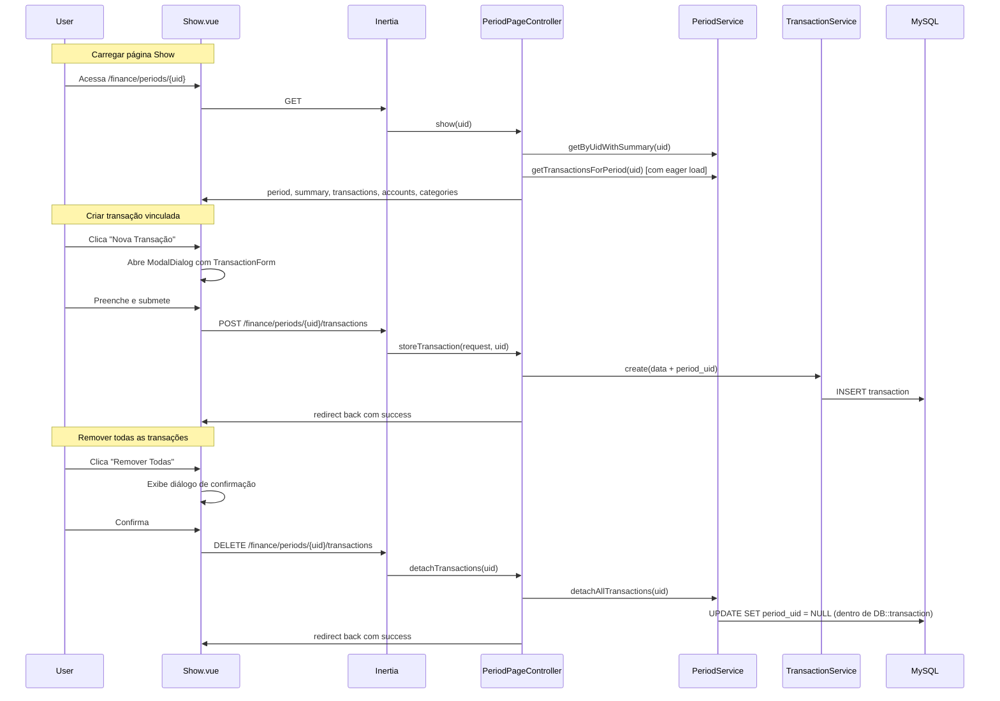

# Design — Gestão de Transações por Período

## Overview

Este design detalha as alterações necessárias para melhorar a gestão de transações dentro da página de detalhes de um período no Himel App. As mudanças abrangem cinco áreas:

1. **Sidebar**: Reordenar o link "Períodos" para a 2ª posição (após "Visão Geral").
2. **Dados legíveis**: Incluir eager loading de `account` e `category` nas transações do período e exibir nomes ao invés de UUIDs.
3. **Agrupamento por tipo**: Separar transações em seções "Entradas" e "Saídas" com subtotais.
4. **Remoção em lote**: Desvincular todas as transações de um período (set `period_uid = null`), sem deletar.
5. **Criação vinculada**: Criar transações diretamente na página Show do período via ModalDialog, com `period_uid` pré-preenchido.

### Decisões de Design

- **Remoção = desvinculação**: A operação de "remover todas as transações" não deleta registros. Apenas define `period_uid = null`. Isso preserva o histórico financeiro.
- **Reutilização do TransactionForm**: O formulário existente será reutilizado na página Show do período, recebendo `periodUid` como prop adicional para pré-preencher o campo.
- **Rota de store no PeriodPageController**: A criação de transação no contexto do período será tratada por um novo método `storeTransaction` no `PeriodPageController`, que delega ao `TransactionService::create()` existente. Isso permite redirecionar de volta à página Show do período.
- **Rota de remoção em lote**: Um novo endpoint `DELETE /finance/periods/{uid}/transactions` será adicionado ao `PeriodPageController` para a operação de desvinculação em lote.
- **Agrupamento no frontend**: O agrupamento por INFLOW/OUTFLOW será feito via `computed` properties no Vue, filtrando o array de transações já carregado. Os subtotais por seção serão calculados no frontend a partir das transações visíveis.

## Architecture



## Components and Interfaces

### Backend

#### PeriodServiceInterface (alterações)
```php
// Novo método
public function detachAllTransactions(string $periodUid, string $userUid): int;
```

#### PeriodService (alterações)
- `detachAllTransactions(string $periodUid, string $userUid): int` — Desvincula todas as transações do período dentro de `DB::transaction`. Retorna o número de transações desvinculadas.
- `getTransactionsForPeriod()` — Adicionar `->with(['account', 'category'])` ao query para eager loading.

#### PeriodPageController (alterações)
- `show()` — Adicionar `accounts` e `categories` como props Inertia para o formulário de criação.
- `storeTransaction(StoreTransactionRequest $request, string $uid): RedirectResponse` — Novo método que delega ao `TransactionService::create()` com `period_uid` injetado, redirecionando de volta à página Show.
- `detachTransactions(Request $request, string $uid): RedirectResponse` — Novo método que chama `PeriodService::detachAllTransactions()`.

#### StoreTransactionRequest (alteração)
- Adicionar regra: `'period_uid' => ['nullable', 'uuid', 'exists:financial_periods,uid']`

#### Rotas (alterações em `Period/Routes/web.php`)
```php
Route::post('periods/{uid}/transactions', [PeriodPageController::class, 'storeTransaction'])
    ->name('finance.periods.transactions.store');
Route::delete('periods/{uid}/transactions', [PeriodPageController::class, 'detachTransactions'])
    ->name('finance.periods.transactions.detach');
```

### Frontend

#### AppSidebar.vue (alteração)
- Mover o item `{ title: 'Períodos', ... }` para a 2ª posição no array `financeNavItems` (índice 1).

#### Show.vue (alterações)
- Adicionar props: `accounts: Account[]`, `categories: Category[]`.
- Substituir tabela única por duas seções: "Entradas" e "Saídas" usando `computed` properties que filtram `transactions` por `direction`.
- Calcular subtotais por seção via `computed` (soma dos `amount` por grupo).
- Adicionar botão "Nova Transação" no header que abre `ModalDialog` com `TransactionForm`.
- Adicionar botão "Remover Todas as Transações" no header com diálogo de confirmação (usando `AlertDialog` do Shadcn/Vue).
- Integrar `TransactionForm` dentro do `ModalDialog`, passando `periodUid` e `periodDate` como props.

#### TransactionForm.vue (alteração)
- Adicionar prop opcional `periodUid?: string` e `periodDate?: string`.
- Quando `periodUid` estiver presente: incluir `period_uid` nos `initialValues`, usar `periodDate` como `occurred_at` default, e ajustar a `action` URL para apontar para a rota do período.

#### transaction-schema.ts (alteração)
- Adicionar campo: `period_uid: z.string().uuid().nullable().optional()`

## Data Models

Nenhuma alteração no schema do banco de dados é necessária. As tabelas existentes já suportam todas as operações:

- `financial_transactions.period_uid` — FK nullable para `financial_periods.uid` (já existe, com ON DELETE SET NULL).
- `financial_transactions.description` — VARCHAR(255) nullable (já existe).
- Relacionamentos `account()` e `category()` no model Transaction (já existem).

### Dados passados como props Inertia na página Show

```typescript
interface PeriodShowProps {
  period: Period;
  summary: PeriodSummary;
  transactions: Transaction[]; // com account e category carregados
  meta: PaginationMeta;
  filters: Record<string, string>;
  accounts: Account[];    // NOVO
  categories: Category[]; // NOVO
}
```

## Correctness Properties

*A property is a characteristic or behavior that should hold true across all valid executions of a system — essentially, a formal statement about what the system should do. Properties serve as the bridge between human-readable specifications and machine-verifiable correctness guarantees.*

### Property 1: Detach preserves transaction existence

*For any* period with N linked transactions (N ≥ 0), after calling `detachAllTransactions`, all N transactions SHALL still exist in the database with `period_uid = null`, and the total count of transactions in the system SHALL remain unchanged.

**Validates: Requirements 4.3**

### Property 2: Transaction creation with period_uid links correctly

*For any* valid transaction data that includes a valid `period_uid`, after creation, the resulting transaction in the database SHALL have `period_uid` equal to the provided value, and the period's transaction count SHALL increase by one.

**Validates: Requirements 5.5**

### Property 3: period_uid validation accepts valid UUIDs and rejects invalid strings

*For any* valid UUID v4 string that corresponds to an existing period, the `StoreTransactionRequest` SHALL accept the `period_uid` field. *For any* non-UUID string, the request SHALL reject it with a validation error.

**Validates: Requirements 5.8**

## Error Handling

| Cenário | Camada | Tratamento |
|---------|--------|------------|
| Período não encontrado no show | Controller | `abort(404)` (já existe) |
| Período não encontrado no detach | Controller | `redirect()->back()->with('error', ...)` |
| Falha no detach (DB error) | Service → Controller | `DB::transaction` rollback + `Log::error()` + flash error |
| Falha na criação de transação | Controller | `try-catch` + `Log::error()` + flash error |
| Validação falha (422) | FormRequest | Retorno automático com erros por campo |
| Categoria incompatível com direção | TransactionService | `InvalidArgumentException` → Controller catch → flash error |

Todas as mensagens de erro são em Português (pt-BR), conforme padrão do projeto.

## Testing Strategy

### Abordagem

Testes de feature (PHPUnit 12) cobrindo endpoints HTTP, validação e lógica de negócio. Testes de propriedade para validar invariantes críticos.

### Testes de Feature (PHPUnit)

1. **Sidebar ordering** — Verificação visual/manual (configuração estática de array).

2. **Eager loading** — `test_period_show_includes_account_and_category_in_transactions`: Criar período com transações, acessar show, verificar que `account.name` e `category.name` estão presentes na resposta.

3. **Accounts and categories as props** — `test_period_show_includes_accounts_and_categories_props`: Verificar que a página Show retorna `accounts` e `categories` nas props.

4. **Detach all transactions** — `test_user_can_detach_all_transactions_from_period`: Criar período com transações, chamar DELETE, verificar que todas têm `period_uid = null` e nenhuma foi deletada.

5. **Detach atomicity** — `test_detach_transactions_is_atomic`: Simular falha parcial, verificar rollback.

6. **Detach error handling** — `test_detach_returns_error_on_failure`: Mock de exceção, verificar flash error.

7. **Store transaction with period_uid** — `test_user_can_create_transaction_linked_to_period`: Submeter transação com `period_uid`, verificar criação e vínculo.

8. **Store transaction validation** — `test_store_transaction_validates_period_uid`: Submeter com `period_uid` inválido, verificar 422.

9. **Store transaction redirect** — `test_store_transaction_redirects_to_period_show`: Verificar redirect para a página Show do período.

10. **Multi-tenant isolation** — `test_user_cannot_detach_transactions_from_another_users_period`: Verificar que usuário A não pode operar no período do usuário B.

### Testes de Propriedade (Property-Based)

Biblioteca: Não aplicável diretamente com PHPUnit padrão. Os testes de propriedade serão implementados como testes parametrizados com dados gerados por factories, executando múltiplas iterações com dados variados.

- **Property 1**: Gerar N transações (variando N de 0 a 50) vinculadas a um período, executar detach, verificar que todas existem com `period_uid = null`.
  - Tag: `Feature: period-transactions-management, Property 1: Detach preserves transaction existence`
  - Mínimo 100 iterações via loop com factory.

- **Property 2**: Gerar dados válidos de transação com `period_uid`, criar, verificar vínculo.
  - Tag: `Feature: period-transactions-management, Property 2: Transaction creation with period_uid links correctly`

- **Property 3**: Gerar UUIDs válidos e strings inválidas, testar validação.
  - Tag: `Feature: period-transactions-management, Property 3: period_uid validation accepts valid UUIDs and rejects invalid strings`
