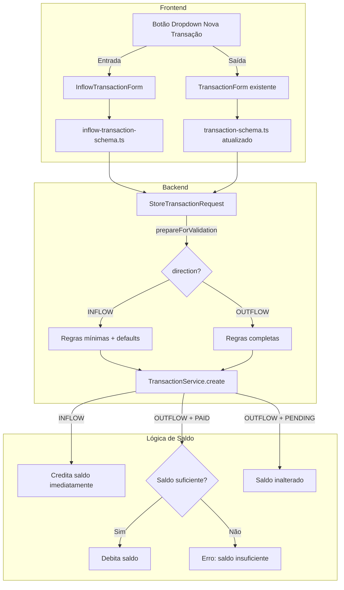

# Design — Separação de Entradas e Saídas em Transações

## Visão Geral

Esta feature diferencia o tratamento de transações INFLOW (entradas) e OUTFLOW (saídas) em toda a stack: validação backend, validação frontend, componentes de interface e lógica de saldo. O objetivo é simplificar o cadastro de entradas (menos campos obrigatórios, defaults automáticos, crédito imediato no saldo) enquanto mantém o fluxo completo para saídas (todos os campos, débito condicional ao status PAID, validação de saldo suficiente).

A arquitetura segue os padrões DDD existentes no projeto, com alterações concentradas no domínio Transaction (backend e frontend) e impacto mínimo em outros domínios.

## Arquitetura

### Fluxo de Dados por Direção



### Decisões de Design

1. **Formulários separados por direção**: Em vez de lógica condicional complexa em um único componente, criamos `InflowTransactionForm.vue` dedicado para entradas. Isso mantém cada componente simples e focado.

2. **`prepareForValidation()` nos Form Requests**: Os defaults de INFLOW (`status=PAID`, `source=MANUAL`) são aplicados no `prepareForValidation()` do Form Request, antes da validação. Isso garante que os dados cheguem ao Service já normalizados.

3. **Validação condicional via `required_if`**: Campos obrigatórios apenas para OUTFLOW usam `required_if:direction,OUTFLOW` nas regras do Form Request, evitando lógica manual de if/else.

4. **Saldo: INFLOW sempre credita, OUTFLOW só debita quando PAID**: A lógica atual do `TransactionService` já trata o saldo apenas para status PAID. Para INFLOW, alteramos para creditar independentemente do status (já que INFLOW default é PAID). Para OUTFLOW, adicionamos validação de saldo suficiente antes do débito.

5. **Dropdown button com reka-ui**: Usamos os componentes `DropdownMenu` já disponíveis no projeto (baseados em reka-ui) para o botão de nova transação.

6. **Roteamento de edição por direção**: O store `useTransactionStore` é estendido para detectar a direção da transação ao abrir o modal de edição, direcionando para o formulário correto.

## Componentes e Interfaces

### Backend

#### StoreTransactionRequest (modificado)

```php
// Adições ao StoreTransactionRequest existente:

protected function prepareForValidation(): void
{
    if ($this->input('direction') === 'INFLOW') {
        $this->mergeIfMissing([
            'status' => 'PAID',
            'source' => 'MANUAL',
        ]);
    }
}

public function rules(): array
{
    return [
        'account_uid' => ['required', 'uuid'],
        'amount' => ['required', 'numeric', 'min:0.01'],
        'direction' => ['required', 'string', 'in:INFLOW,OUTFLOW'],
        'occurred_at' => ['required', 'date'],
        // Campos condicionais por direção
        'category_uid' => ['required_if:direction,OUTFLOW', 'nullable', 'uuid'],
        'status' => ['required_if:direction,OUTFLOW', 'nullable', 'string', 'in:PENDING,PAID,OVERDUE'],
        'source' => ['required_if:direction,OUTFLOW', 'nullable', 'string', 'in:MANUAL,CREDIT_CARD,FIXED,TRANSFER'],
        // Campos sempre opcionais
        'due_date' => ['nullable', 'date'],
        'paid_at' => ['nullable', 'date'],
        'description' => ['nullable', 'string', 'max:255'],
        'reference_id' => ['nullable', 'uuid'],
        'period_uid' => ['nullable', 'uuid', 'exists:periods,uid'],
    ];
}
```

#### UpdateTransactionRequest (modificado)

Mesma lógica condicional do `StoreTransactionRequest`, com `prepareForValidation()` para aplicar defaults quando a direção é INFLOW. Usa `sometimes` combinado com `required_if` para campos condicionais.

```php
protected function prepareForValidation(): void
{
    // Determinar direção: do payload ou da transação existente
    $direction = $this->input('direction');
    if (!$direction) {
        $transaction = Transaction::where('uid', $this->route('uid'))->first();
        $direction = $transaction?->direction;
    }

    if ($direction === 'INFLOW') {
        $this->mergeIfMissing([
            'status' => 'PAID',
            'source' => 'MANUAL',
        ]);
    }
}

public function rules(): array
{
    return [
        'account_uid' => ['sometimes', 'uuid'],
        'amount' => ['sometimes', 'numeric', 'min:0.01'],
        'direction' => ['sometimes', 'string', 'in:INFLOW,OUTFLOW'],
        'occurred_at' => ['sometimes', 'date'],
        'category_uid' => ['required_if:direction,OUTFLOW', 'nullable', 'uuid'],
        'status' => ['required_if:direction,OUTFLOW', 'nullable', 'string', 'in:PENDING,PAID,OVERDUE'],
        'source' => ['required_if:direction,OUTFLOW', 'nullable', 'string', 'in:MANUAL,CREDIT_CARD,FIXED,TRANSFER'],
        'due_date' => ['nullable', 'date'],
        'paid_at' => ['nullable', 'date'],
        'description' => ['nullable', 'string', 'max:255'],
        'reference_id' => ['nullable', 'uuid'],
    ];
}
```

#### TransactionService (modificado)

Alterações na lógica de saldo:

```php
public function create(array $data, string $userUid): Transaction
{
    return DB::transaction(function () use ($data, $userUid) {
        // 1. Validar ownership da conta
        $account = Account::where('uid', $data['account_uid'])
            ->where('user_uid', $userUid)
            ->firstOrFail();

        // 2. Validar categoria (apenas quando informada)
        if (!empty($data['category_uid'])) {
            $category = Category::where('uid', $data['category_uid'])->first();
            if ($category && $category->direction !== $data['direction']) {
                throw new \InvalidArgumentException(
                    'A categoria não corresponde à direção da transação.'
                );
            }
        }

        // 3. Criar transação
        $transaction = Transaction::create([
            'user_uid' => $userUid,
            'account_uid' => $data['account_uid'],
            'category_uid' => $data['category_uid'] ?? null,
            'amount' => $data['amount'],
            'direction' => $data['direction'],
            'status' => $data['status'] ?? 'PAID',
            'source' => $data['source'] ?? 'MANUAL',
            'description' => $data['description'] ?? null,
            'occurred_at' => $data['occurred_at'],
            'due_date' => $data['due_date'] ?? null,
            'paid_at' => $data['paid_at'] ?? null,
            'reference_id' => $data['reference_id'] ?? null,
            'period_uid' => $data['period_uid'] ?? null,
        ]);

        // 4. Atualizar saldo por direção
        if ($transaction->direction === Transaction::DIRECTION_INFLOW) {
            // INFLOW: credita imediatamente, independente do status
            $account->balance += $transaction->amount;
            $account->save();
        } elseif ($transaction->status === Transaction::STATUS_PAID) {
            // OUTFLOW + PAID: verifica saldo e debita
            if ($account->balance < $transaction->amount) {
                throw new InsufficientBalanceException($account, $transaction->amount);
            }
            $account->balance -= $transaction->amount;
            $account->save();
        }
        // OUTFLOW + PENDING/OVERDUE: saldo inalterado

        return $transaction;
    });
}
```

A lógica de `update()` e `delete()` segue o mesmo padrão, diferenciando INFLOW (sempre afeta saldo) de OUTFLOW (só afeta quando status é PAID).

#### InsufficientBalanceException (novo)

```php
namespace App\Domain\Transaction\Exceptions;

use App\Domain\Account\Models\Account;

class InsufficientBalanceException extends \RuntimeException
{
    public function __construct(
        public readonly Account $account,
        public readonly float $requiredAmount,
    ) {
        $formatted = number_format($requiredAmount, 2, ',', '.');
        $available = number_format($account->balance, 2, ',', '.');
        parent::__construct(
            "Saldo insuficiente na conta '{$account->name}'. "
            . "Necessário: R$ {$formatted}. Disponível: R$ {$available}. "
            . "Considere realizar uma transferência entre contas para disponibilizar o saldo."
        );
    }
}
```

### Frontend

#### InflowTransactionForm.vue (novo)

Componente simplificado para transações INFLOW com apenas os campos essenciais:
- `account_uid` — Select de contas do usuário
- `amount` — Input numérico (min 0.01)
- `description` — Input texto (opcional)
- `occurred_at` — Input date

A direção `INFLOW` é definida automaticamente como valor hidden no formulário. Usa `ValidatedInertiaForm` com o schema `inflowTransactionSchema`. Suporta criação e edição (recebe prop `item` opcional).

#### inflow-transaction-schema.ts (novo)

```typescript
import { z } from 'zod';

export const inflowTransactionSchema = z.object({
    account_uid: z.string().uuid('Conta é obrigatória'),
    amount: z.coerce.number().positive('Valor deve ser maior que zero'),
    description: z.string().max(255).nullable().optional(),
    occurred_at: z.string().min(1, 'Data é obrigatória'),
    direction: z.literal('INFLOW').default('INFLOW'),
});

export type InflowTransactionFormData = z.infer<typeof inflowTransactionSchema>;
```

#### transaction-schema.ts (modificado)

O schema existente é atualizado para refletir uso exclusivo para OUTFLOW. O campo `direction` recebe default `'OUTFLOW'`. Os campos `category_uid` e `status` permanecem obrigatórios.

#### useTransactionStore (modificado)

O store é estendido com controle de modais separados por direção:

```typescript
const inflowModalOpen = ref(false);
const outflowModalOpen = ref(false);

function openCreateInflowModal() {
    currentItem.value = null;
    modalMode.value = 'create';
    inflowModalOpen.value = true;
}

function openCreateOutflowModal() {
    currentItem.value = null;
    modalMode.value = 'create';
    outflowModalOpen.value = true;
}

function openEditModal(item: Transaction) {
    currentItem.value = item;
    modalMode.value = 'edit';
    if (item.direction === 'INFLOW') {
        inflowModalOpen.value = true;
    } else {
        outflowModalOpen.value = true;
    }
}

function closeInflowModal() {
    inflowModalOpen.value = false;
    setTimeout(() => { currentItem.value = null; }, 200);
}

function closeOutflowModal() {
    outflowModalOpen.value = false;
    setTimeout(() => { currentItem.value = null; }, 200);
}
```

#### Botão Dropdown (nas páginas Index e Show)

Substitui o botão simples "Criar" por um `DropdownMenu` com opções "Entrada" e "Saída":

```vue
<DropdownMenu>
    <DropdownMenuTrigger as-child>
        <Button size="sm">
            <Plus class="size-4" />
            Nova Transação
        </Button>
    </DropdownMenuTrigger>
    <DropdownMenuContent>
        <DropdownMenuItem @click="store.openCreateInflowModal()">
            Entrada
        </DropdownMenuItem>
        <DropdownMenuItem @click="store.openCreateOutflowModal()">
            Saída
        </DropdownMenuItem>
    </DropdownMenuContent>
</DropdownMenu>
```

Dois `ModalDialog` separados são renderizados: um para `InflowTransactionForm` e outro para `TransactionForm`.

## Modelos de Dados

### Transaction (sem alteração no schema do banco)

O modelo `Transaction` não requer alterações na tabela. Os campos `category_uid`, `status`, `source`, `due_date` e `paid_at` já são nullable no banco. A mudança é apenas na camada de validação e lógica de negócio.

### Account (sem alteração)

O campo `balance` (decimal:2) já existe e é usado para rastrear o saldo. A lógica de atualização muda apenas no `TransactionService`.

### Fluxo de Saldo — Tabela de Referência

| Operação | INFLOW | OUTFLOW PENDING | OUTFLOW PAID |
|---|---|---|---|
| Criar | +amount | sem efeito | -amount (com check de saldo) |
| Excluir | -amount | sem efeito | +amount |
| Atualizar valor | ±diferença | sem efeito | ±diferença (com check de saldo) |
| PENDING→PAID | N/A | -amount (com check de saldo) | N/A |
| PAID→PENDING | N/A | N/A | +amount |

## Propriedades de Corretude

*Uma propriedade é uma característica ou comportamento que deve ser verdadeiro em todas as execuções válidas de um sistema — essencialmente, uma declaração formal sobre o que o sistema deve fazer. Propriedades servem como ponte entre especificações legíveis por humanos e garantias de corretude verificáveis por máquina.*

### Propriedade 1: Validação OUTFLOW exige todos os campos obrigatórios

*Para qualquer* payload com `direction=OUTFLOW`, a validação backend SHALL rejeitar o payload se qualquer um dos campos `account_uid`, `category_uid`, `amount`, `direction`, `status`, `source` ou `occurred_at` estiver ausente, e SHALL aceitar o payload quando todos estiverem presentes com valores válidos.

**Valida: Requisitos 1.1, 1.6, 1.7**

### Propriedade 2: Validação INFLOW exige apenas campos mínimos

*Para qualquer* payload com `direction=INFLOW`, a validação backend SHALL aceitar o payload quando apenas `account_uid`, `amount`, `direction` e `occurred_at` estiverem presentes com valores válidos, independentemente da presença ou ausência dos campos `category_uid`, `status`, `source`, `due_date` e `paid_at`.

**Valida: Requisitos 1.2, 1.3**

### Propriedade 3: Validação frontend OUTFLOW exige campos obrigatórios

*Para qualquer* objeto de formulário com `direction=OUTFLOW`, o schema Zod `transactionSchema` SHALL rejeitar o objeto se `account_uid`, `category_uid`, `amount`, `status` ou `occurred_at` estiver ausente, e SHALL aceitar quando todos estiverem presentes com valores válidos.

**Valida: Requisito 2.1**

### Propriedade 4: Validação frontend INFLOW exige apenas campos mínimos

*Para qualquer* objeto de formulário INFLOW, o schema Zod `inflowTransactionSchema` SHALL aceitar o objeto quando apenas `account_uid`, `amount` e `occurred_at` estiverem presentes com valores válidos, e SHALL rejeitar quando qualquer um desses estiver ausente.

**Valida: Requisitos 2.2, 2.3**

### Propriedade 5: Defaults de INFLOW são aplicados automaticamente

*Para qualquer* payload INFLOW válido que não contenha os campos `status` e `source`, após `prepareForValidation()`, o payload SHALL conter `status=PAID` e `source=MANUAL`.

**Valida: Requisitos 1.4, 1.5**

### Propriedade 6: Round-trip de saldo para INFLOW (criar e excluir)

*Para qualquer* transação INFLOW com valor positivo, se o saldo inicial da conta é `B`, após criar a transação o saldo SHALL ser `B + amount`, e após excluir a transação o saldo SHALL retornar a `B`.

**Valida: Requisitos 4.1, 4.2**

### Propriedade 7: Atualização de INFLOW ajusta saldo pela diferença

*Para qualquer* transação INFLOW existente com valor `V1` e um novo valor `V2`, após a atualização o saldo da conta SHALL ter sido ajustado em `V2 - V1` (ou seja, saldo final = saldo antes da atualização + V2 - V1).

**Valida: Requisito 4.3**

### Propriedade 8: Validação de ownership da conta

*Para qualquer* `account_uid` que não pertence ao usuário autenticado, a criação de transação (INFLOW ou OUTFLOW) SHALL ser rejeitada com erro de validação.

**Valida: Requisito 4.5**

### Propriedade 9: OUTFLOW PENDING não afeta saldo (criar e excluir)

*Para qualquer* transação OUTFLOW com `status=PENDING`, o saldo da conta SHALL permanecer inalterado tanto na criação quanto na exclusão da transação.

**Valida: Requisitos 5.1, 5.5**

### Propriedade 10: Round-trip de status OUTFLOW (PENDING↔PAID)

*Para qualquer* transação OUTFLOW, se o saldo inicial da conta é `B` e a transação é criada com `status=PENDING` (saldo permanece `B`), ao alterar para `PAID` o saldo SHALL ser `B - amount`, e ao retornar para `PENDING` o saldo SHALL voltar a `B`.

**Valida: Requisitos 5.2, 5.3, 5.4**

### Propriedade 11: Validação de atualização segue regras da direção

*Para qualquer* transação sendo atualizada, as regras de validação de campos obrigatórios/opcionais SHALL corresponder à direção da transação (atual ou nova, se alterada), aplicando as mesmas regras definidas para criação.

**Valida: Requisitos 6.1, 6.2, 6.3, 6.4**

### Propriedade 12: Verificação de saldo suficiente para OUTFLOW PAID

*Para qualquer* transação OUTFLOW sendo marcada como PAID (seja na criação ou atualização), se o saldo da conta é menor que o valor da transação, a operação SHALL ser rejeitada com erro de saldo insuficiente. Se o saldo é maior ou igual, a operação SHALL ser aceita e o saldo debitado.

**Valida: Requisitos 7.1, 7.2, 7.4**

## Tratamento de Erros

### Erros de Validação

| Cenário | Código HTTP | Mensagem |
|---|---|---|
| Campo obrigatório ausente (OUTFLOW) | 422 | Mensagem específica do campo (ex: "A categoria é obrigatória.") |
| Conta não pertence ao usuário | 422 / 404 | "A conta informada é inválida." |
| Categoria com direção incompatível | 422 | "A categoria não corresponde à direção da transação." |
| Valor inválido (≤ 0) | 422 | "O valor deve ser maior que zero." |

### Erros de Negócio

| Cenário | Código HTTP | Mensagem |
|---|---|---|
| Saldo insuficiente ao pagar OUTFLOW | 422 | "Saldo insuficiente na conta '{nome}'. Necessário: R$ X. Disponível: R$ Y. Considere realizar uma transferência entre contas para disponibilizar o saldo." |
| Transação não encontrada | 404 | "Transação não encontrada." |

### Tratamento no Frontend

- Erros de validação (422) são mapeados automaticamente pelo `ValidatedInertiaForm` para os campos do formulário via `setErrors()`.
- O erro de saldo insuficiente é capturado no `onError` do Inertia e exibido via `vue-sonner` toast com a mensagem completa incluindo sugestão de transferência.

## Estratégia de Testes

### Testes Unitários (PHPUnit)

Testes focados em cenários específicos e edge cases:

- **StoreTransactionRequest**: Testar regras de validação condicional para INFLOW e OUTFLOW, incluindo `prepareForValidation()` com defaults.
- **UpdateTransactionRequest**: Testar validação condicional na atualização, incluindo mudança de direção.
- **TransactionService.create()**: Testar criação com saldo correto para INFLOW e OUTFLOW, incluindo erro de saldo insuficiente.
- **TransactionService.update()**: Testar transições de status e ajuste de saldo.
- **TransactionService.delete()**: Testar reversão de saldo por direção e status.
- **Account ownership**: Testar rejeição quando conta não pertence ao usuário.

### Testes de Propriedade (Property-Based Testing)

Biblioteca: **PHPUnit** com geração de dados via factories e loops parametrizados (o projeto usa PHPUnit, não Pest).

Cada propriedade de corretude (seção anterior) será implementada como um teste de propriedade com mínimo de 100 iterações, usando factories do Laravel para gerar dados aleatórios.

Configuração:
- Mínimo 100 iterações por teste de propriedade
- Cada teste referencia a propriedade do design via tag no comentário
- Formato da tag: **Feature: transaction-income-expense-split, Property {número}: {título}**

Propriedades a implementar:
1. Validação OUTFLOW exige campos obrigatórios (backend)
2. Validação INFLOW exige campos mínimos (backend)
3. Validação frontend OUTFLOW (Zod schema)
4. Validação frontend INFLOW (Zod schema)
5. Defaults de INFLOW
6. Round-trip de saldo INFLOW (criar/excluir)
7. Atualização INFLOW ajusta saldo
8. Ownership da conta
9. OUTFLOW PENDING sem efeito no saldo
10. Round-trip status OUTFLOW (PENDING↔PAID)
11. Validação de atualização segue direção
12. Saldo suficiente para OUTFLOW PAID

### Testes E2E (Playwright)

Testes de integração end-to-end cobrindo os fluxos de UI:
- Dropdown de nova transação com opções "Entrada" e "Saída"
- Criação de transação INFLOW via formulário simplificado
- Criação de transação OUTFLOW via formulário completo
- Edição de INFLOW abre formulário correto
- Edição de OUTFLOW abre formulário correto
- Erro de saldo insuficiente exibido ao usuário
